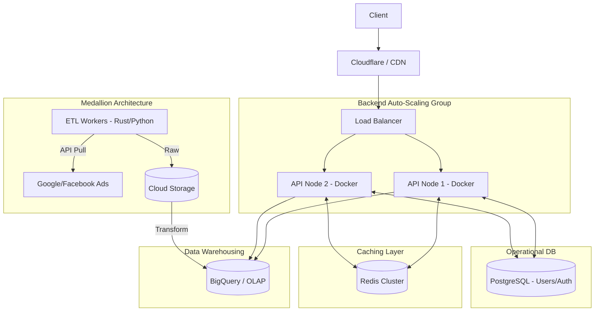

## Context & The Problem

The reporting platform has been highly successful, and the client base has skyrocketed. During month-end periods, up to 1000 CCU log in simultaneously to export reports and view custom dimensions across massive amounts of historical data. The old system is showing its fatal flaws: chart loads take over 10 seconds, the database CPU is constantly maxed out at 100%, and data update batch jobs are bleeding into working hours due to the sheer volume of data being processed.

## System Requirements

- **Performance:** Dashboards must load in under 1 second, even when querying months of data.
- **Scalability:** 1000 CCU, with the ability to auto-scale during traffic spikes.
- **Data:** Extremely large analytical datasets, supporting multi-dimensional queries (OLAP).
- **Availability:** 99.9%, serving 24/7 with no single point of failure (SPOF).

## Architecture Design

The architecture must now completely separate the write flow (Data Pipeline) from the read flow (API / Dashboard).

- **Load Balancing & Backend Cluster:** Requests pass through a Load Balancer and are distributed to Backend Nodes running in Docker containers for easy auto-scaling.
- **Caching Layer (Redis):** All static report query results are hashed by parameters and stored in Redis. 80% of user requests will be served directly from Redis without ever touching the database.
- **Data Warehouse (BigQuery):** Responsible for storing and processing analytical queries (OLAP). BigQuery is designed to scan terabytes of data in seconds.
- **Data Pipeline (ETL):** High-performance languages (like Rust or Python) are used to extract data, dump it into a Data Lake, and then transform and load it into BigQuery following the Medallion architecture (Bronze -> Silver -> Gold).

## Trade-off Analysis

- **Performance vs. Data Staleness:** Using a Cache (Redis) allows the system to handle massive loads excellently, but users might see data that is a few minutes "old". A sensible Cache Invalidation strategy is required.
- **Operational Costs:** Using a Data Warehouse like BigQuery incurs costs based on data scanned (Bytes Billed). If the backend does not tightly control queries and directly executes unoptimized queries without filters (WHERE clauses), infrastructure bills will skyrocket.

## Practical Lessons & Best Practices

1.  **Stop Query Storms (Query Throttling/Debouncing):** When 1000 users spam F5, the Data Warehouse will overload if there is no Cache. Redis must act as the primary defense. This should be combined with Rate Limiting on the API server.
2.  **Optimize the OLAP Data Model:** Data in the Data Warehouse needs to be Denormalized and Partitioned/Clustered by date and `client_id`. This reduces the amount of data scanned during a query by up to 90%, speeding up responses and slashing costs.
3.  **Service Segregation:** Use PostgreSQL strictly for CRUD operations (user creation, permissions, campaign configuration) and let BigQuery purely handle metric calculations. Absolutely never perform direct cross-database queries at the API layer.
