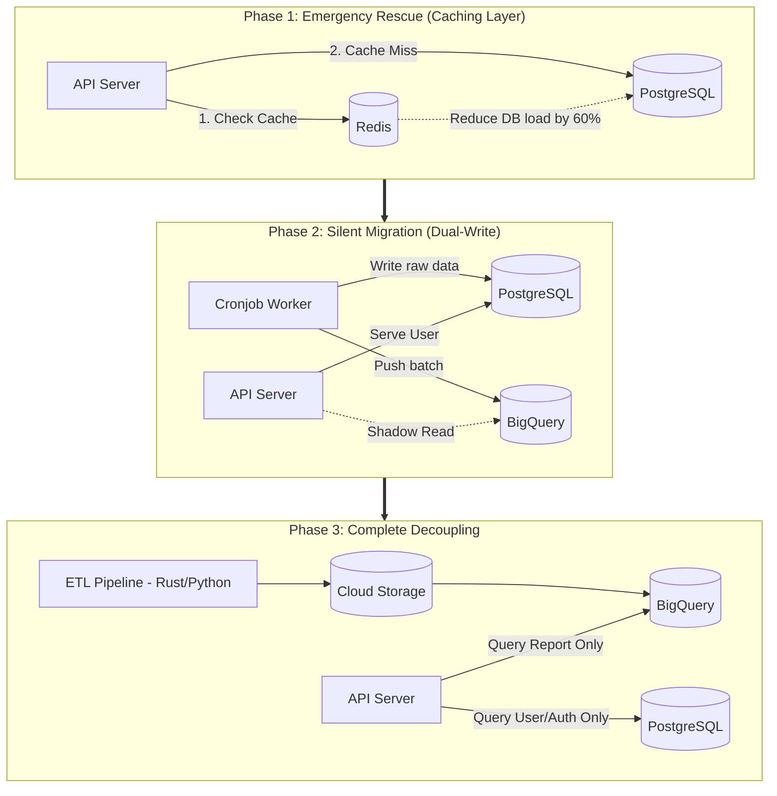

# Context & Problem

The PostgreSQL system from Article 1 is starting to gasp for air. As concurrent users (CCU) approach 300, the database CPU consistently pegs at 90-100% every Monday morning. API response times have spiked from 2 seconds to 15 seconds, and `504 Gateway Timeout` errors are occasionally surfacing.
The mandate: The system must evolve into the Data Warehouse (BigQuery) architecture described in Article 2, but with **strictly zero downtime** and no data discrepancies for active clients.

## Architectural Design: A 3-Phase Migration Strategy

Instead of a high-risk "big bang" rewrite, the system will be upgraded in 3 phases.

### Phase 1: Emergency Rescue (Introduce Redis Cache)

- **The Problem:** 80% of users log in and view the exact same time range (e.g., the last 7 days). Forcing PostgreSQL to scan and recalculate `SUM()` on every click is a massive waste of resources.
- **The Action:** Insert Redis between the API and PostgreSQL. When User A requests a report, the computed result is stored in Redis with a 15-minute Time-to-Live (TTL). When User B queries the same parameters, they instantly receive the data from RAM (Redis).
- **The Result:** Database CPU immediately drops from 100% to 40%. The system gains breathing room, buying the engineering team time to prepare for Phase 2.

### Phase 2: Silent Data Migration (Dual-Write & Shadow Read)

- **The Problem:** We need to migrate data from PostgreSQL to BigQuery without disrupting the live ingestion flow.
- **The Action:** Refactor the Cronjob data workers. Instead of writing solely to PostgreSQL, the worker will **Dual-write** to both PostgreSQL and BigQuery. Simultaneously, at the API layer, we implement a **Shadow Read** mechanism: The API still returns the PostgreSQL result to the user, but it silently fires a background query to BigQuery, logging a comparison to ensure the results match 100%.

### Phase 3: Complete Decoupling & Finalizing the Data Pipeline

- **The Problem:** PostgreSQL is still bloated, and the legacy Cronjob workers are too slow for the growing data volume.
- **The Action:** Completely remove ad data writing from PostgreSQL. Rewrite the Data Pipeline using Rust or Python (following the Medallion Architecture) to push data directly into the Data Lake and BigQuery. Toggle the API to query 100% of its report data from BigQuery. PostgreSQL is now liberated, solely responsible for storing User, Auth, and Configuration data.

## Trade-offs Analysis

- **Dual-Cost in the Short Term:** During Phase 2, you must pay for both the legacy infrastructure (bloated PostgreSQL) and the new infrastructure (BigQuery) simultaneously. This is the mandatory cost of safety (Zero Downtime).
- **Data Synchronization Complexity:** The dual-write process can lead to data inconsistencies if a worker successfully writes to PostgreSQL but fails to write to BigQuery. Robust Retry mechanisms and Idempotency (running a process multiple times yields the same state) are strictly required.

## Real-world Lessons & Best Practices

1.  **Use Feature Flags:** When routing users to read from BigQuery, never roll it out to 100% of users at once. Use a Feature Flag to enable it for the internal QA team first, then 10% of users, 50%, and finally 100%. If BigQuery throws an error, it takes exactly one second to toggle the flag and fallback to PostgreSQL.
2.  **Keep the Legacy System as a Backup:** After completing Phase 3, do not immediately dismantle the PostgreSQL reporting capabilities. Let it run idle for 1-2 weeks. This serves as a vital safety parachute in case the new Data Warehouse encounters unforeseen critical failures.
3.  **Observability is Paramount:** Without monitoring dashboards (like Grafana) to track CPU, RAM, and API Latency, you are flying blind. You will have no objective way of knowing if Phase 1 (Redis) or Phase 2 (Shadow Read) is actually improving the system or covertly slowing it down.
