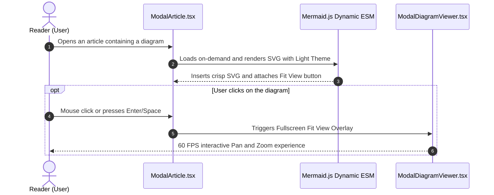

## Problem Description

Embedding dynamic technical diagrams (Dynamic Diagramming) into tech blogs or Documentation Portals provides a highly visual reading experience. However, when introducing the `mermaid` library into a Single Page Application (SPA) written in React and TypeScript, frontend engineers often face 4 thorny technical challenges:

1. **Bundle Size Bloat:** The Mermaid library packages full rendering engines (Dagre, Cytoscape, KaTeX, D3), with a footprint exceeding 1.4MB. If statically imported at the top of the page, the First Contentful Paint (FCP) time will severely degrade.
2. **Color Contrast Issues in Dark Mode:** When users switch to the dark theme, the default text and stroke colors of the SVG might completely blend into the dark background, making the content unreadable.
3. **Limited Experience on Mobile Screens:** Complex architecture diagrams with multiple columns or long microservices chains often shrink too small or overflow the viewport, breaking the layout.
4. **Rigid 'Boxed-in' Feel:** If the diagram is wrapped in cards with hard borders and heavy shadows, it creates a sense of isolation, detaching it from the natural flow of the article.

## Initial Approach Idea

A naive approach commonly seen in early projects:

- Statically import via `import mermaid from 'mermaid'` and call `mermaid.run()` directly after the component mounts.
- Wrap the entire diagram block in a `
` with a background, hard borders, and shadows.
- Use the default theme `theme: 'default'` without syncing it with the site's Design Tokens system.

**Why does this approach expose many bottlenecks?** The diagram cannot automatically update when the user toggles Dark/Light Mode. On mobile, users cannot zoom in to see details. Moreover, the rigid card structure breaks the seamlessness of an in-depth article.

## Optimization Mindset & Algorithmic Structure

To thoroughly resolve the above issues and deliver a top-tier reading experience, I built a comprehensive integration architecture:

1. **Dynamic On-Demand Loading:** Only import Mermaid when the article actually contains a `pre.mermaid` code block, combined with a resilient fallback multi-tier import mechanism.
2. **Synchronizing Theme Variables and Internal Mermaid Formatting:** Use `theme: 'base'` mode combined with a detailed `themeVariables` set (syncing Ruby / Crimson color codes) and perfectly supporting Mermaid's internal `style`/`classDef` syntax, eliminating forced CSS overrides so diagrams can freely customize colors.
3. **Full Viewport Zoom Mechanism (Fit View Modal):** Integrate a neat micro-pill button in the top corner. When clicked, it expands the diagram to the full viewport (95vw x 86vh), supporting mouse dragging (Pan) and scroll zooming (Zoom 40% - 350%).
4. **Natural Integration into the Text Flow:** Remove rigid borders and box backgrounds, turning the diagram into a natural vector illustration nestled between paragraphs.

## Source Code Implementation & Dry Run

Implementing the processing architecture in React components and SCSS:

**Key takeaways in the source code:**

- **Restrict CSS selector `> svg`:** Ensure that the large dimension properties of the diagram do not break the `11x11px` icon inside the Fit View button.
- **Uniform Theme Optimization:** Initialize Mermaid directly in Light Theme with a standard `themeVariables` set, completely eliminating the overhead of listening to MutationObserver.

## Complexity Evaluation & Practical Applications

- **GPU Rendering Performance:** Pan & Zoom operations in the modal viewer use pure `transform: translate3d(...) scale(...)` properties, fully leveraging GPU Compositing to achieve an absolute smooth **60 FPS**.
- **Reducing Initial Bundle Load:** The lazy-load technique saves over **1.4 MB of JavaScript** for articles that do not contain diagrams.
- **Wide Applicability:** This solution is an exemplary architecture for complex technical platforms like API Documentation, Enterprise Architecture Dashboards, and professional Tech Blogs.
