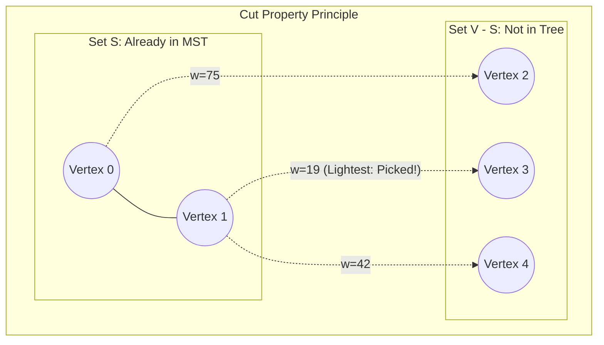

## Problem Description

Unlike Kruskal's algorithm which builds a spanning tree by gathering disconnected edges across the graph to form a Forest, Prim's algorithm (discovered by Vojtěch Jarník in 1930 and rediscovered by Robert Prim in 1957) approaches the Minimum Spanning Tree problem through **Vertex-Centric Growth**.

Starting from an arbitrary source vertex, Prim's algorithm continuously expands the frontier of the current spanning tree by absorbing the nearest vertex not yet in the tree, ensuring that the subgraph maintains its structure as a connected tree at all times during the runtime.

## Initial Approach

A naive version of Prim uses a linear array: At each step, the algorithm scans through all non-tree vertices to find the one with the lightest edge connecting to the current tree. The complexity is `O(V²)`.

For dense graphs (where the number of edges `E \approx V^2`), the `O(V²)` complexity is absolutely optimal. However, on sparse graphs (`E \approx V`), scanning arrays introduces unnecessary delays.

## Optimization Mindset & Algorithm Structure

Prim's algorithm is based on a foundational theorem of graph theory: **The Cut Property**:

1. **The Cut Property:** For any cut that partitions the vertex set `V` into 2 disjoint sets: Set `S` (vertices already in the MST) and Set `V \setminus S` (vertices not yet in the tree). The edge `(u, v)` with the **minimum weight** connecting a vertex in `S` and a vertex in `V \setminus S` (called the lightest crossing edge) _is guaranteed to belong to the Minimum Spanning Tree_.
2. **Frontier Expansion Mechanism:** Maintain a vertex tracking set `inMST[v]`. Initially, `inMST[0] = true`, while the remaining vertices are `false`.
3. **Min-Heap Priority Queue Optimization:**
   - Store all crossing edges in a `std::priority_queue`.
   - At each step, extract the edge `(u, v, w)` with the minimum weight. If `v` is not yet in the tree, add `v` to `inMST`, add weight `w` to the total cost, and push all adjacent edges from `v` to non-tree vertices into the Min-Heap.

Thanks to the Min-Heap structure, Prim's complexity on sparse graphs drastically decreases to `O((V + E) \log V)`.

## Source Code Implementation & Dry Run

Diagram of the Cut Property mechanism and Prim's spanning tree expansion:



**Complete C++ Source Code (Prim with std::priority_queue):**

```c++
#include <iostream>
#include <vector>
#include <queue>
#include <utility>

struct Edge {
    int to;
    long long weight;
};

// State structure in Min-Heap: {weight, destination vertex, source vertex}
struct HeapNode {
    long long weight;
    int u;
    int parent;

    bool operator>(const HeapNode& other) const {
        return weight > other.weight;
    }
};

struct MSTEdge {
    int u, v;
    long long weight;
};

struct PrimResult {
    long long totalWeight;
    std::vector<MSTEdge> mstEdges;
};

PrimResult primMST(int V, const std::vector<std::vector<Edge>>& adj) {
    std::vector<bool> inMST(V, false);
    std::priority_queue<HeapNode, std::vector<HeapNode>, std::greater<HeapNode>> pq;

    // Start from vertex 0 with weight = 0, parent = -1
    pq.push({0, 0, -1});

    long long totalWeight = 0;
    std::vector<MSTEdge> mstEdges;

    while (!pq.empty()) {
        auto [w, u, p] = pq.top();
        pq.pop();

        // If vertex u has already been included in the tree, skip
        if (inMST[u]) {
            continue;
        }

        // Include u into MST
        inMST[u] = true;
        totalWeight += w;
        if (p != -1) {
            mstEdges.push_back({p, u, w});
        }

        // Push all adjacent edges from u connecting to non-tree vertices into Min-Heap
        for (const auto& edge : adj[u]) {
            if (!inMST[edge.to]) {
                pq.push({edge.weight, edge.to, u});
            }
        }
    }

    return {totalWeight, mstEdges};
}

int main() {
    int V = 5;
    std::vector<std::vector<Edge>> adj(V);

    auto addUndirectedEdge = [&](int u, int v, long long w) {
        adj[u].push_back({v, w});
        adj[v].push_back({u, w});
    };

    addUndirectedEdge(0, 1, 9);
    addUndirectedEdge(0, 2, 75);
    addUndirectedEdge(1, 2, 95);
    addUndirectedEdge(1, 3, 19);
    addUndirectedEdge(1, 4, 42);
    addUndirectedEdge(2, 3, 51);
    addUndirectedEdge(3, 4, 31);

    auto result = primMST(V, adj);

    std::cout << "--- PRIM'S MINIMUM SPANNING TREE RESULT ---" << std::endl;
    std::cout << "Total MST weight: " << result.totalWeight << std::endl;
    for (const auto& e : result.mstEdges) {
        std::cout << "Edge (" << e.u << " - " << e.v << ") | Weight: " << e.weight << std::endl;
    }

    return 0;
}
```

**Detailed Execution Trace (Dry Run):**

- _Start:_ Vertex 0 is included. Push edges `(0-1: 9)` and `(0-2: 75)` to the heap.
- _Step 1:_ Pop `(w=9, u=1)` &rarr; Include vertex 1 into tree. Push adjacent edges of 1: `(1-3: 19)`, `(1-4: 42)`, `(1-2: 95)`.
- _Step 2:_ Pop `(w=19, u=3)` (lightest crossing edge) &rarr; Include vertex 3. Push `(3-4: 31)`, `(3-2: 51)`.
- _Step 3:_ Pop `(w=31, u=4)` &rarr; Include vertex 4.
- _Step 4:_ Pop `(w=42, u=4)` &rarr; Vertex 4 is already in the tree &rarr; Ignore (Lazy Deletion).
- _Step 5:_ Pop `(w=51, u=2)` &rarr; Include vertex 2. Have absorbed all 5 vertices &rarr; Total final weight `9 + 19 + 31 + 51 = 110` (identical to Kruskal).

## Complexity Evaluation & Practical Applications

- **Time Complexity:**
  - With Binary Min-Heap (`std::priority_queue`): `O((V + E) \log V)`.
  - With Adjacency Matrix on Dense Graphs (`E \approx V^2`): `O(V²)` (faster than Kruskal because there's no `V^2` edge sorting cost).
  - With Fibonacci Heap (Theoretical): `O(E + V \log V)`.
- **Space Complexity:** `O(V + E)` for the adjacency list and priority queue.
- **Practical Applications:**
  - **Spanning Tree Protocol (STP - IEEE 802.1D):** Preventing packet loops in local Ethernet switching networks (Switching Loops).
  - **Traveling Salesperson Problem Approximation (TSP 2-Approximation):** Using Prim's spanning tree to generate an approximate tour for the NP-Hard TSP problem.
  - **Multicast Routing Trees Load Balancing:** Establishing digital broadcast flow from a central server to millions of subscribers.
