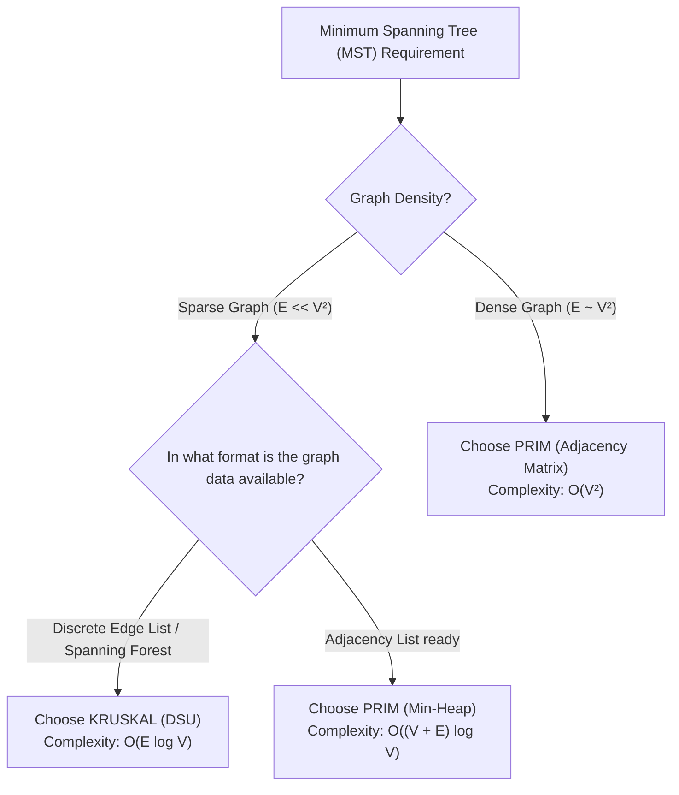

## Problem Description

In the problem of constructing a Minimum Spanning Tree (MST), the two classic algorithms, **Kruskal** and **Prim**, yield the exact same globally optimal result but operate on entirely opposite architectural models:

- **Kruskal:** A global approach on the edge set (Edge-Centric), sorting edges and merging fragmented forests using DSU.
- **Prim:** A local approach on the vertex set (Vertex-Centric), growing a continuous tree from an initial nucleus using a Min-Heap.

Understanding the performance boundary between the two algorithms based on Graph Density is crucial knowledge for any systems engineer.

## Initial Approach

Common practical mistakes:

1. **Using Kruskal on Dense Graphs (`E \approx V^2`):** Sorting `10^6` edges costs multiple times more time and memory compared to simply running Prim with an `O(V²)` matrix.
2. **Using Prim on Disconnected Graphs:** Prim will only find the spanning tree for the connected component containing the starting vertex, whereas Kruskal automatically finds the **Minimum Spanning Forest (MSF)** for the entire graph without requiring source code modifications.

## Optimization Mindset & Algorithm Structure

**Comprehensive Comparison Matrix between Kruskal and Prim:**

<table style="width:100%; border-collapse: collapse; margin-bottom: 20px;">
  <thead>
    <tr style="border-bottom: 2px solid #e2e8f0; text-align: left;">
      <th style="padding: 8px;">Comparison Criteria</th>
      <th style="padding: 8px;">Kruskal's Algorithm</th>
      <th style="padding: 8px;">Prim's Algorithm</th>
    </tr>
  </thead>
  <tbody>
    <tr style="border-bottom: 1px solid #edf2f7;">
      <td style="padding: 8px"><b>Design Philosophy</b></td>
      <td style="padding: 8px">Edge-Centric Greedy</td>
      <td style="padding: 8px">Vertex-Centric Greedy</td>
    </tr>
    <tr style="border-bottom: 1px solid #edf2f7;">
      <td style="padding: 8px"><b>Core Data Structure</b></td>
      <td style="padding: 8px">Disjoint Set Union (DSU) + Sort</td>
      <td style="padding: 8px">Min-Heap Priority Queue / Matrix</td>
    </tr>
    <tr style="border-bottom: 1px solid #edf2f7;">
      <td style="padding: 8px"><b>Complexity (Sparse Graph)</b></td>
      <td style="padding: 8px"><code>O(E \log V)</code> (Superior)</td>
      <td style="padding: 8px"><code>O(E \log V)</code></td>
    </tr>
    <tr style="border-bottom: 1px solid #edf2f7;">
      <td style="padding: 8px"><b>Complexity (Dense Graph)</b></td>
      <td style="padding: 8px"><code>O(V² \log V)</code> (Slowed by sorting)</td>
      <td style="padding: 8px"><code>O(V²)</code> with matrix (Absolute optimal)</td>
    </tr>
    <tr style="border-bottom: 1px solid #edf2f7;">
      <td style="padding: 8px"><b>Graph Representation</b></td>
      <td style="padding: 8px">Discrete Edge List</td>
      <td style="padding: 8px">Adjacency List or Adjacency Matrix</td>
    </tr>
    <tr style="border-bottom: 1px solid #edf2f7;">
      <td style="padding: 8px"><b>Disconnected Graphs</b></td>
      <td style="padding: 8px">Automatically generates MSF</td>
      <td style="padding: 8px">Requires outer loop over components</td>
    </tr>
    <tr>
      <td style="padding: 8px"><b>Parallelization Capability</b></td>
      <td style="padding: 8px">Sorting step is easy to parallelize</td>
      <td style="padding: 8px">Strictly sequential by vertex addition</td>
    </tr>
  </tbody>
</table>

## Source Code Implementation & Dry Run

Decision tree for selecting the Minimum Spanning Tree algorithm:



**C++ Benchmark Source Code comparing Kruskal vs Prim:**

```c++
#include <iostream>
#include <vector>
#include <algorithm>
#include <queue>

struct Edge {
    int u, v;
    long long weight;
    bool operator<(const Edge& o) const { return weight < o.weight; }
};

// DSU for Kruskal
struct DSU {
    std::vector<int> p;
    DSU(int n) : p(n) { for (int i = 0; i < n; ++i) p[i] = i; }
    int find(int x) { return p[x] == x ? x : p[x] = find(p[x]); }
    bool unite(int a, int b) {
        a = find(a); b = find(b);
        if (a == b) return false;
        p[a] = b;
        return true;
    }
};

long long runKruskal(int V, std::vector<Edge> edges) {
    std::sort(edges.begin(), edges.end());
    DSU dsu(V);
    long long total = 0;
    int count = 0;
    for (const auto& e : edges) {
        if (dsu.unite(e.u, e.v)) {
            total += e.weight;
            if (++count == V - 1) break;
        }
    }
    return total;
}

long long runPrim(int V, const std::vector<std::vector<std::pair<int, long long>>>& adj) {
    std::vector<bool> vis(V, false);
    using State = std::pair<long long, int>;
    std::priority_queue<State, std::vector<State>, std::greater<State>> pq;
    pq.push({0, 0});
    long long total = 0;

    while (!pq.empty()) {
        auto [w, u] = pq.top();
        pq.pop();
        if (vis[u]) continue;
        vis[u] = true;
        total += w;
        for (const auto& edge : adj[u]) {
            if (!vis[edge.first]) {
                pq.push({edge.second, edge.first});
            }
        }
    }
    return total;
}

int main() {
    int V = 4;
    std::vector<Edge> edges = {
        {0, 1, 1}, {1, 2, 2}, {2, 3, 3}, {0, 3, 4}, {0, 2, 5}
    };

    std::vector<std::vector<std::pair<int, long long>>> adj(V);
    for (const auto& e : edges) {
        adj[e.u].push_back({e.v, e.weight});
        adj[e.v].push_back({e.u, e.weight});
    }

    std::cout << "Total MST weight (Kruskal): " << runKruskal(V, edges) << std::endl;
    std::cout << "Total MST weight (Prim):    " << runPrim(V, adj) << std::endl;

    return 0;
}
```

## Complexity Evaluation & Practical Applications

Quick memorization rules for software engineers:

1. **Choose Kruskal:** When the graph is sparse (like a road network or topographical map), when the input data is already in an edge list format, or when you need to find a spanning forest for a graph that might be fragmented into multiple independent clusters.
2. **Choose Prim:** When the graph is dense (such as a full distance matrix between all points, or a fully connected network), where Prim's algorithm using an adjacency matrix achieves `O(V²)`, far outperforming the `O(V² \log V)` sorting cost of Kruskal.
