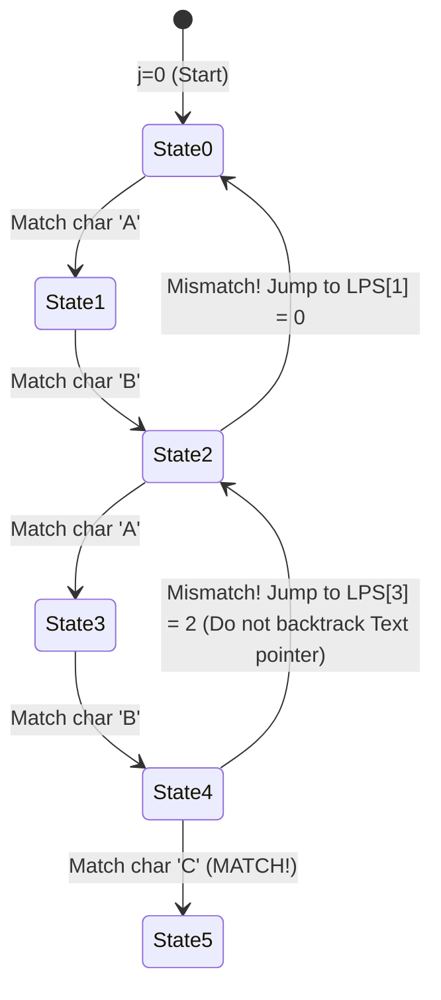

## Problem Description

In source code editors (VS Code, Vim), text search tools (grep, ripgrep), network intrusion detection systems (Snort), or bioinformatics genome analysis software (BLAST), the most common operation is: _Finding occurrences of a `Pattern` string (length `M`) inside a large `Text` string (length `N`)._

The problem statement: **Exact String Matching**. Given a text string `Text[0..N-1]` and a pattern string `Pattern[0..M-1]` (where `M <= N`). Find all index positions `i` in `Text` such that `Text[i .. i + M - 1] == Pattern[0 .. M - 1]`.

Two pinnacle algorithms dominating this field are the **Knuth-Morris-Pratt (KMP) Algorithm** and the **Rabin-Karp Algorithm**.

## Initial Approach

The Naive String Matching algorithm slides the `Pattern` across each position `i` of the `Text` and matches characters from left to right. If a mismatch occurs at position `j`, the algorithm moves the `Text` pointer back to `i + 1` and restarts matching from `Pattern[0]`.

The worst-case scenario happens when both text and pattern contain repeating characters (e.g., `Text = "AAAAAAAAB"`, `Pattern = "AAAB"`). On every mismatch, the algorithm has to uselessly compare `M` characters, pushing the complexity to quadratic `O(N * M)`. When `N = 10^7` and `M = 10^4`, the naive algorithm consumes hundreds of billions of operations!

## Optimization Mindset & Algorithm Structure

**1. Knuth-Morris-Pratt Algorithm (KMP - 1977):**

KMP achieved the `O(N + M)` breakthrough by **never moving the pointer backward on the Text string**. When a mismatch occurs, KMP leverages the prefix information already matched to shift the `Pattern` to the right as far as possible using the **LPS (Longest Proper Prefix which is also Suffix)** array:

- `LPS[i]` stores the length of the longest proper prefix of `Pattern[0..i]` that is simultaneously a suffix of `Pattern[0..i]`.
- Upon mismatch at `Pattern[j]`, instead of falling back to `Pattern[0]`, we jump straight to `j = LPS[j - 1]` and continue comparing with the current character of the `Text`.

**2. Rabin-Karp Algorithm (1987):**

Rabin-Karp transforms the string matching problem into an integer matching problem via the **Polynomial Rolling Hash**:

- Calculate the hash of the `Pattern` in `O(M)`: `H(P) = \sum P[i] \times B^{M - 1 - i} \pmod P`.
- When sliding the window of size `M` on `Text` from `i` to `i + 1`, the new window's hash is updated in `O(1)` by removing the leading character `Text[i]` and adding the new character `Text[i + M]`:

```
H_{new} = (H_{old} - Text[i] * B^{M-1}) * B + Text[i + M] \pmod P
```

- Only when the hash of the window matches the hash of the `Pattern` do we perform a character-by-character comparison to filter out Hash Collisions.

## Source Code Implementation & Dry Run

State transition automaton and LPS jump steps in KMP:



**Complete C++ Source Code (Simultaneous implementation of KMP and Rabin-Karp):**

```c++
#include <iostream>
#include <vector>
#include <string>

// --- 1. KNUTH-MORRIS-PRATT ALGORITHM (KMP) ---

// Precompute the LPS (Longest Proper Prefix which is also Suffix) array
std::vector<int> computeLPS(const std::string& pattern) {
    int m = static_cast<int>(pattern.size());
    std::vector<int> lps(m, 0);
    int len = 0; // Length of the previous longest prefix
    int i = 1;

    while (i < m) {
        if (pattern[i] == pattern[len]) {
            ++len;
            lps[i] = len;
            ++i;
        } else {
            if (len != 0) {
                len = lps[len - 1]; // Jump back to a shorter prefix
            } else {
                lps[i] = 0;
                ++i;
            }
        }
    }
    return lps;
}

std::vector<int> KMPSearch(const std::string& text, const std::string& pattern) {
    std::vector<int> matches;
    int n = static_cast<int>(text.size());
    int m = static_cast<int>(pattern.size());
    if (m == 0 || n < m) return matches;

    std::vector<int> lps = computeLPS(pattern);
    int i = 0; // Pointer on text (NEVER BACKTRACKS)
    int j = 0; // Pointer on pattern

    while (i < n) {
        if (text[i] == pattern[j]) {
            ++i;
            ++j;
        }

        if (j == m) {
            matches.push_back(i - j); // Pattern match found!
            j = lps[j - 1];           // Prepare to find the next match
        } else if (i < n && text[i] != pattern[j]) {
            if (j != 0) {
                j = lps[j - 1]; // Shift pattern pointer based on LPS array
            } else {
                ++i;
            }
        }
    }
    return matches;
}

// --- 2. RABIN-KARP ROLLING HASH ALGORITHM ---

std::vector<int> rabinKarpSearch(const std::string& text, const std::string& pattern) {
    std::vector<int> matches;
    int n = static_cast<int>(text.size());
    int m = static_cast<int>(pattern.size());
    if (m == 0 || n < m) return matches;

    const long long BASE = 256;
    const long long MOD = 1000000007;

    long long patternHash = 0;
    long long currentHash = 0;
    long long h = 1; // BASE^(M-1) % MOD

    for (int i = 0; i < m - 1; ++i) {
        h = (h * BASE) % MOD;
    }

    // Calculate the initial hash for pattern and the first window of text
    for (int i = 0; i < m; ++i) {
        patternHash = (BASE * patternHash + pattern[i]) % MOD;
        currentHash = (BASE * currentHash + text[i]) % MOD;
    }

    for (int i = 0; i <= n - m; ++i) {
        // If hashes match, verify character by character to avoid collisions
        if (patternHash == currentHash) {
            bool match = true;
            for (int j = 0; j < m; ++j) {
                if (text[i + j] != pattern[j]) {
                    match = false;
                    break;
                }
            }
            if (match) {
                matches.push_back(i);
            }
        }

        // Calculate rolling hash for the next window in O(1)
        if (i < n - m) {
            currentHash = (BASE * (currentHash - text[i] * h) + text[i + m]) % MOD;
            if (currentHash < 0) {
                currentHash += MOD;
            }
        }
    }
    return matches;
}

int main() {
    std::string text = "ABABDABACDABABCABAB";
    std::string pattern = "ABABCABAB";

    auto kmpMatches = KMPSearch(text, pattern);
    auto rkMatches = rabinKarpSearch(text, pattern);

    std::cout << "--- SUBSTRING SEARCH RESULTS ---" << std::endl;
    std::cout << "KMP found at indices:        ";
    for (int idx : kmpMatches) std::cout << idx << " ";
    std::cout << std::endl;

    std::cout << "Rabin-Karp found at indices: ";
    for (int idx : rkMatches) std::cout << idx << " ";
    std::cout << std::endl;

    return 0;
}
```

**Detailed Execution Trace (Dry Run KMP):**

- _Pattern `Pattern = "ABABCABAB"`:_ Array `LPS = [0, 0, 1, 2, 0, 1, 2, 3, 4]`.
  - `LPS[3] = 2` because substring `"ABAB"` has prefix `"AB"` matching suffix `"AB"`.
  - `LPS[8] = 4` because substring `"ABABCABAB"` has prefix `"ABAB"` matching suffix `"ABAB"`.
- _Matching process on `Text = "ABABDABACDABABCABAB"`:_
  - First 4 characters `"ABAB"` match successfully (`j = 4`).
  - At the 5th character (`Text[4] = 'D'`, `Pattern[4] = 'C'`) &rarr; Mismatch!
  - KMP does not regress `i` back to 1. It keeps `i = 4` and assigns `j = LPS[3] = 2` (representing the `"AB"` prefix that already matched).
  - Continues comparing `Text[4] = 'D'` with `Pattern[2] = 'A'` &rarr; Saving 4 redundant comparisons!
  - At `i = 10`, the entire pattern perfectly matches &rarr; Records occurrence at `index = 10`.

## Complexity Evaluation & Practical Applications

- **Time Complexity:**
  - **KMP:** `\Theta(N + M)` in all cases. Computing LPS takes `O(M)`, and scanning Text takes `O(N)` with no backtracking.
  - **Rabin-Karp:** Average `O(N + M)`. Worst-case (many hash collisions) is `O(N * M)`.
- **Space Complexity:**
  - KMP: `O(M)` for the `LPS` prefix array.
  - Rabin-Karp: `O(1)` auxiliary space using just a few hash accumulation variables.
- **Practical Applications:**
  - **Source Code and Text Searchers:** The core of Regex matching and keyword lookup in IDEs.
  - **Genomic Bioinformatics:** Searching for disease-causing genes or mutant DNA patterns within sequences containing billions of nucleotides.
  - **Plagiarism Detection:** Rabin-Karp with multiple-pattern Rolling Hash enables simultaneous text overlap matching against hundreds of snippets.
  - **Firewalls & IDS/IPS:** Scanning malicious malware signatures inside TCP/IP network packets in real-time.
