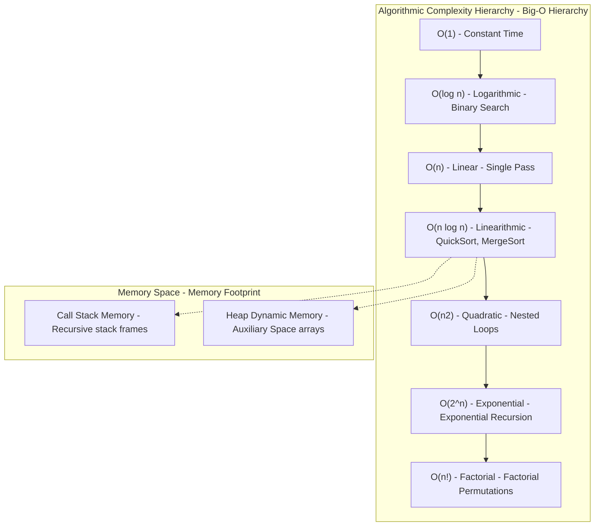

## Problem Description

In software development and system optimization, the crucial question every engineer must answer before deploying any code to Production is: _'How fast does this algorithm run, and how many resources does it consume when user data grows 1,000 times?'_.

A classic mistake made by beginners is using wall-clock time via functions like `console.time()` or `System.nanoTime()` to measure speed. This approach cannot provide accurate conclusions because physical execution time depends entirely on CPU hardware configurations, machine temperature, compilers, and the operating system's background processes. Therefore, computer science requires a **standardized Mathematical Framework** for hardware-independent analysis.

## Initial Approach Idea

The initial empirical approach (Empirical Benchmarking):

- Run the algorithm on a personal computer with small sample data (N = 100) and measure the time in milliseconds.
- _Why does this method fail?_ An O(N²) algorithm might take only `0.2ms` when N = 100, making the programmer mistakenly believe it is fast enough. But when N increases to 1,000,000 in Production, the execution time will explode to **over 11 days**, paralyzing the entire system (Server Freeze).

We need an Asymptotic Analysis mindset to predict the resource growth trend based on the input size N.

## Optimization Mindset & Algorithmic Structure

To comprehensively evaluate an algorithm, I established a standard computational model based on the **Random Access Machine (RAM) Model** and 3 pillar measurement metrics:

1. **Asymptotic Notations Hierarchy:**

- **Big-O (O):** Upper Bound - Represents the Worst-Case Scenario. This is the most important metric for committing to system SLAs.
- **Big-Omega (Ω):** Lower Bound - Best-Case Scenario.
- **Big-Theta (Θ):** Tight Bound - When the upper and lower bounds asymptotically coincide, reflecting actual average behavior.

2. **Strictly Differentiating Time vs Space Complexity:**

- **Time Complexity:** The number of primitive operations (assignment, comparison, arithmetic) as a function of N.
- **Space Complexity (Total Space vs Auxiliary Space):** The total memory capacity the algorithm needs to use. Within this, _Auxiliary Space_ is the temporary memory dynamically allocated by the algorithm itself (excluding the input array), including Heap allocations and Call Stack frames in recursion.

## Source Code Implementation & Dry Run

The hierarchy map of algorithmic complexity growth and memory structure:

**TypeScript source code illustrating standard Big-O levels:**

- **O(1) Constant Time:** Accessing an element by array index `arr[0]` or looking up a key in a HashMap.
- **O(log N) Logarithmic Time:** Binary search algorithm dividing the search space in half after each step.
- **O(N) Linear Time:** Iterating through all N elements in an array exactly once.
- **O(N log N) Linearithmic Time:** Optimal divide-and-conquer algorithms like QuickSort, MergeSort, TimSort.
- **O(N²) Quadratic Time:** 2 nested loops iterating through all pairs (i, j).

## Complexity Evaluation & Practical Applications

From this article onwards, every algorithm in the series will be dissected and scored based on exactly 5 core criteria:

1. **Worst-Case Time Complexity (O):** Ensures the system doesn't hang when encountering reverse-ordered data.
2. **Best/Average-Case Time (Ω / Θ):** Actual performance under randomized data conditions.
3. **Auxiliary Space Complexity:** Additional RAM allocated on the Heap and Call Stack.
4. **Stability & In-place Processing:** Whether it alters the relative order of equal elements.
5. **Scalability Threshold:** The safe N limit to execute in under `100ms` in a Production environment.
