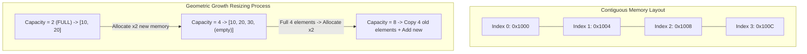

## Problem Description

In modern computer hardware architecture (Von Neumann architecture), RAM memory is organized as a massive linear array of memory cells (Bytes). An **Array** is the most primitive and foundational data structure in computer science, representing a block of elements of the same data type allocated in a **Contiguous Memory Block**.

However, traditional Static Arrays have a fixed size determined at compile time. In actual software development, the number of elements needed often fluctuates continuously at Runtime. The challenge: _How to design a **Dynamic Array** (equivalent to `std::vector` in C++ or `ArrayList` in Java) capable of elastic auto-resizing while maintaining instantaneous `O(1)` access speed and optimizing CPU Cache Locality?_

## Initial Approach

The naive initial approach when an array gets full: Every time a new element is added (`push_back`), allocate a new array of size `N + 1`, copy all `N` old elements over, and deallocate the old array.

This Linear Resizing strategy leads to a performance catastrophe: To add `N` elements, the total number of memory copy operations would be `1 + 2 + 3 + ... + N = (N \times (N + 1)) / 2 = O(N^2)`. The average cost for each insertion shoots up to `O(N)` - completely unfeasible for large data processing systems.

## Optimization Mindset & Algorithm Structure

To fully resolve this issue, modern programming languages adopt a **Geometric / Exponential Resizing** allocation strategy:

1. **Capacity Doubling:** When the actual number of elements (`size`) hits the maximum limit (`capacity`), the array allocates a new memory region twice the size (`capacity \times 2`), copies the old elements over, and frees the old memory space.
2. **Amortized Analysis:** Although the expansion operation at the moment the array fills up costs `O(N)`, this event occurs very sparsely (after every `1, 2, 4, 8, 16, ...` elements). The total copy cost when inserting `N` elements is `1 + 2 + 4 + ... + N \le 2N = O(N)`. Divided evenly across `N` operations, the Amortized Cost for each `push_back` is a **constant `O(1)`**.
3. **Direct Address Calculation:** Thanks to the contiguous memory layout, the memory address of the `i`-th element is instantly calculated using mathematical pointer arithmetic:

```
Address(arr[i]) = Base_Address + i * sizeof(ElementType)
```

Random Access reading/writing takes exactly 1 CPU clock cycle `O(1)`. 4. **Cache Locality Optimization:** When the CPU reads an element from RAM, an entire Cache Line (typically 64 bytes) containing neighboring elements is fetched simultaneously into the L1/L2 Cache, making array traversal dozens of times faster compared to linked lists.

## Source Code Implementation & Dry Run

Diagram of contiguous memory layout and the Dynamic Array's capacity doubling mechanism:



**Complete C++ Source Code: Building a Custom Dynamic Vector:**

```c++
#include <iostream>
#include <stdexcept>
#include <utility>

template <typename T>
class MyVector {
private:
    T* data;           // Pointer referencing the dynamic memory area on the Heap
    size_t length;     // Current number of elements (Size)
    size_t cap;        // Current maximum capacity (Capacity)

    // Reallocate memory when capacity is full
    void reallocate(size_t newCapacity) {
        T* newBlock = new T[newCapacity];
        for (size_t i = 0; i < length; ++i) {
            newBlock[i] = std::move(data[i]); // Move data to the new memory block
        }
        delete[] data; // Free old memory
        data = newBlock;
        cap = newCapacity;
    }

public:
    MyVector() : data(nullptr), length(0), cap(0) {
        reallocate(2); // Initial starting capacity = 2
    }

    ~MyVector() {
        delete[] data;
    }

    // Insert element at the end of the array: Amortized O(1)
    void pushBack(const T& value) {
        if (length >= cap) {
            reallocate(cap * 2); // Double the capacity
        }
        data[length++] = value;
    }

    // Remove the last element: O(1)
    void popBack() {
        if (length > 0) {
            --length;
        }
    }

    // Element access with Bounds Checking: O(1)
    T& at(size_t index) {
        if (index >= length) {
            throw std::out_of_range("Index out of bounds!");
        }
        return data[index];
    }

    // Random access operator via index: O(1)
    T& operator[](size_t index) {
        return data[index];
    }

    const T& operator[](size_t index) const {
        return data[index];
    }

    size_t size() const { return length; }
    size_t capacity() const { return cap; }
    bool empty() const { return length == 0; }
};

int main() {
    MyVector<int> vec;

    std::cout << "--- DYNAMIC ARRAY DEMO ---" << std::endl;
    for (int i = 1; i <= 5; ++i) {
        vec.pushBack(i * 10);
        std::cout << "Added " << (i * 10) << " | Size: " << vec.size()
                  << " | Capacity: " << vec.capacity() << std::endl;
    }

    std::cout << "\nElements in array: ";
    for (size_t i = 0; i < vec.size(); ++i) {
        std::cout << vec[i] << " ";
    }
    std::cout << std::endl;

    return 0;
}
```

**Detailed Execution Trace (Dry Run):**

- _Initialization:_ `size = 0, capacity = 2`. Allocate a 2-element array on the Heap.
- _Add 10 (i=1):_ `size = 1 < 2` &rarr; `data[0] = 10`. `size = 1, capacity = 2`.
- _Add 20 (i=2):_ `size = 2 <= 2` &rarr; `data[1] = 20`. `size = 2, capacity = 2` (Full!).
- _Add 30 (i=3):_ `size = 2 == capacity = 2` &rarr; Triggers `reallocate(4)`: Allocates new array size 4, copies `[10, 20]`, assigns `data[2] = 30` &rarr; `size = 3, capacity = 4`.
- _Add 40 (i=4):_ `size = 4, capacity = 4` (Full!).
- _Add 50 (i=5):_ Triggers `reallocate(8)`: Allocates new array size 8, copies 4 elements over, assigns `data[4] = 50` &rarr; `size = 5, capacity = 8`.

## Complexity Evaluation & Practical Applications

- **Access by Index:** Absolute `O(1)` thanks to direct pointer arithmetic.
- **Append (push_back):** Amortized `O(1)`, Worst-Case `O(N)` when hitting the doubling capacity threshold.
- **Insert / Delete at index (front or middle):** `O(N)` because all subsequent elements must be shifted by one position.
- **Space Complexity:** `O(N)` with a memory utilization factor typically fluctuating between `50%` and `100%` (since capacity is always `\ge` actual size).
- **Practical Applications:**
  - **Foundational Structures:** Used as the base building block to implement Hash Tables, Binary Heaps (Priority Queues), and Ring Buffers.
  - **Graphics & Gaming:** Transformation Matrices (3D math), Vertex Buffers in OpenGL/DirectX.
  - **Database Systems:** Storing Database Pages inside contiguous memory blocks to accelerate disk I/O.
