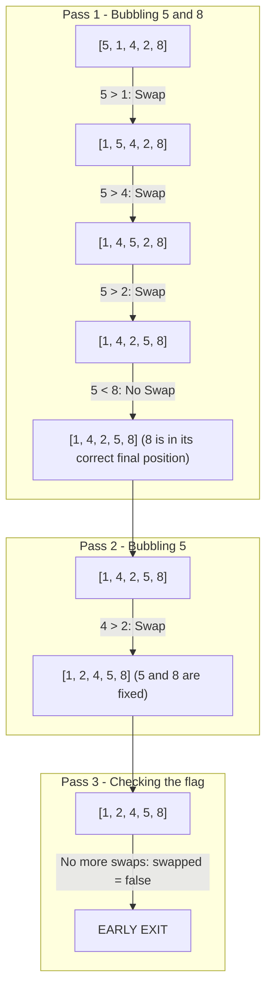

## Problem Description

Sorting a list is a foundational problem in computer science. The prompt is: Given an unordered array of N integers, sort the elements in ascending order such that `arr[0] <= arr[1] <= ... <= arr[N-1]`.

Bubble Sort is the first classic sorting algorithm every software engineer must master to clearly understand the mechanism of Adjacent Comparison & Swapping.

## Initial Approach Idea

The unoptimized original approach:

- Use two nested loops to iterate through the array N - 1 times. In each pass, iterate from the beginning to the end of the array and compare the adjacent pair `arr[j]` and `arr[j+1]`; if `arr[j] > arr[j+1]`, swap them.
- _Fatal flaw:_ The algorithm always performs exactly `N * (N - 1) / 2` comparisons even if the input array _is already perfectly sorted_ from the start, wasting `O(N²)` CPU cycles.

## Optimization Mindset & Algorithmic Structure

Optimizing Bubble Sort through 2 key improvements:

1. **Boundary Shrinking after each Pass:** After the `i`-th iteration, exactly `i` of the largest elements are guaranteed to be fixed at the end of the array. Therefore, the inner loop only needs to scan up to index `N - 1 - i`.
2. **Swapped Flag Optimization (Early Exit):** Use a boolean flag `bool swapped = false` before each pass. If no swap operations occur after a scan, the array is absolutely sorted &rarr; Break the loop immediately, bringing the Best-case to an ideal `Ω(N)`.

## Source Code Implementation & Dry Run

Illustrating the bubbling mechanism of the sample array `[5, 1, 4, 2, 8]` through each iteration:



**Standardized C++ Source Code Implementation:**

```c++
#include <iostream>
#include <vector>
#include <utility>

// Optimized Bubble Sort algorithm with swapped flag
void bubbleSort(std::vector<int>& arr) {
    int n = static_cast<int>(arr.size());
    for (int i = 0; i < n - 1; ++i) {
        bool swapped = false;
        // Shrink scan boundary to n - 1 - i
        for (int j = 0; j < n - 1 - i; ++j) {
            if (arr[j] > arr[j + 1]) {
                std::swap(arr[j], arr[j + 1]);
                swapped = true;
            }
        }
        // If no swaps occurred, exit early
        if (!swapped) {
            break;
        }
    }
}

int main() {
    std::vector<int> data = {5, 1, 4, 2, 8};
    bubbleSort(data);
    std::cout << "Sorted array: ";
    for (int x : data) std::cout << x << " ";
    std::cout << std::endl;
    return 0;
}
```

**Execution Flow Analysis (Dry Run Trace):**

- _Input:_ `data = {5, 1, 4, 2, 8}`, `N = 5`.
- _Pass 1 (`i = 0`):_ Compare `(5, 1) ->` Swap `{1, 5, 4, 2, 8}`; Compare `(5, 4) ->` Swap `{1, 4, 5, 2, 8}`; Compare `(5, 2) ->` Swap `{1, 4, 2, 5, 8}`; Compare `(5, 8) ->` Keep. Flag `swapped = true`. Element `8` is locked at index 4.
- _Pass 2 (`i = 1`):_ Scan up to index 2: Compare `(1, 4) ->` Ok; `(4, 2) ->` Swap `{1, 2, 4, 5, 8}`; `(4, 5) ->` Ok. Flag `swapped = true`. Element `5` locked at index 3.
- _Pass 3 (`i = 2`):_ Scan `(1, 2)` and `(2, 4)`, no swaps &rarr; `swapped = false` &rarr; `break` immediately! Saves 40% of calculations compared to the original version.

## Complexity Evaluation & Practical Applications

**Performance Evaluation per Standard Framework:**

1. **Worst-Case Time Complexity (`O`):** `O(N²)` when the array is in completely reverse order (e.g., `[5, 4, 3, 2, 1]`).
2. **Best-Case Time Complexity (`Ω`):** `Ω(N)` when the array is already sorted, thanks to the `swapped` flag stopping after exactly 1 pass.
3. **Average-Case Time Complexity (`Θ`):** `Θ(N²)` on a random distribution.
4. **Auxiliary Space Complexity:** `O(1)` - Purely in-place algorithm, only uses counters and a boolean flag.
5. **Stability:** Stable because the condition `arr[j] > arr[j+1]` maintains the relative order of equal elements.

**Practical Applications:** Checking if an array is sorted at a very low cost, used in embedded microcontrollers with ultra-small RAM, and serving as a model algorithm in computer science curricula.
