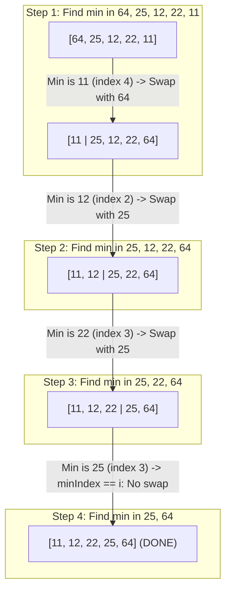

## Problem Description

In embedded systems or hardware using Flash / EEPROM memory, every Write Operation wears down the physical lifespan of the memory chip and consumes power. The prompt is: How can we sort an N-element integer array with **the absolute minimum possible number of swaps (Memory Writes)**?

Selection Sort solves this problem by partitioning the array and executing exactly a maximum of `N - 1` swap operations throughout the entire sorting lifecycle.

## Initial Approach Idea

Naive approach idea:

- Every time the array is traversed and an element smaller than `arr[i]` is encountered, immediately call `std::swap`.
- _Limitation:_ This method causes an uncontrollable number of memory writes (up to `O(N²)` swaps), degrading CPU cache performance and causing memory wear.

## Optimization Mindset & Algorithmic Structure

The partitioning and minimum-selection mindset of Selection Sort:

1. **Dividing the Array into 2 Logical Subarrays:** The array is divided into a Sorted Area `[0..i-1]` and an Unsorted Area `[i..N-1]`.
2. **Min-Index Scanning:** At each step `i`, only record the index `minIndex = i`. Traverse the entire unsorted area to find the true minimum element _without performing any swaps during the scan_.
3. **Exactly 1 Swap per Pass:** After finding the global `minIndex` of the unsorted area, execute exactly one `std::swap(arr[i], arr[minIndex])` operation if `minIndex != i`. This guarantees the total memory writes stay fixed at `O(N)`.

## Source Code Implementation & Dry Run

Illustrating the partitioning and moving of the minimum element for the array `[64, 25, 12, 22, 11]`:



**Standardized C++ Source Code:**

```c++
#include <iostream>
#include <vector>
#include <utility>

// Selection Sort algorithm: Optimizes memory writes with O(N) swaps
void selectionSort(std::vector<int>& arr) {
    int n = static_cast<int>(arr.size());
    for (int i = 0; i < n - 1; ++i) {
        int minIndex = i;
        // Find the minimum element in the unsorted subarray [i+1 .. n-1]
        for (int j = i + 1; j < n; ++j) {
            if (arr[j] < arr[minIndex]) {
                minIndex = j;
            }
        }
        // Only swap exactly once if the minimum position is different from the current position
        if (minIndex != i) {
            std::swap(arr[i], arr[minIndex]);
        }
    }
}

int main() {
    std::vector<int> data = {64, 25, 12, 22, 11};
    selectionSort(data);
    std::cout << "Sorted array: ";
    for (int x : data) std::cout << x << " ";
    std::cout << std::endl;
    return 0;
}
```

**Execution Flow Analysis (Dry Run Trace):**

- _Initialization:_ `data = {64, 25, 12, 22, 11}` (`N = 5`).
- _Pass `i = 0`:_ Unsorted area `[64, 25, 12, 22, 11]`. Scan for min `->` `minIndex = 4` (value 11). Swap `arr[0]` and `arr[4]` `->` Array becomes `{11, 25, 12, 22, 64}`.
- _Pass `i = 1`:_ Unsorted area `[25, 12, 22, 64]`. Scan for min `->` `minIndex = 2` (value 12). Swap `arr[1]` and `arr[2]` `->` Array becomes `{11, 12, 25, 22, 64}`.
- _Pass `i = 2`:_ Unsorted area `[25, 22, 64]`. Scan for min `->` `minIndex = 3` (value 22). Swap `arr[2]` and `arr[3]` `->` Array becomes `{11, 12, 22, 25, 64}`.
- _Pass `i = 3`:_ Unsorted area `[25, 64]`. `minIndex = 3` equals `i` `->` No swap consumed. Array perfectly sorted!

## Complexity Evaluation & Practical Applications

**Performance Evaluation per Standard Framework:**

1. **Time Complexity:** `O(N²)`, `Ω(N²)`, `Θ(N²)` - Always iterates through the full `(N * (N - 1)) / 2` comparisons regardless of the initial array order.
2. **Memory Writes Complexity:** `O(N)` - Exactly a maximum of `N - 1` swaps (Absolute advantage over Bubble Sort and Insertion Sort which can consume `O(N²)` writes).
3. **Auxiliary Space Complexity:** `O(1)` - Purely In-place.
4. **Stability:** Unstable because long-distance swaps can jump over and reverse the order of equal elements (e.g., `[4a, 4b, 2]` `->` `[2, 4b, 4a]`).

**Practical Applications:** Microcontroller embedded systems using Flash / EEPROM memory with limited write cycles, and sorting problems where the cost of writing to memory is vastly more expensive than reading.
