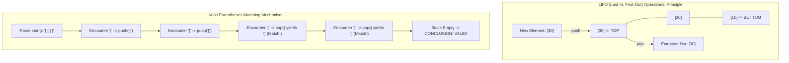

## Problem Description

In software architecture, numerous tasks require the ability to **Backtrack**, **Undo/Redo actions**, or **remember Nested Contexts**, such as Source Code Syntax Parsing or CPU function calling mechanisms. The common characteristic of these tasks is: _The last action to occur is the first action that needs to be processed and completed._

A **Stack** is an abstract linear data structure operating under the strict **Last-In, First-Out (LIFO)** principle. Every addition or removal of an element is only permitted at one single end, known as the **Top of the stack**.

## Initial Approach

A Stack can be implemented utilizing two foundational structures:

1. **Dynamic Array Stack:** Stores elements in a vector. The top of the stack corresponds to the `size - 1` index. Pros: Contiguous memory, excellent CPU Cache utilization. Both `push()` and `pop()` achieve an amortized `O(1)` cost.
2. **Linked List Stack:** Each element is a node pointing to the node below it. The top of the stack is the `head`. Pros: Highly flexible memory expansion, one node at a time, avoiding the heavy cost of capacity doubling.

## Optimization Mindset & Algorithm Structure

The three core invariant operations of a Stack:

- `push(x)`: Pushes a new element onto the top of the Stack in `O(1)`.
- `pop()`: Removes and returns the element currently at the top of the Stack in `O(1)`. Encounters a _Stack Underflow_ error if operated on an empty Stack.
- `top() / peek()`: Views the value of the top element without removing it in `O(1)`.

**Typical Application Problem: Valid Parentheses Check:**

Given a string containing bracket characters: `'('`, `')'`, `'{'`, `'}'`, `'['`, `']'`. The string is considered valid if every opening bracket is closed by the same type of closing bracket in the correct nested order.

- When an opening bracket is encountered (`(`, `{`, `[`): `push` onto the Stack.
- When a closing bracket is encountered (`)`, `}`, `]`): Check the Stack. If the Stack is empty &rarr; Invalid (extra closing bracket). Otherwise, `pop` the top element and verify if it matches the current closing bracket. If it mismatches &rarr; Invalid.
- End of string traversal: If the Stack is entirely empty &rarr; Valid (All opening brackets were correctly closed).

## Source Code Implementation & Dry Run

Diagram of the LIFO mechanism and the valid parentheses check problem:



**Complete C++ Source Code: Generic Stack and Parentheses Checking Function:**

```c++
#include <iostream>
#include <vector>
#include <string>
#include <stdexcept>

template <typename T>
class MyStack {
private:
    std::vector<T> storage;

public:
    void push(const T& value) {
        storage.push_back(value);
    }

    void pop() {
        if (empty()) {
            throw std::underflow_error("Stack is empty, cannot pop!");
        }
        storage.pop_back();
    }

    T& top() {
        if (empty()) {
            throw std::underflow_error("Stack is empty, cannot access top!");
        }
        return storage.back();
    }

    const T& top() const {
        if (empty()) {
            throw std::underflow_error("Stack is empty, cannot access top!");
        }
        return storage.back();
    }

    bool empty() const { return storage.empty(); }
    size_t size() const { return storage.size(); }
};

// Application: Check for valid parentheses
bool isValidParentheses(const std::string& s) {
    MyStack<char> st;

    for (char c : s) {
        if (c == '(' || c == '{' || c == '[') {
            st.push(c);
        } else if (c == ')' || c == '}' || c == ']') {
            if (st.empty()) return false; // Extra closing bracket

            char topChar = st.top();
            st.pop();

            if ((c == ')' && topChar != '(') ||
                (c == '}' && topChar != '{') ||
                (c == ']' && topChar != '[')) {
                return false; // Bracket type mismatch
            }
        }
    }

    return st.empty(); // All opening brackets must be closed
}

int main() {
    std::string s1 = "{[()]}";
    std::string s2 = "{[(])}";
    std::string s3 = "((()";

    std::cout << "--- VALID PARENTHESES CHECK (STACK APPLICATION) ---" << std::endl;
    std::cout << s1 << " -> " << (isValidParentheses(s1) ? "VALID" : "INVALID") << std::endl;
    std::cout << s2 << " -> " << (isValidParentheses(s2) ? "VALID" : "INVALID") << std::endl;
    std::cout << s3 << " -> " << (isValidParentheses(s3) ? "VALID" : "INVALID") << std::endl;

    return 0;
}
```

**Detailed Execution Trace (Dry Run):**

- _Test string:_ `s1 = "{[()]}"`.
- _Char 1 (`'{'`):_ Opening bracket &rarr; `push('{')`. Stack = `['{']`.
- _Char 2 (`'['`):_ Opening bracket &rarr; `push('[')`. Stack = `['{', '[']`.
- _Char 3 (`'('`):_ Opening bracket &rarr; `push('(')`. Stack = `['{', '[', '(']`.
- _Char 4 (`')'`):_ Closing bracket &rarr; `pop()` yields `'('` &rarr; Perfect match. Stack = `['{', '[']`.
- _Char 5 (`']'`):_ Closing bracket &rarr; `pop()` yields `'['` &rarr; Perfect match. Stack = `['{']`.
- _Char 6 (`'}'`):_ Closing bracket &rarr; `pop()` yields `'{'` &rarr; Perfect match. Stack = `[]`.
- _Conclusion:_ String parsing is finished and Stack is empty &rarr; Result `true` (Valid).

## Complexity Evaluation & Practical Applications

- **Time Complexity:**
  - `push()`: Amortized `O(1)` with Dynamic Array, absolute `O(1)` with Linked List.
  - `pop()`: Absolute `O(1)`.
  - `top() / peek()`: Absolute `O(1)`.
  - Search for an arbitrary element: `O(N)` (requires dismantling the Stack).
- **Space Complexity:** `O(N)` linear memory to store the elements.
- **Practical Applications:**
  - **Execution Call Stack:** Managing Stack Frames, storing local variables and return addresses during recursive function executions.
  - **Web Browsers and Office Applications:** Undo / Redo (Ctrl + Z) functionality and the Browser Back Button.
  - **Compilers:** Evaluating Reverse Polish Notation (RPN) math expressions and the Shunting-Yard parsing algorithm.
  - **Graph Algorithms:** Converting recursive Depth-First Search (DFS) into an Iterative DFS traversal.
