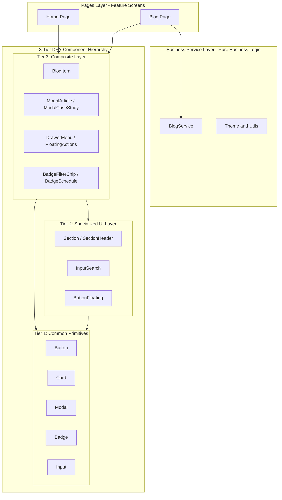

## Context & Problem

As a Single Page Application (SPA) scales in feature size, a very common architectural syndrome is the 'God Component', or the messy blending of UI logic (Presentation), state logic (State), and data handling logic (Data Hydration/Fetching).

In the initial codebase, the `BlogSection` and `App.tsx` components were shouldering too many responsibilities: managing routing, themes, parsing HTML tags, filtering articles, and directly rendering the card list. This led to code duplication (WET), breaking the Single Responsibility Principle, and making automated tests (Unit Tests) bloated and fragile.

## System Requirements

To definitively eliminate these architectural bottlenecks, the system needs to meet core design requirements:

1. **Clear Separation of Concerns:** Strictly separate Atomic UI (Primitives), Specialized UI, Composite Components, Business Services, and Main Screens (Pages).
2. **Strictly Apply the DRY Principle:** Eliminate repetitive HTML/CSS snippets through Component Composition techniques (assembling smaller components).
3. **Decoupled Business Service Layer:** All logic for parsing archives by month/year, article hydration, and filtering/sorting algorithms must be moved into a pure TypeScript Service layer, independent of the React Component Lifecycle.
4. **Type Safety & High Testability:** 100% of components must have explicit interfaces and can be unit tested independently without needing to mock complex DOM trees.

## Architectural Design

I built a 3-tier UI architectural model combined with an independent Service Layer following standard schematics:

**Detailed roles of each architectural tier:**

- **Tier 1 - Common Primitives (`src/components/common`):** Foundational components (`Button`, `Card`, `Badge`, `Input`, `Modal`) that are entirely stateless or contain minimal UI-state, strictly adhering to Design Tokens and semantic HTML.
- **Tier 2 - Specialized UI (`src/components/ui`):** Inheriting from Tier 1 but highly specialized (e.g., `InputSearch` integrating a magnifying glass icon and quick clear button, `ButtonFloating` integrating a neon glow effect).
- **Tier 3 - Composite Components (`src/components/composite`):** Assembling multiple Tier 1 & Tier 2 components to form a complete functional widget. Typical examples include `BlogItem` encapsulating `Card` + `Badge` + `TechTagList` + `Button` to read articles; `ModalArticle` integrating `Modal` + `TocSidebar` scrollspy.
- **Business Services (`src/services`):** Houses all business logic (dynamic import globs, date parsing, section assembling), helping UI components focus purely on display.
- **Pages Layer (`src/pages`):** Packages complete screens (`Home.tsx`, `Blog.tsx`), making `App.tsx` an extremely streamlined Root Router.

## Trade-off Analysis

**Benefits Gained:**

- _Extremely High Reusability:_ Any changes to the UI of a button or card only need to be updated in one single place within `common/`.
- _Maintainability & Scalability:_ Adding new pages or blog topics does not affect the existing source code.
- _Testability:_ Easy to write unit tests for each tier with 100% coverage.

**Trade-off Costs:**

- _Increased File Count:_ Requires managing a strict tiered folder structure and creating corresponding barrel exports (`index.ts`).
- _Team Discipline:_ Requires all members to strictly follow the rule: do not import backwards from lower tiers to higher tiers.

## Practical Lessons & Best Practices

- **Prioritize Composition over Inheritance:** Use Compound Components structures (like `Card.Header`, `Card.Body`, `Card.Footer`) instead of passing too many complex configuration props.
- **Consistent Naming Conventions:** Apply clear inheritance prefixes like `ModalCaseStudy`, `BadgeSchedule`, `ButtonFloatingScrollTop` to help anyone looking at the filename instantly recognize the component's role and origin.
- **Eliminate CSS Coupling:** Remove hard layout properties (inline styles) on shared components so child components remain fully flexible based on the parent's layout (Flexbox/Grid).
