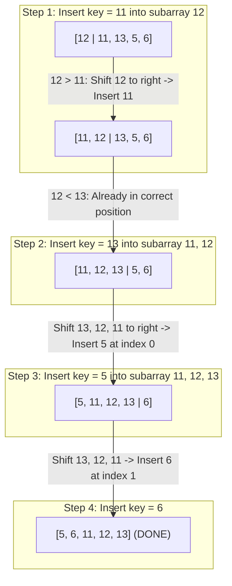

## Problem Description

In real-time data processing (Data Streaming), data arrives one element at a time and the sorted state must be continuously maintained. The prompt is: How can we insert a new element into an already ordered subarray with the lowest computational cost?

Insertion Sort exactly simulates the behavior of humans sorting playing cards in their hand: Drawing a new card one at a time and inserting it into the correct position within the previously sorted deck.

## Initial Approach Idea

Naive approach:

- Every time a new element `arr[i]` is taken, continuously swap backward toward the beginning of the array using `std::swap`.
- _Bottleneck:_ Each `std::swap` operation costs 3 memory assignments (using a temporary variable), resulting in wasted CPU resources when many elements have to be moved.

## Optimization Mindset & Algorithmic Structure

The Shifting mechanism and Adaptability of Insertion Sort:

1. **Subarray Shifting Technique:** Instead of continuously swapping, save the value to be inserted into a variable `key = arr[i]`. Only shift elements greater than `key` to the right by 1 position (`arr[j + 1] = arr[j]`), then place `key` into the single empty slot `arr[j + 1] = key`. This saves 66% of memory assignment operations.
2. **High Adaptability (Adaptive Sorting):** For nearly sorted arrays, the inner loop stops almost immediately after 1 comparison &rarr; Execution time achieves ultra-fast linearity `Ω(N)`.
3. **Online Algorithm:** Can sort data on the fly as each element is received from a network stream without needing to know the total size N beforehand.

## Source Code Implementation & Dry Run

Illustrating the process of shifting and inserting the element `key` in the array `[12, 11, 13, 5, 6]`:



**Standardized C++ Source Code:**

```c++
#include <iostream>
#include <vector>

// Insertion Sort algorithm: Adaptive subarray shifting technique
void insertionSort(std::vector<int>& arr) {
    int n = static_cast<int>(arr.size());
    for (int i = 1; i < n; ++i) {
        int key = arr[i];
        int j = i - 1;
        // Shift elements greater than key to the right by 1 position
        while (j >= 0 && arr[j] > key) {
            arr[j + 1] = arr[j];
            --j;
        }
        // Place key into the appropriate gap
        arr[j + 1] = key;
    }
}

int main() {
    std::vector<int> data = {12, 11, 13, 5, 6};
    insertionSort(data);
    std::cout << "Sorted array: ";
    for (int x : data) std::cout << x << " ";
    std::cout << std::endl;
    return 0;
}
```

**Execution Flow Analysis (Dry Run Trace):**

- _Initialization:_ `data = {12, 11, 13, 5, 6}` (`N = 5`). Initial sorted subarray is `{12}`.
- _Pass `i = 1`:_ `key = 11`. `j = 0`: `arr[0] = 12 > 11` `->` Assign `arr[1] = 12`, `j = -1` (stop). Assign `arr[0] = 11` `->` Array: `{11, 12, 13, 5, 6}`.
- _Pass `i = 2`:_ `key = 13`. `j = 1`: `arr[1] = 12 < 13` (stop immediately). Assign `arr[2] = 13` `->` Array: `{11, 12, 13, 5, 6}`.
- _Pass `i = 3`:_ `key = 5`. Sequentially shift 13, 12, 11 to the right `->` Assign `arr[0] = 5` `->` Array: `{5, 11, 12, 13, 6}`.
- _Pass `i = 4`:_ `key = 6`. Shift 13, 12, 11 to the right `->` Assign `arr[1] = 6` `->` Array: `{5, 6, 11, 12, 13}`.

## Complexity Evaluation & Practical Applications

**Performance Evaluation per Standard Framework:**

1. **Worst-Case Time Complexity (`O`):** `O(N²)` when the array is in completely reverse order.
2. **Best-Case Time Complexity (`Ω`):** `Ω(N)` when the array is already sorted (while loop only runs 1 comparison per pass).
3. **Average-Case Time Complexity (`Θ`):** `Θ(N²)` on a random distribution.
4. **Auxiliary Space Complexity:** `O(1)` - Purely in-place.
5. **Stability:** Stable.

**Practical Applications:** Serves as the core sub-algorithm in industry-standard hybrid algorithms like **TimSort** (in Python, Java) and **Introsort** (in C++ `std::sort`) when the subarray size drops to `N <= 16 - 32`.
