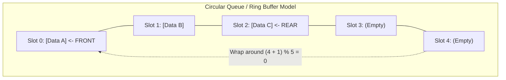

## Problem Description

In Asynchronous Processing systems, web servers handling thousands of concurrent connections, Print Spoolers, or distributed message broker systems (Kafka, RabbitMQ), requests must be processed in the **exact chronological order they were received**: _The request that arrives first must be served first._

A **Queue** is a linear data structure operating under the **First-In, First-Out (FIFO)** principle. Data is added at one end called the **Rear / Tail** and removed from the opposite end called the **Front / Head**.

## Initial Approach

If implementing a Queue using a standard static Array: Every time we add an element, we increment the `rear` pointer; every time we retrieve an element (`dequeue`), we increment the `front` pointer.

After several insertion and deletion operations, the `rear` pointer will reach the end of the array while the memory slots before `front` have been completely emptied. Even though the array has plenty of empty space left, we cannot insert new elements. This phenomenon is called **Index Drift / False Overflow**.

## Optimization Mindset & Algorithm Structure

To completely solve the memory waste problem, the standard solution is a **Circular Queue / Ring Buffer**:

1. **Circular Indexing Space:** Treat the array as a closed circle connecting the last index `capacity - 1` back to the first index `0` using Modulo Arithmetic:

```
next_index = (current_index + 1) % capacity
```

2. **Distinguishing Empty and Full States:** There are 2 popular techniques:

- _Counter Technique:_ Maintain a `count` variable storing the actual number of elements. Empty when `count == 0`, Full when `count == capacity`.
- _One Slot Open Technique:_ Empty when `front == rear`, Full when `(rear + 1) % capacity == front`.

3. **Constant Performance:** Both adding to the rear (`enqueue`) and removing from the front (`dequeue`) take only a few simple arithmetic operations in absolute **`O(1)`** time without any memory reallocation or copying.

## Source Code Implementation & Dry Run

Diagram of the Circular Ring Buffer's operational mechanism:



**Complete C++ Source Code: Implementing a Circular Queue Ring Buffer:**

```c++
#include <iostream>
#include <vector>
#include <stdexcept>

template <typename T>
class CircularQueue {
private:
    std::vector<T> buffer;
    size_t frontIdx;
    size_t rearIdx;
    size_t count;
    size_t capacity;

public:
    CircularQueue(size_t cap)
        : buffer(cap), frontIdx(0), rearIdx(0), count(0), capacity(cap) {}

    // Add an element to the rear of the queue (Enqueue): O(1)
    bool enqueue(const T& value) {
        if (isFull()) {
            return false; // Queue is full
        }
        buffer[rearIdx] = value;
        rearIdx = (rearIdx + 1) % capacity; // Wrap around index
        ++count;
        return true;
    }

    // Remove an element from the front of the queue (Dequeue): O(1)
    bool dequeue(T& outValue) {
        if (isEmpty()) {
            return false; // Queue is empty
        }
        outValue = buffer[frontIdx];
        frontIdx = (frontIdx + 1) % capacity; // Wrap around index
        --count;
        return true;
    }

    // View the element at the front without removing it: O(1)
    T front() const {
        if (isEmpty()) throw std::underflow_error("Queue is empty!");
        return buffer[frontIdx];
    }

    bool isEmpty() const { return count == 0; }
    bool isFull() const { return count == capacity; }
    size_t size() const { return count; }
};

int main() {
    CircularQueue<int> q(4); // Circular queue with capacity 4

    std::cout << "--- CIRCULAR QUEUE DEMO ---" << std::endl;
    q.enqueue(10);
    q.enqueue(20);
    q.enqueue(30);
    q.enqueue(40);

    std::cout << "Is queue full? " << (q.isFull() ? "YES" : "NO") << std::endl;

    int val;
    q.dequeue(val);
    std::cout << "Dequeued: " << val << std::endl; // Removes 10
    q.dequeue(val);
    std::cout << "Dequeued: " << val << std::endl; // Removes 20

    // Add new elements to test the wrap-around functionality
    q.enqueue(50);
    q.enqueue(60);

    std::cout << "Current front element: " << q.front() << std::endl; // Should be 30

    return 0;
}
```

**Detailed Execution Trace (Dry Run):**

- _Initialization:_ `capacity = 4, frontIdx = 0, rearIdx = 0, count = 0`.
- _Enqueue 10, 20, 30, 40:_
  - Insert 10 at index 0 &rarr; `rearIdx = 1`.
  - Insert 20 at index 1 &rarr; `rearIdx = 2`.
  - Insert 30 at index 2 &rarr; `rearIdx = 3`.
  - Insert 40 at index 3 &rarr; `rearIdx = (3 + 1) % 4 = 0`. `count = 4` (Full!).
- _Dequeue 2 times:_ Extract 10 (`frontIdx = 1`), extract 20 (`frontIdx = 2`). `count = 2`.
- _Enqueue 50:_ Write at `buffer[0] = 50` &rarr; `rearIdx = 1` (Successfully wrapped around without memory overflow!).
- _Enqueue 60:_ Write at `buffer[1] = 60` &rarr; `rearIdx = 2`. `front()` still correctly points to `buffer[2] = 30`.

## Complexity Evaluation & Practical Applications

- **Enqueue (Add to rear):** Absolute `O(1)`.
- **Dequeue (Remove from front):** Absolute `O(1)`.
- **Front / Peek:** Absolute `O(1)`.
- **Space Complexity:** `O(K)` where `K` is the fixed capacity of the Ring Buffer. It never requires dynamic allocation.
- **Practical Applications:**
  - **Breadth-First Search (BFS):** Graph traversal to find the unweighted shortest path by expanding layers wave by wave.
  - **CPU Scheduling in Operating Systems (Round-Robin):** Alternating Time Slices among running processes.
  - **Producer-Consumer Pattern:** Lock-Free Ring Buffers for ultra-fast message passing between Threads.
  - **Real-Time Audio Processing (Audio Streaming Buffers):** Continuously feeding audio sample data to the sound card without Audio Dropouts.
