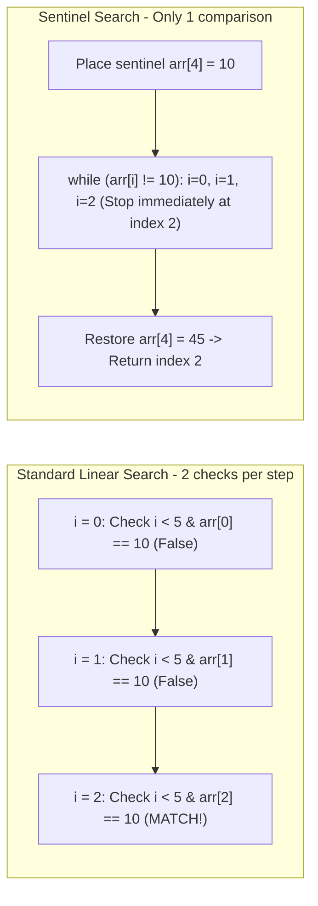

## Problem Description

Data retrieval is the most frequent operation in any software application. The prompt is: Given a list of `N` _unsorted_ elements or a linked data stream that does not support random access (like a Singly Linked List), find the first occurrence index of a `target` value, or return `-1` if not found.

Linear Search is the only viable general solution when the data lacks any supplementary structure or pre-existing sorted order.

## Initial Approach Idea

The standard approach (Standard Loop):

- Use a `for (int i = 0; i < n; ++i)` loop to scan sequentially from the beginning to the end of the array.
- _CPU Bottleneck:_ At each iteration, the CPU must perform **2 comparisons**: a bounds check `i < n` and a value check `arr[i] == target`. On large datasets, the bounds check accounts for up to 50% of the loop's execution time.

## Optimization Mindset & Algorithmic Structure

Optimization using the Sentinel Element Technique (Sentinel Linear Search):

1. **Place a Sentinel at the end of the array:** Temporarily store the last element `last = arr[n - 1]`, then assign the `target` value to the last position `arr[n - 1] = target`.
2. **Completely eliminate the bounds check `i < n`:** Since the `target` is guaranteed to appear at the end of the array, the `while (arr[i] != target) ++i;` loop will never run out of bounds. The number of CPU comparison instructions is reduced by exactly 50%.
3. **Restore and Verify:** After exiting the loop, restore the value `arr[n - 1] = last` and check if the found index `i` is a real element in the array or the sentinel itself.

## Source Code Implementation & Dry Run

Illustrating the sequential scanning mechanism and sentinel technique on the array `[20, 35, 10, 80, 45]` with `target = 10`:



**Complete C++ source code for both methods:**

```c++
#include <iostream>
#include <vector>

// 1. Standard Linear Search
int linearSearch(const std::vector<int>& arr, int target) {
    int n = static_cast<int>(arr.size());
    for (int i = 0; i < n; ++i) {
        if (arr[i] == target) {
            return i;
        }
    }
    return -1;
}

// 2. Linear Search with Sentinel Technique
int sentinelLinearSearch(std::vector<int>& arr, int target) {
    int n = static_cast<int>(arr.size());
    if (n == 0) return -1;

    int last = arr[n - 1];
    arr[n - 1] = target; // Place sentinel at the end

    int i = 0;
    while (arr[i] != target) {
        ++i;
    }

    arr[n - 1] = last; // Restore the original array

    if (i < n - 1 || arr[n - 1] == target) {
        return i;
    }
    return -1;
}

int main() {
    std::vector<int> data = {20, 35, 10, 80, 45};
    int target = 10;
    int idx = sentinelLinearSearch(data, target);
    std::cout << "Position of " << target << ": " << idx << std::endl;
    return 0;
}
```

**Execution Flow Analysis (Dry Run Trace):**

- _Input:_ `data = {20, 35, 10, 80, 45}`, `target = 10`.
- _Sentinel:_ Store `last = 45`, assign `data[4] = 10`. Temporary array becomes `{20, 35, 10, 80, 10}`.
- _Loop:_ `i = 0` (20 != 10) `-> i = 1` (35 != 10) `-> i = 2` (`10 == 10` &rarr; Exit loop).
- _Verification:_ Restore `data[4] = 45`. `i = 2 < 4` `->` Conclude the element is at index `2`.

## Complexity Evaluation & Practical Applications

**Performance Evaluation per Standard Framework:**

1. **Worst-Case Time Complexity (`O`):** `O(N)` when the element is at the end of the array or does not exist.
2. **Best-Case Time Complexity (`Ω`):** `Ω(1)` when the element is right at the first position (`i = 0`).
3. **Average-Case Time Complexity (`Θ`):** `Θ(N)` (requires scanning `N / 2` elements on average).
4. **Auxiliary Space Complexity:** `O(1)` - Consumes no extra auxiliary memory.
5. **CPU Cache Locality Advantage:** Because the array is scanned sequentially through memory blocks (Sequential Memory Access), Linear Search achieves maximum Cache Line loading efficiency (Spatial Locality), often running faster than search trees for `N <= 64`.

**Practical Applications:** Lookups on small unsorted datasets, searching on Linked Lists, filtering raw data streams from network sockets.
