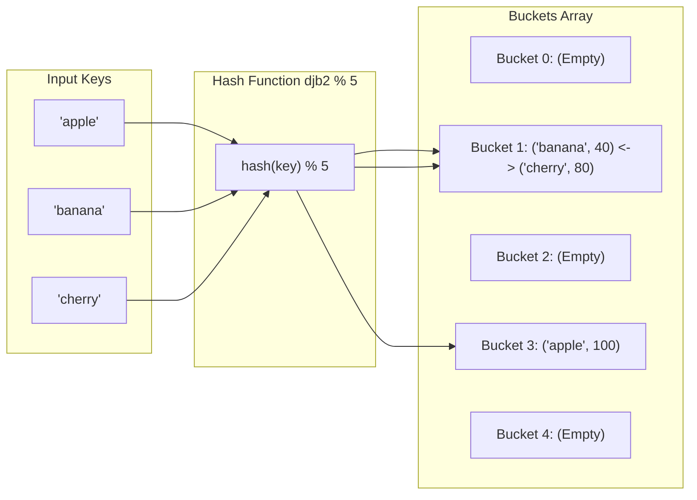

## Problem Description

In high-performance applications (such as User Session Stores, Database Indexing, or distributed caches like Redis), Key-Value Lookups occur millions of times per second. If we used an Array or Linked List, the `O(N)` linear search cost would crash the entire system when the dataset exceeds millions of records.

A **Hash Table (or Hash Map)** is a revolutionary data structure that enables all 3 operations—**Insert**, **Delete**, and **Lookup**—in **average constant time `O(1)`**, regardless of how large the dataset grows.

## Initial Approach

The essence of a Hash Table is using a **Hash Function** to convert an input key (string, complex object) into an integer index representing a memory slot (Bucket) in an array:

```
bucket_index = hash(key) % capacity
```

The core mathematical challenge: According to the _Pigeonhole Principle_, because the space of possible keys is infinite while the hash array size is finite, there will always be cases where **two different keys generate the same memory index (`hash(k₁) % M == hash(k₂) % M`)**. This phenomenon is called a **Hash Collision**.

## Optimization Mindset & Algorithm Structure

To resolve collisions and maintain `O(1)` performance, two classic architectural strategies are applied:

1. **Separate Chaining:**

- Each memory slot (Bucket) of the hash table is a Linked List (or a Red-Black Tree when the chain gets long, e.g., > 8 elements).
- When a collision occurs, the new `{key, value}` pair is simply appended to the list at that bucket in `O(1)`.
- This is the default mechanism in C++'s `std::unordered_map` and Java's `HashMap`.

2. **Open Addressing / Linear Probing:**

- All elements reside directly within the array. When a `bucket` is occupied, the algorithm probes adjacent slots `(bucket + 1) % capacity` until an empty slot is found.

3. **Load Factor Control & Dynamic Rehashing:**

- The Load Factor `alpha = N / capacity` indicates how full the table is.
- When `alpha >= 0.75`, the hash table automatically allocates a new array twice the size (`capacity x 2`) and rehashes all elements (Rehashing) to preserve the average `O(1)` complexity.

## Source Code Implementation & Dry Run

Diagram of hash function mapping and collision resolution using Separate Chaining:



**Complete C++ Source Code: Custom HashTable with Separate Chaining:**

```c++
#include <iostream>
#include <vector>
#include <list>
#include <string>
#include <utility>

template <typename K, typename V>
class HashTable {
private:
    struct Entry {
        K key;
        V value;
    };

    std::vector<std::list<Entry>> table;
    size_t numElements;
    size_t capacity;

    // Polynomial hash function djb2 for std::string type
    size_t hashFunction(const std::string& key) const {
        unsigned long hash = 5381;
        for (char c : key) {
            hash = ((hash << 5) + hash) + static_cast<unsigned char>(c);
        }
        return hash % capacity;
    }

    void rehash() {
        size_t oldCapacity = capacity;
        capacity *= 2;
        std::vector<std::list<Entry>> oldTable = std::move(table);
        table.resize(capacity);
        numElements = 0;

        for (size_t i = 0; i < oldCapacity; ++i) {
            for (const auto& entry : oldTable[i]) {
                insert(entry.key, entry.value);
            }
        }
    }

public:
    HashTable(size_t initialCapacity = 7)
        : numElements(0), capacity(initialCapacity) {
        table.resize(capacity);
    }

    void insert(const K& key, const V& value) {
        if (static_cast<double>(numElements) / capacity >= 0.75) {
            rehash();
        }

        size_t bucket = hashFunction(key);
        for (auto& entry : table[bucket]) {
            if (entry.key == key) {
                entry.value = value; // Update if key already exists
                return;
            }
        }
        table[bucket].push_back({key, value});
        ++numElements;
    }

    bool get(const K& key, V& outValue) const {
        size_t bucket = hashFunction(key);
        for (const auto& entry : table[bucket]) {
            if (entry.key == key) {
                outValue = entry.value;
                return true;
            }
        }
        return false;
    }

    bool remove(const K& key) {
        size_t bucket = hashFunction(key);
        for (auto it = table[bucket].begin(); it != table[bucket].end(); ++it) {
            if (it->key == key) {
                table[bucket].erase(it);
                --numElements;
                return true;
            }
        }
        return false;
    }

    size_t size() const { return numElements; }
};

int main() {
    HashTable<std::string, int> ht;

    std::cout << "--- HASH TABLE DEMO (SEPARATE CHAINING) ---" << std::endl;
    ht.insert("apple", 100);
    ht.insert("banana", 40);
    ht.insert("cherry", 80);

    int val;
    if (ht.get("banana", val)) {
        std::cout << "Value of 'banana': " << val << std::endl;
    }

    ht.remove("banana");
    std::cout << "Search for 'banana' after deletion: "
              << (ht.get("banana", val) ? "FOUND" : "NOT FOUND") << std::endl;

    return 0;
}
```

**Detailed Execution Trace (Dry Run):**

- _Initialization:_ `capacity = 7, numElements = 0`.
- _Insert "apple" (val 100):_ `hash("apple") % 7 = 3` &rarr; Placed in `table[3]`. `numElements = 1`.
- _Insert "banana" (val 40):_ `hash("banana") % 7 = 1` &rarr; Placed in `table[1]`. `numElements = 2`.
- _Insert "cherry" (val 80):_ `hash("cherry") % 7 = 1` (Collision with banana!) &rarr; Appended to the linked list at `table[1]`. `table[1] = [banana, cherry]`.
- _Lookup "banana":_ Hashes to bucket 1 &rarr; Scans the first element of the list, matches key "banana" &rarr; Returns `40` in `O(1)`.

## Complexity Evaluation & Practical Applications

- **Average Case:** `O(1)` for Insert, Delete, and Lookup, assuming a uniform hash function.
- **Worst Case:** `O(N)` when all keys hash to the exact same bucket (mitigated by upgrading long chains to Red-Black Trees to achieve `O(\log N)`).
- **Space Complexity:** `O(N + M)` where `N` is the number of elements and `M` is the size of the bucket array.
- **Practical Applications:**
  - **Database Indexing Systems:** Hash Indexes in PostgreSQL / MySQL Memory Engine for equality comparisons (`=`).
  - **In-Memory Caches:** Redis and Memcached storing ultra-fast Key-Value pairs.
  - **Compilers & Interpreters:** Symbol Tables managing variable names, functions, and scoping rules.
