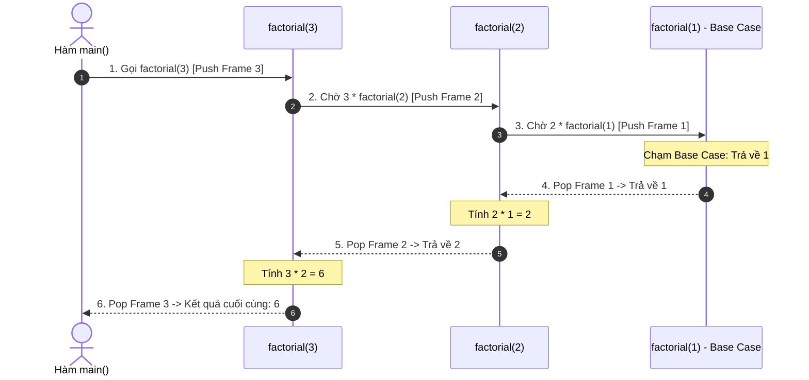

## Mô tả bài toán

Nhiều bài toán phức tạp (duyệt cây nhị phân, phân tách tệp tin thư mục, quay lui Backtracking, giải thuật Chia để Trị) rất khó giải quyết bằng các vòng lặp tuần tự phẳng. Đề bài đặt ra: Làm thế nào để giải quyết một bài toán lớn bằng cách phân rã thành các bài toán con _cùng dạng nhưng có quy mô nhỏ hơn_?

Đệ quy (Recursion) là kỹ thuật lập trình mà trong đó hàm tự gọi lại chính nó để giải quyết bài toán con cho tới khi chạm điểm dừng cơ sở.

## Ý tưởng tiếp cận ban đầu

Cạm bẫy đệ quy ngây thơ:

- Thiếu điều kiện dừng (Missing Base Case) hoặc điều kiện dừng không bao giờ đạt tới &rarr; Hàm tự gọi vô tận dẫn đến **Tràn ngăn xếp (Call Stack Overflow Crash)**.
- Đệ quy giải quyết các bài toán con trùng lặp (Overlapping Subproblems) như tính số Fibonacci ngây thơ làm bùng nổ độ phức tạp lên cấp số mũ `O(2ᴺ)`.

## Tư duy tối ưu & Cấu trúc thuật toán

Nguyên lý cốt lõi và Kỹ thuật tối ưu hóa Đệ quy:

1. **Hai Thành phần Bất biến của Hàm Đệ quy:**

- _Điều kiện cơ sở (Base Case):_ Điểm dừng không cần đệ quy, trả về kết quả trực tiếp ngay lập tức.
- _Bước đệ quy (Recursive Step):_ Gọi lại hàm với tham số `N` đã được thu hẹp về phía Base Case.

2. **Cơ chế Phân bổ Call Stack:** Mỗi lần gọi hàm, hệ điều hành cấp phát một Stack Frame (chứa tham số, biến cục bộ, địa chỉ trả về). Khi đạt Base Case, các frame lần lượt được thu hồi (Unwind/Pop).
3. **Tối ưu hóa Đệ quy Đuôi (Tail Call Optimization - TCO):** Nếu lời gọi đệ quy là _thao tác cuối cùng_ của hàm (không còn phép tính tồn đọng nào), trình biên dịch C++ hiện đại có thể tái sử dụng ngay Stack Frame hiện tại &rarr; Giảm dung lượng Call Stack từ `O(N)` về `O(1)`.

## Triển khai mã nguồn & Dry Run

Minh họa quá trình Đẩy (Push) và Thu hồi (Pop) Call Stack khi tính `factorial(3)`:



**Mã nguồn C++ chuẩn hóa:**

```c++
#include <iostream>

// 1. Đệ quy Truyền thống: Tốn O(N) Call Stack Frames
long long factorial(int n) {
    if (n <= 1) return 1; // Base Case
    return n * factorial(n - 1); // Phép nhân bị hoãn lại chờ đệ quy trả về
}

// 2. Đệ quy Đuôi (Tail Recursive): Tối ưu O(1) Auxiliary Space
long long factorialTail(int n, long long accumulator = 1) {
    if (n <= 1) return accumulator; // Base Case
    // Lời gọi đệ quy là thao tác cuối cùng, tích lũy kết quả trực tiếp
    return factorialTail(n - 1, n * accumulator);
}

// 3. Tính lũy thừa nhanh (Fast Exponentiation): O(log N) Time
double fastPower(double base, int exp) {
    if (exp == 0) return 1.0; // Base Case
    if (exp < 0) return 1.0 / fastPower(base, -exp);
    double half = fastPower(base, exp / 2);
    if (exp % 2 == 0) {
        return half * half;
    } else {
        return half * half * base;
    }
}

int main() {
    int n = 5;
    std::cout << n << "! (Đệ quy đuôi) = " << factorialTail(n) << std::endl;
    std::cout << "2^10 (Fast Power) = " << fastPower(2.0, 10) << std::endl;
    return 0;
}
```

**Phân tích luồng thực thi (Dry Run Trace):**

- _Tính `factorialTail(3, 1)`:_
- `N = 3, 	ext{acc} = 1`: Gọi `factorialTail(2, 3 * 1 = 3)`.
- `N = 2, 	ext{acc} = 3`: Gọi `factorialTail(1, 2 * 3 = 6)`.
- `N = 1, 	ext{acc} = 6`: Chạm Base Case (`N <= 1`) &rarr; Trả về trực tiếp `6` mà không cần tích lũy phép nhân khi quay lui.
- _Tính `fastPower(2, 10)`:_ Chia bài toán thành `2^5 -> 2^2 -> 2^1 -> 2^0` &rarr; Chỉ mất đúng 4 bước đệ quy thay vì 10 vòng lặp.

## Đánh giá độ phức tạp & Ứng dụng thực tế

**Đánh giá Hiệu năng theo Framework Chuẩn:**

1. **Time Complexity:** Phụ thuộc vào công thức truy hồi (Master Theorem), ví dụ: `O(N)` cho Giai thừa, `O(log₂ N)` cho Lũy thừa nhanh, `O(N log N)` cho QuickSort/MergeSort.
2. **Auxiliary Space Complexity:** `O(D)` trong đó `D` là độ sâu tối đa của Call Stack. Với Tail Call Optimization, không gian phụ trợ giảm xuống `O(1)`.
3. **Bảo vệ Ngăn xếp (Stack Safety):** Cần đảm bảo độ sâu đệ quy không vượt quá giới hạn an toàn của Call Stack (thường từ 10^4 đến 10^5 frames tùy hệ điều hành).

**Ứng dụng thực tế:** Duyệt cây nhị phân (Binary Tree Traversal), phân tích cú pháp AST trong trình biên dịch, thuật toán Chia để Trị (MergeSort/QuickSort), và giải thuật Quay lui (N-Queens, Sudoku Solver).
