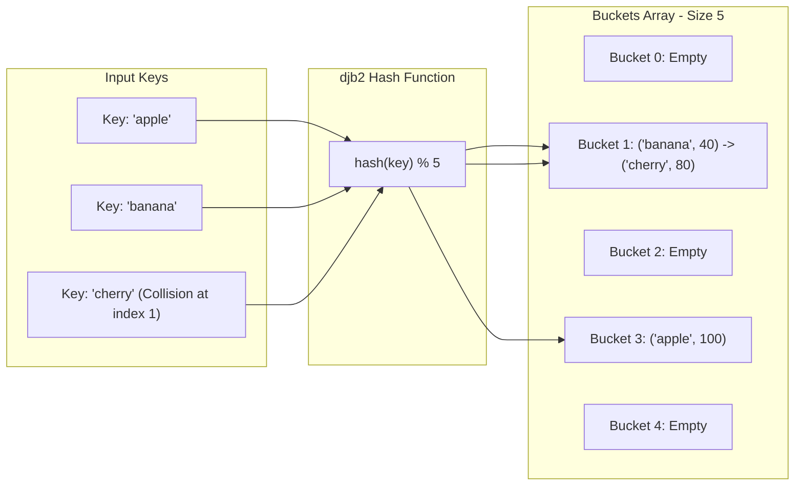

## Problem Description

In distributed systems, databases, and high-load web servers, looking up data by key (Key-Value Lookup) must happen instantaneously with ultra-low latency. The prompt is: Design a storage data structure that allows **Insert, Get, and Delete operations with an expected average time of `O(1)`**.

The Hash Table, combined with Hashing algorithms, is the global standard solution to achieve a constant `O(1)` access speed independent of data size.

## Initial Approach Idea

Comparing with traditional data structures:

- _Flat Array:_ Searching costs `O(N)` sequential comparisons.
- _Balanced Binary Search Tree (AVL / Red-Black Tree):_ Maintains `O(log N)` time, but still incurs key comparison costs and Tree Rebalancing overhead.

## Optimization Mindset & Algorithmic Structure

Hash Table Architecture and Collision Resolution strategies:

1. **Hash Function:** Maps a key of any size (string, object) to an integer `index = hash(key) % Capacity` distributed uniformly across memory slots (Buckets). A famous string hashing algorithm: `djb2` (multiply by 33 combined with XOR).
2. **Collision Resolution:** When two distinct keys produce the same hash index:

- _Separate Chaining:_ Each bucket is a Linked List. Upon collision, insert the new element into the list at that bucket.
- _Open Addressing:_ Probe for the next empty slot in the table (Linear Probing, Quadratic Probing, Double Hashing).

3. **Load Factor (`α`) & Rehashing:** When the ratio `α = (numElements / Capacity) >= 0.75`, the hash table automatically doubles its size and redistributes all elements to prevent linked lists from growing too long, maintaining `O(1)` performance.

## Source Code Implementation & Dry Run

Illustrating Separate Chaining Hash Table architecture handling collisions:



**Full C++ Implementation of a Complete Hash Table:**

```c++
#include <iostream>
#include <vector>
#include <list>
#include <string>
#include <utility>

// Complete Hash Table handling collisions with Separate Chaining
class HashTable {
private:
    struct Entry {
        std::string key;
        int value;
    };

    std::vector<std::list<Entry>> table;
    int numElements;
    int capacity;

    // Classic djb2 string hash function
    int hashFunction(const std::string& key) const {
        unsigned long hash = 5381;
        for (char c : key) {
            hash = ((hash << 5) + hash) + static_cast<unsigned char>(c); // hash * 33 + c
        }
        return static_cast<int>(hash % capacity);
    }

    // Rehashing mechanism to expand size when Load Factor exceeds threshold
    void rehash() {
        int oldCapacity = capacity;
        capacity *= 2;
        std::vector<std::list<Entry>> oldTable = std::move(table);
        table.resize(capacity);
        numElements = 0;

        for (int i = 0; i < oldCapacity; ++i) {
            for (const auto& entry : oldTable[i]) {
                insert(entry.key, entry.value);
            }
        }
    }

public:
    HashTable(int initialCapacity = 7) : numElements(0), capacity(initialCapacity) {
        table.resize(capacity);
    }

    void insert(const std::string& key, int value) {
        // Load Factor threshold >= 0.75 triggers Rehashing
        if (static_cast<double>(numElements) / capacity >= 0.75) {
            rehash();
        }

        int bucket = hashFunction(key);
        for (auto& entry : table[bucket]) {
            if (entry.key == key) {
                entry.value = value; // Update if key already exists
                return;
            }
        }
        table[bucket].push_back({key, value});
        ++numElements;
    }

    bool get(const std::string& key, int& outValue) const {
        int bucket = hashFunction(key);
        for (const auto& entry : table[bucket]) {
            if (entry.key == key) {
                outValue = entry.value;
                return true;
            }
        }
        return false;
    }

    bool remove(const std::string& key) {
        int bucket = hashFunction(key);
        for (auto it = table[bucket].begin(); it != table[bucket].end(); ++it) {
            if (it->key == key) {
                table[bucket].erase(it);
                --numElements;
                return true;
            }
        }
        return false;
    }
};

int main() {
    HashTable ht;
    ht.insert("apple", 100);
    ht.insert("banana", 40);
    ht.insert("cherry", 80);

    int val;
    if (ht.get("banana", val)) {
        std::cout << "Value of banana: " << val << std::endl;
    }
    return 0;
}
```

**Execution Flow Analysis (Dry Run Trace):**

- _Initialization:_ `capacity = 7`, `numElements = 0`.
- _Insert "apple" (value 100):_ `hashFunction("apple")` yields bucket `3` &rarr; Add `{"apple", 100}` to `table[3]`. `numElements = 1` (`α = 1/7  pprox 0.14`).
- _Insert "banana" (value 40):_ `hashFunction("banana")` yields bucket `1` &rarr; Add `{"banana", 40}` to `table[1]`. `numElements = 2`.
- _Insert "cherry" (value 80):_ Assume it hashes to the same bucket `1` &rarr; Hash collision! Separate Chaining appends `{"cherry", 80}` to the end of the linked list at `table[1]`.
- _Retrieve `get("banana")`:_ Computes hash to bucket `1` &rarr; Traverses the first node of the list and finds the "banana" key immediately &rarr; Returns `40` in `O(1)` time.

## Complexity Evaluation & Practical Applications

**Performance Evaluation per Standard Framework:**

1. **Average-Case Time Complexity (`Θ`):** Absolute `Θ(1)` for all three Insert, Search, and Delete operations when the hash function distributes well and `α < 0.75`.
2. **Worst-Case Time Complexity (`O`):** `O(N)` in extreme degenerate scenarios where all `N` elements collide into a single bucket.
3. **Auxiliary Space Complexity:** `O(N)` to store the bucket array and linked nodes.
4. **Hash Function Security:** In Production environments facing Denial-of-Service attacks (HashDoS Attacks), collision-resistant hash functions like **SipHash** should be used instead of simple ones.

**Practical Applications:** `std::unordered_map` / `std::unordered_set` in C++ STL, HashMap in Java, Objects/Maps in JavaScript V8, Redis In-Memory Cache, Database Query Hash-Join, and Routing Tables in computer networks.
