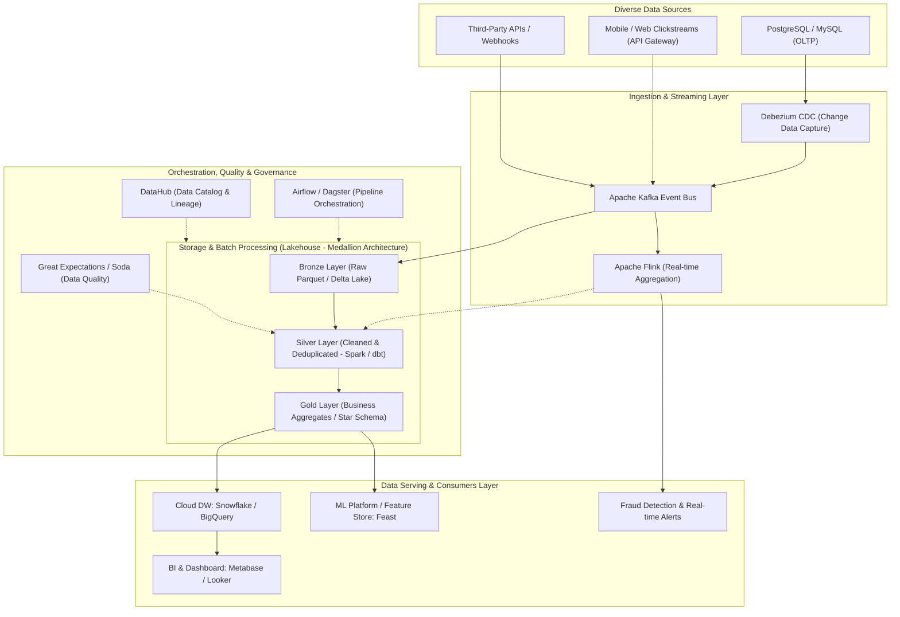

## Problem Statement & Overview

In the booming era of Artificial Intelligence (AI), Machine Learning, and Big Data, there is a classic tech industry proverb: _'Without reliable data pipelines, AI is just math on a whiteboard.'_ Every state-of-the-art Deep Learning model, recommendation algorithm, or Business Intelligence (BI) Dashboard becomes meaningless if the input data is flawed, fragmented, or delayed.

**Data Engineers (DE)** are the architects and builders behind that curtain. The core mission of a Data Engineer is to design, construct, operate, and optimize distributed systems to ingest, store, transform, and serve massive volumes of data (from Gigabytes to Petabytes) in a manner that is **Accurate**, **Reliable**, **Secure**, and **Low-Latency**.

This article provides a panoramic view of the Data Engineering career landscape, demystifies the paradigm shift from traditional Data Warehouse systems to the **Modern Data Stack (Lakehouse Architecture)**, and offers a standardized competency roadmap for software engineers looking to master this domain.

## Multidimensional Assessment / Benchmarking

To clearly understand the Data Engineer's position in the tech ecosystem, we need to analyze it through 2 lenses: Role delineation and Processing architecture models comparison.

**1. Role Delineation: Data Engineer vs Data Scientist vs Backend Engineer:**

<table style="width:100%; border-collapse: collapse; margin-bottom: 20px;">
  <thead>
    <tr style="border-bottom: 2px solid #e2e8f0; text-align: left;">
      <th style="padding: 8px;">Criteria</th>
      <th style="padding: 8px;">Backend Engineer</th>
      <th style="padding: 8px;">Data Engineer</th>
      <th style="padding: 8px;">Data Scientist</th>
    </tr>
  </thead>
  <tbody>
    <tr style="border-bottom: 1px solid #edf2f7;">
      <td style="padding: 8px"><b>Core Objective</b></td>
      <td style="padding: 8px">Build business application OLTP, APIs, Microservices</td>
      <td style="padding: 8px">Build data processing infrastructure OLAP, Data Pipelines, Lakehouse</td>
      <td style="padding: 8px">Build statistical models, Machine Learning, extract Insights</td>
    </tr>
    <tr style="border-bottom: 1px solid #edf2f7;">
      <td style="padding: 8px"><b>System Type</b></td>
      <td style="padding: 8px">OLTP (ACID transactions, single-record CRUD)</td>
      <td style="padding: 8px">OLAP / Streaming (Processing billions of records in batch or stream)</td>
      <td style="padding: 8px">Experimental (Jupyter Notebooks, Model Training, R&D)</td>
    </tr>
    <tr style="border-bottom: 1px solid #edf2f7;">
      <td style="padding: 8px"><b>Main Toolbelt</b></td>
      <td style="padding: 8px">Java/Go/Node.js, PostgreSQL, Redis, Docker, k8s</td>
      <td style="padding: 8px">Python/Scala, Spark, Kafka, Iceberg, dbt, Airflow, Snowflake</td>
      <td style="padding: 8px">Python/R, PyTorch, TensorFlow, Scikit-learn, Pandas</td>
    </tr>
    <tr>
      <td style="padding: 8px"><b>Success Metric</b></td>
      <td style="padding: 8px">API Latency (p99 &lt; 50ms), Uptime 99.99%, Throughput</td>
      <td style="padding: 8px">Data Freshness, Pipeline SLA, Data Quality, Compute Cost</td>
      <td style="padding: 8px">Model Accuracy, F1-Score, Business Lift, ROI prediction</td>
    </tr>
  </tbody>
</table>

**2. The Evolution of Data Processing Architectures:**

- **Traditional ETL (Extract &rarr; Transform &rarr; Load):** Data from source databases is extracted, heavily transformed computationally on intermediate servers (Informatica, SSIS), and then loaded into a Data Warehouse. _Bottleneck:_ Processing servers easily overload as data grows, and deployment cycles take months.
- **Modern ELT (Extract &rarr; Load &rarr; Transform):** Leveraging the horizontal scaling power (Massively Parallel Processing - MPP) of Cloud Data Warehouses (Snowflake, BigQuery), raw data is loaded directly into the warehouse first (Load Raw), and then transformed in-place using SQL and **dbt (data build tool)**.
- **Lakehouse Architecture (Data Lake + Data Warehouse):** Combines the unlimited cheap storage of Object Storage (S3, GCS) using open formats (Apache Parquet, Apache Iceberg, Delta Lake) with the high-speed SQL query and ACID transaction capabilities of a warehouse.

## Practical Experience / Case Study

To illustrate the actual work of a Data Engineer, below is the architecture of a Modern Data Platform processing over 100 million events/day in an E-commerce & Fintech ecosystem:

**Hard-earned Technical Lessons from Building Data Pipelines:**

1. **Idempotency & Replayability:** A perfect pipeline must ensure that: When re-running a task (Backfill or Retry) for the same data timeframe, the final result in the warehouse is never duplicated or corrupted. Partition Overwrite and Merge-on-Read techniques are key.
2. **Data Contracts:** Prevent Backend engineers from arbitrarily changing column names or data types in the database, which would crash the entire downstream reporting system. Apply a Schema Registry (Avro / Protobuf) to strictly manage schema versions.
3. **Medallion Architecture Strategy (Bronze &rarr; Silver &rarr; Gold):** Always preserve raw data completely intact (Bronze) so you can recover from any disaster scenario, clean and standardize it in the Silver layer, and only expose business-optimized aggregates to end-users in the Gold layer.

## Actionable Suggestions

A Skill Matrix roadmap for engineers looking to transition or specialize in Data Engineering:

1. **Programming & Core Computer Science Skills:**

- Master **Python** (data manipulation, scripting, API interaction) and **Advanced SQL** (Window functions, CTEs, optimizing Explain Plans).
- Deep understanding of Algorithms, Data Structures, and Memory Architecture (Memory/CPU cache, I/O bound vs CPU bound).
- Recommended to learn **Scala/Java** or **Rust** for working with core distributed systems.

2. **Data Modeling:**

- Master Kimball Dimensional Modeling methodologies (Fact Tables, Dimension Tables, Star Schema, Snowflake Schema).
- Understand Data Vault architecture and Slowly Changing Dimensions techniques (SCD Type 1, 2, 3).

3. **Distributed Computing & Big Data Processing Tools:**

- Master **Apache Spark**: Understand RDDs, DataFrames, the Catalyst Optimizer mechanism, Tungsten memory manager, and how to resolve Data Skew (uneven data distribution across partitions).
- Master modern transformation tools: **dbt (data build tool)** combined with Snowflake/BigQuery data warehouses.

4. **Streaming & Orchestration Systems:**

- Build event pipelines using **Apache Kafka** (Topics, Partitions, Consumer Groups, Exactly-Once Semantics).
- Schedule and manage complex dependent DAGs with **Apache Airflow** or **Dagster**.

5. **DataOps Culture & Data Quality:**

- Automate data testing with `dbt test`, `Great Expectations`, or `Soda`.
- Establish CI/CD systems for data pipeline source code and monitor Data Lineage.

## Open Questions & Discussion

Prominent technology trends reshaping the future of Data Engineering that the community is actively discussing:

- **Data Mesh vs Centralized Lakehouse:** Should enterprises continue maintaining a Centralized Data Team managing the entire Data Platform, or decentralize Domain-Driven Data Ownership back to independent business departments?
- **The Impact of Generative AI on Data Engineering:** AI can automatically write SQL queries and dbt pipelines, but the Data Engineer's role will aggressively shift toward defining the **Semantic Layer**, establishing **Data Quality Guardrails**, and building **RAG / Vector Database Pipelines** infrastructure to serve LLM models.
- **The Dominance of Open Table Formats:** Will the battle between Apache Iceberg, Delta Lake, and Apache Hudi end with a convergence on the Apache Iceberg standard across all major cloud platforms (AWS, GCP, Snowflake, Databricks)?

**Discussion Prompt:** _In your opinion, does the greatest challenge of building a large-scale data system in reality lie in the technology aspect (Tools/Frameworks) or the governance process aspect (Data Governance & Data Culture)? Share your perspective!_
