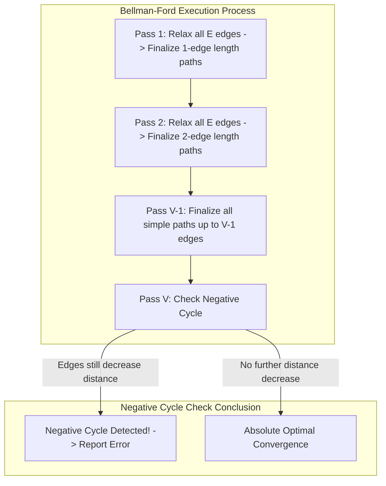

## Problem Description

In reality, not all networks have positive costs. In financial markets (Currency Arbitrage) or renewable energy exchange models, graph edges can carry **negative weights** (representing profit gained when executing a transaction).

The premise: Given a directed graph `G = (V, E)` with `V` vertices and `E` edges, edge weights can take any negative values. Given a source vertex `s`:

1. Find the shortest path length from `s` to all other vertices in the graph.
2. Detect if the graph contains a **Negative Cycle**. A negative cycle is a closed loop with a total sum of weights < 0. If traversed infinitely, the path cost would drop to `-\infty`, rendering the shortest path problem unsolvable.

The Bellman-Ford algorithm (developed by Richard Bellman and Lester Ford Jr.) is the standard algorithm perfectly equipped to tackle this challenge.

## Initial Approach

Dijkstra's algorithm fails entirely on graphs with negative weights because its Greedy strategy permanently finalizes the vertex with the smallest distance at each step. When a negative edge appears later, the distance to an already finalized vertex could decrease, but Dijkstra has no mechanism to undo or update vertices already removed from the priority queue.

To ensure absolute accuracy without greedy assumptions, we must shift to a Dynamic Programming mindset: Systematically perform Relaxation over the _entire list of edges_.

## Optimization Mindset & Algorithm Structure

The mathematical essence of Bellman-Ford is based on the **Simple Path Invariant**:

1. **Maximum length of a shortest path:** In a graph of `V` vertices with no negative cycles, any simple shortest path can contain at most `V - 1` edges (if it contained `V` or more edges, by the Dirichlet principle at least 1 vertex would repeat, forming a cycle).
2. **Dynamic Programming over `V - 1` passes:** At the `k`-th pass (where `k = 1, 2, ..., V - 1`), the algorithm guarantees finding the shortest path for all journeys using up to `k` edges. After `V - 1` passes over all `E` edges, every vertex achieves its absolute optimal distance.
3. **Negative Cycle Detection Mechanism (Pass `V`):** Perform an additional `V`-th pass. If there is still any edge `(u, v)` satisfying `dist[u] + w < dist[v]`, it proves the existence of a negative cycle that can continue shortening the distance infinitely.
4. **Early-Exit Flag Optimization:** If during any pass no edges are relaxed (`updated = false`), the algorithm can terminate immediately. This helps Bellman-Ford achieve `O(E)` in the best case when the graph has a favorable structure.

## Source Code Implementation & Dry Run

Relaxation progression diagram across passes and negative cycle detection mechanism:



**Complete C++ Source Code (Bellman-Ford with Early-Exit & Negative Cycle Detection):**

```c++
#include <iostream>
#include <vector>
#include <algorithm>

const long long INF = 1e18;

struct Edge {
    int from;
    int to;
    long long weight;
};

// Return result includes distance array and negative cycle flag
struct BellmanFordResult {
    std::vector<long long> dist;
    std::vector<int> parent;
    bool hasNegativeCycle;
};

BellmanFordResult bellmanFord(int startNode, int numVertices, const std::vector<Edge>& edges) {
    std::vector<long long> dist(numVertices, INF);
    std::vector<int> parent(numVertices, -1);
    dist[startNode] = 0;

    // 1. Perform up to V - 1 relaxation passes over all edges
    for (int i = 1; i <= numVertices - 1; ++i) {
        bool updated = false;

        for (const auto& edge : edges) {
            if (dist[edge.from] != INF && dist[edge.from] + edge.weight < dist[edge.to]) {
                dist[edge.to] = dist[edge.from] + edge.weight;
                parent[edge.to] = edge.from;
                updated = true;
            }
        }

        // Early exit optimization if no edges were relaxed
        if (!updated) {
            break;
        }
    }

    // 2. V-th pass: Check for the existence of Negative Cycles
    bool hasNegativeCycle = false;
    for (const auto& edge : edges) {
        if (dist[edge.from] != INF && dist[edge.from] + edge.weight < dist[edge.to]) {
            hasNegativeCycle = true;
            break; // Negative cycle found
        }
    }

    return {dist, parent, hasNegativeCycle};
}

int main() {
    int V = 5;
    std::vector<Edge> edges = {
        {0, 1, -1},
        {0, 2, 4},
        {1, 2, 3},
        {1, 3, 2},
        {1, 4, 2},
        {3, 2, 5},
        {3, 1, 1},
        {4, 3, -3}
    };

    auto result = bellmanFord(0, V, edges);

    if (result.hasNegativeCycle) {
        std::cout << "WARNING: The graph contains a Negative-Weight Cycle!" << std::endl;
    } else {
        std::cout << "--- BELLMAN-FORD RESULTS FROM VERTEX 0 ---" << std::endl;
        for (int i = 0; i < V; ++i) {
            std::cout << "Distance to vertex " << i << ": " << result.dist[i] << std::endl;
        }
    }

    return 0;
}
```

**Detailed Execution Trace (Dry Run):**

- _Initialization:_ `dist = [0, \infty, \infty, \infty, \infty]`.
- _Pass 1 (i = 1):_
  - Edge `(0->1, w=-1)`: `dist[1] = 0 + (-1) = -1`.
  - Edge `(0->2, w=4)`: `dist[2] = 4`.
  - Edge `(1->3, w=2)`: `dist[3] = -1 + 2 = 1`.
  - Edge `(1->4, w=2)`: `dist[4] = -1 + 2 = 1`.
  - Edge `(1->2, w=3)`: `-1 + 3 = 2 < 4` &rarr; `dist[2] = 2`.
  - End of pass 1: `dist = [0, -1, 2, 1, 1]`.
- _Pass 2 (i = 2):_
  - Edge `(4->3, w=-3)`: `dist[4] + (-3) = 1 - 3 = -2 < dist[3]=1` &rarr; Relaxed! `dist[3] = -2`.
  - Edge `(3->1, w=1)`: `dist[3] + 1 = -2 + 1 = -1 == dist[1]` (unchanged).
  - End of pass 2: `dist = [0, -1, 2, -2, 1]`.
- _Pass 3 (i = 3):_ No edges yield further improvement &rarr; Flag `updated = false` &rarr; Early exit at pass 3 instead of waiting for all 4 passes.
- _Negative cycle check:_ Traverse all 8 edges, no edge further reduces distances &rarr; The graph is safe, finalized result `[0, -1, 2, -2, 1]`.

## Complexity Evaluation & Practical Applications

Performance metric summary according to the standard RAM Model:

- **Time Complexity:**
  - Worst & Average Case: `O(V \times E)`. For dense graphs (`E \approx V^2`), complexity approaches `O(V^3)`.
  - Best Case: `O(E)` when the distance array converges after the first pass thanks to the early exit flag.
- **Space Complexity:** `O(V)` for the `dist` and `parent` arrays, plus `O(E)` to store the discrete edge list.
- **Practical Applications:**
  - **RIP (Routing Information Protocol):** The foundation of Distance-Vector Routing in telecommunication networks.
  - **Currency Arbitrage Detection:** Transforming exchange rate matrices using logarithms `-log(rate)` to turn the rate multiplication problem into finding negative cycles in a graph.
  - **Difference Constraints System Scheduling:** Solving systems of inequalities of the form `x[j] - x[i] \leq c` in compilers and project management.
