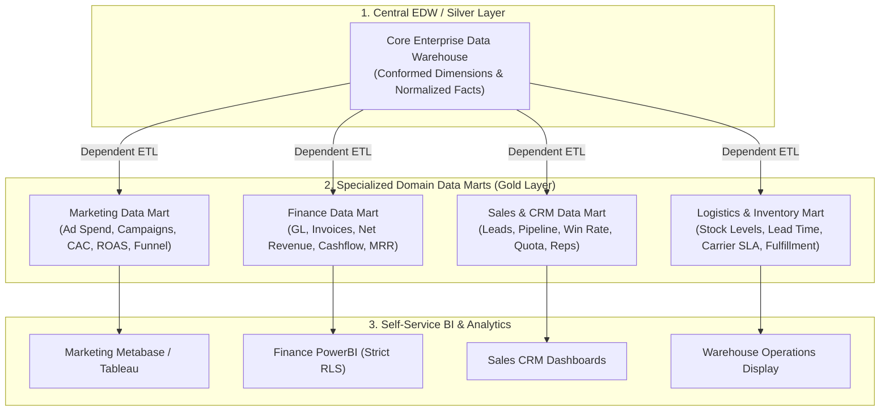

## Business Scenario / Data Requirements

As a business grows beyond its initial scale, the central Enterprise Data Warehouse (EDW) begins to exhibit severe organizational and operational barriers:

1. **Centralized Team Bottleneck:** All business departments (Marketing, Finance, Sales, Supply Chain, HR) queue up and send report modification requests to a single Data Engineering team. The deployment cycle for a new metric drags on from weeks to months, slowing down the pace of business decision-making.
2. **Metric Discrepancy & Conflict:** The Marketing department calculates Revenue based on Gross Merchandise Value (GMV) of orders placed; Sales calculates it based on successfully delivered orders; Finance calculates it based on actual cash flow recognized through payment gateways after deducting discounts and refunds. As a result, department heads walk into meetings with completely contradictory report numbers.
3. **Data Governance & RBAC (Role-Based Access Control) Crisis:** Sensitive data like HR payrolls or detailed Finance P&L reports cannot be granted open access across the entire EDW, necessitating a strict tiered Domain-based Access Control mechanism.
4. **Degrading Query Performance on Massive Data Warehouses:** Scanning through company-wide, billion-row aggregate Fact tables merely to serve a localized ad campaign performance report wastes cloud compute costs and increases query latency.

**Core Concept & Objectives of a Data Mart:**

A **Data Mart** is a specialized partition or database extracted, optimized, and organized specifically for an individual department or business process. The primary goal of a Data Mart is to deliver _Curated & Analytics-Ready data_, ensuring Self-Service Analytics for Domain Data Analysts with response speeds measured in milliseconds.

## Data Modeling

To successfully design a Data Mart, a data engineer must master 3 core architectural models and select the appropriate table structure for each use case.

**1. Three Classic Data Mart Architectural Models:**

<table style="width:100%; border-collapse: collapse; margin-bottom: 20px;">
  <thead>
    <tr style="border-bottom: 2px solid #e2e8f0; text-align: left;">
      <th style="padding: 8px;">Data Mart Type</th>
      <th style="padding: 8px;">Data Source</th>
      <th style="padding: 8px;">Core Advantages</th>
      <th style="padding: 8px;">Risks & Limitations</th>
    </tr>
  </thead>
  <tbody>
    <tr style="border-bottom: 1px solid #edf2f7;">
      <td style="padding: 8px"><b>Dependent Data Mart</b></td>
      <td style="padding: 8px">100% extracted from the central Enterprise Data Warehouse (EDW)</td>
      <td style="padding: 8px">Ensures absolute consistency, a Single Source of Truth, tight data governance</td>
      <td style="padding: 8px">Dependent on EDW construction progress, higher operational costs</td>
    </tr>
    <tr style="border-bottom: 1px solid #edf2f7;">
      <td style="padding: 8px"><b>Independent Data Mart</b></td>
      <td style="padding: 8px">Loaded directly from source application DBs (OLTP, CRM, APIs)</td>
      <td style="padding: 8px">Super-fast deployment, fully independent, immediately solves urgent departmental needs</td>
      <td style="padding: 8px">Creates Data Silos, metric definition conflicts, complex spider-web pipeline maintenance</td>
    </tr>
    <tr style="border-bottom: 1px solid #edf2f7;">
      <td style="padding: 8px"><b>Hybrid Data Mart</b></td>
      <td style="padding: 8px">Combines central EDW data with External Ad-hoc Data sources</td>
      <td style="padding: 8px">Perfect balance between standard consistency and agile flexibility with new data</td>
      <td style="padding: 8px">Requires setting up automated Data Reconciliation and testing processes</td>
    </tr>
  </tbody>
</table>

**2. Standard Data Marts Distribution Architecture Diagram (Kimball Bus & Medallion Architecture):**



**3. Table Model Selection in Data Marts: Star Schema vs One Big Table (OBT):**

- **Star Schema Model:** Features a Fact Table in the center linked to Conformed Dimension tables (like `dim_date`, `dim_customer`). _Best when:_ The Data Mart must serve highly flexible analytical viewpoints and reuse common data dimensions across the company.
- **One Big Table (OBT) Model:** Denormalizes all Facts and Dimensions entirely into a single wide table containing 50 to 200 columns. _Best when:_ The Data Mart directly feeds modern BI tools (PowerBI DirectQuery, ClickHouse, Apache Superset) to achieve instant query speeds without executing any JOINs at runtime.

## Building Pipelines / Processing Scripts

To illustrate how to construct a modern standard Data Mart, below is **dbt (data build tool)** source code building a **Marketing Performance Data Mart**. It combines ad spend data (Google/Facebook Ads) with order conversion data from the central warehouse to automatically compute core metrics: Customer Acquisition Cost (CAC), Return on Ad Spend (ROAS), and Funnel Conversion Rates.

**1. dbt Model: Building the Marketing Performance Data Mart (`marts_marketing_roi.sql`):**

```sql
-- models/gold/marts/marketing/marts_marketing_roi.sql
{{
    config(
        materialized='table',
        schema='marketing_mart',
        cluster_by=['campaign_date', 'channel'],
        tags=['marketing', 'daily_marts']
    )
}}

WITH daily_ad_spend AS (
    -- Ad spend data by channel from Staging
    SELECT
        ad_date AS campaign_date,
        channel, -- 'google_ads', 'facebook_ads', 'tiktok_ads'
        campaign_id,
        campaign_name,
        SUM(spend_amount) AS total_spend,
        SUM(impressions) AS total_impressions,
        SUM(clicks) AS total_clicks
    FROM {{ ref('stg_marketing_ad_spend') }}
    GROUP BY ad_date, channel, campaign_id, campaign_name
),

daily_orders_attributed AS (
    -- Revenue and new customer data from central Fact Orders
    SELECT
        CAST(f.order_timestamp AS DATE) AS campaign_date,
        f.utm_channel AS channel,
        f.utm_campaign_id AS campaign_id,
        COUNT(DISTINCT f.order_id) AS attributed_orders,
        COUNT(DISTINCT CASE WHEN c.is_first_order = TRUE THEN f.customer_key END) AS new_customers_acquired,
        SUM(f.net_amount) AS attributed_revenue
    FROM {{ ref('fact_orders') }} f
    INNER JOIN {{ ref('dim_customers') }} c ON f.customer_key = c.customer_key
    WHERE f.order_status = 'COMPLETED'
    GROUP BY CAST(f.order_timestamp AS DATE), f.utm_channel, f.utm_campaign_id
)

SELECT
    -- Unique identifier key for the Data Mart row
    MD5(s.campaign_date || '-' || s.channel || '-' || s.campaign_id) AS marketing_mart_key,
    s.campaign_date,
    s.channel,
    s.campaign_id,
    s.campaign_name,

    -- Input metrics
    s.total_spend,
    s.total_impressions,
    s.total_clicks,
    COALESCE(o.attributed_orders, 0) AS attributed_orders,
    COALESCE(o.new_customers_acquired, 0) AS new_customers_acquired,
    COALESCE(o.attributed_revenue, 0) AS attributed_revenue,

    -- Pre-computed Semantic KPIs
    ROUND(s.total_clicks / NULLIF(s.total_impressions, 0) * 100, 2) AS ctr_pct, -- Click-Through Rate
    ROUND(s.total_spend / NULLIF(s.total_clicks, 0), 2) AS cpc_amount, -- Cost Per Click
    ROUND(s.total_spend / NULLIF(o.new_customers_acquired, 0), 2) AS cac_amount, -- Customer Acquisition Cost
    ROUND(COALESCE(o.attributed_revenue, 0) / NULLIF(s.total_spend, 0), 2) AS roas_ratio -- Return On Ad Spend
FROM daily_ad_spend s
LEFT JOIN daily_orders_attributed o
    ON s.campaign_date = o.campaign_date
    AND s.channel = o.channel
    AND s.campaign_id = o.campaign_id;
```

**2. Implementing Row-Level Security (RLS) on the Finance Data Mart:**

Ensuring branch managers can only view figures for their own region, while the Chief Financial Officer (CFO) can see nationwide data:

```sql
-- Create Row Access Policy on Snowflake Data Mart
CREATE OR REPLACE ROW ACCESS POLICY finance_region_policy
AS (region_name VARCHAR) RETURNS BOOLEAN ->
  CURRENT_ROLE() IN ('FINANCE_CFO_ROLE', 'EXECUTIVE_ADMIN')
  OR (CURRENT_ROLE() = 'NORTH_MANAGER_ROLE' AND region_name = 'NORTH')
  OR (CURRENT_ROLE() = 'SOUTH_MANAGER_ROLE' AND region_name = 'SOUTH');

-- Apply the policy to the Finance Data Mart table
ALTER TABLE finance_mart.marts_branch_pnl
ADD ROW ACCESS POLICY finance_region_policy ON (region_code);
```

## Data Testing & Performance Optimization

To ensure Data Marts operate accurately without running 'out of sync' with the central warehouse and achieve maximum performance, Data Engineers must deploy the following strategies:

**1. Cross-Mart Reconciliation Testing:**

- One of the most severe errors is when Total Revenue on the Finance Data Mart mismatches the Sales Data Mart. We set up automated Reconciliation Assertions running daily:

```sql
-- tests/reconciliation_finance_vs_sales_revenue.sql
-- Test returns 0 rows if figures match perfectly
WITH fin_rev AS (
    SELECT SUM(net_revenue) AS total_fin FROM {{ ref('marts_finance_revenue') }}
    WHERE report_date = CURRENT_DATE() - 1
),
sales_rev AS (
    SELECT SUM(gross_amount - discount_amount) AS total_sales FROM {{ ref('marts_sales_orders') }}
    WHERE order_date = CURRENT_DATE() - 1
)
SELECT
    f.total_fin,
    s.total_sales,
    ABS(f.total_fin - s.total_sales) AS discrepancy
FROM fin_rev f, sales_rev s
WHERE ABS(f.total_fin - s.total_sales) > 0.01; -- Red alert if discrepancy > 1 cent
```

**2. Self-Service BI Query Performance Optimization Techniques:**

- **Pre-computed Aggregate Tables / Materialized Views:** For executive dashboards that only view monthly or yearly figures, building Pre-aggregated Mart tables reduces query time by 99% compared to scanning daily granular detail tables.
- **Leveraging Caching & Semantic Layer Mechanisms:** Use tools like _Cube.js_ or the _dbt Semantic Layer_ in front of the Data Mart to cache query results In-memory, enabling Dashboards to load instantly in under 100ms.

**3. Performance & Operational Cost Benchmark Matrix:**

<table style="width:100%; border-collapse: collapse; margin-bottom: 20px;">
  <thead>
    <tr style="border-bottom: 2px solid #e2e8f0; text-align: left;">
      <th style="padding: 8px;">Exploitation Method</th>
      <th style="padding: 8px">Dashboard Load Time (p95)</th>
      <th style="padding: 8px">Data Consistency Level</th>
      <th style="padding: 8px">Self-Service Capability</th>
    </tr>
  </thead>
  <tbody>
    <tr style="border-bottom: 1px solid #edf2f7;">
      <td style="padding: 8px"><b>Direct Querying Raw EDW</b></td>
      <td style="padding: 8px">18,400ms (18.4s)</td>
      <td style="padding: 8px">High, but queries are very complex</td>
      <td style="padding: 8px">Very Low (Mandatory Data Engineer assistance)</td>
    </tr>
    <tr style="border-bottom: 1px solid #edf2f7;">
      <td style="padding: 8px"><b>Independent Data Marts (Silos)</b></td>
      <td style="padding: 8px">650ms</td>
      <td style="padding: 8px">Very Low (Metric definition conflicts)</td>
      <td style="padding: 8px">Medium (Each team does it their own way)</td>
    </tr>
    <tr style="border-bottom: 1px solid #edf2f7;">
      <td style="padding: 8px"><b>Dependent Star / OBT Data Marts</b></td>
      <td style="padding: 8px"><b>45ms</b></td>
      <td style="padding: 8px"><b>Absolute 100%</b> (Single Source of Truth)</td>
      <td style="padding: 8px"><b>Very High</b> (Data Analysts drag & drop reports)</td>
    </tr>
  </tbody>
</table>

## Conclusion & Recommendations

Data Marts are the vital bridges that convert the massive computational power of a Data Warehouse into tangible business value for each individual department.

**Actionable Recommendations for Enterprise Data Teams:**

1. **Absolutely Prioritize Dependent Data Mart Architecture:** Always build Data Marts originating from standardized data layers (Conformed Silver/EDW). Avoid the temptation of patching together Independent Data Marts which leads to disastrous data conflict down the line.
2. **Unify Metric Definitions at the Semantic Layer:** Do not let calculation logic (e.g., CAC, LTV, Churn formulas) scatter across individual BI reports. Encapsulate them inside dbt code or a unified Semantic Layer.
3. **Domain-Based Authorization (Data Mesh Mindset):** Empower Domain Data Analysts in each department with ownership and exploitation rights over their Data Mart, while the central Data Engineering team focuses on ensuring infrastructure, core data quality, and pipeline SLAs.
4. **Automate Daily Reconciliation Testing:** Always deploy cross-mart reconciliation tests to catch any anomalies early before the data lands on the executive board's desk.

> **Final Note:** _A successful Data Mart system is realized when business analysts can confidently generate accurate reports in minutes, and corporate leaders can completely trust every single number presented!_
