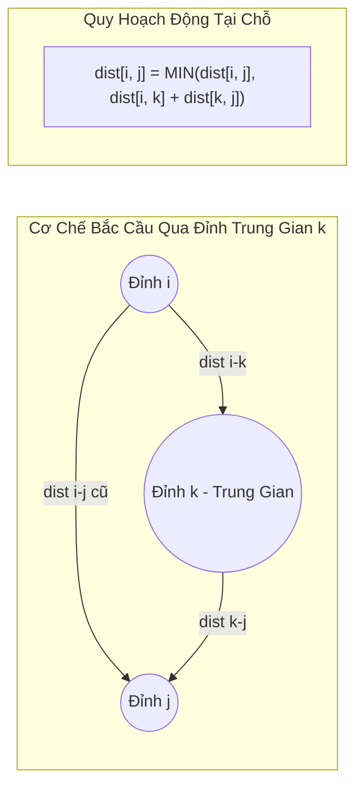

## Mô tả bài toán

Trong nhiều hệ thống thực tế như mạng lưới giao thông liên tỉnh, hệ thống chuyển mạch viễn thông hay game nhập vai thế giới mở, hệ thống cần tra cứu khoảng cách ngắn nhất giữa **bất kỳ cặp đỉnh nào `(u, v)`** trong thời gian tức thời `O(1)` sau một pha tiền tính toán duy nhất.

Bài toán đặt ra: **Tìm đường đi ngắn nhất giữa mọi cặp đỉnh (All-Pairs Shortest Path - APSP)**. Cho đồ thị có hướng `G = (V, E)` có thể chứa trọng số âm nhưng không chứa chu trình âm. Hãy xây dựng ma trận khoảng cách `dist[V][V]` sao cho `dist[i][j]` biểu diễn độ dài đường đi ngắn nhất từ đỉnh `i` đến đỉnh `j` với mọi `0 <= i, j < V`.

Thuật toán Floyd-Warshall (do Robert Floyd và Stephen Warshall công bố năm 1962) là lời giải kinh điển, thanh lịch bậc nhất với cấu trúc 3 vòng lặp lồng nhau cực kỳ tinh gọn.

## Ý tưởng tiếp cận ban đầu

Ta có thể giải bài toán APSP bằng cách chạy các thuật toán Single-Source Shortest Path (SSSP) lặp lại `V` lần với từng đỉnh làm nguồn:

- **Chạy Dijkstra `V` lần:** Chi phí thời gian `O(V x (V + E) \log V)`. Tuy nhiên, Dijkstra không xử lý được trọng số âm.
- **Chạy Bellman-Ford `V` lần:** Chi phí thời gian `O(V x V x E) = O(V² E)`. Với đồ thị dày (`E ~ V²`), độ phức tạp vọt lên `O(V⁴)` - quá nặng nề và phức tạp khi cài đặt.

Floyd-Warshall giải quyết bài toán này chỉ trong `O(V³)` bằng Quy hoạch động ma trận tại chỗ (In-Place Matrix DP), không đòi hỏi cấu trúc dữ liệu phức tạp như Heap hay danh sách kề.

## Tư duy tối ưu & Cấu trúc thuật toán

Tư duy Quy hoạch động của Floyd-Warshall định nghĩa trạng thái dựa trên **Tập hợp các đỉnh trung gian cho phép**:

1. **Định nghĩa trạng thái DP:** Gọi `dp[k][i][j]` là độ dài đường đi ngắn nhất từ đỉnh `i` đến đỉnh `j`, với điều kiện mọi đỉnh trung gian trên hành trình chỉ được phép chọn từ tập hợp `{0, 1, 2, ..., k}`.
2. **Hệ thức chuyển trạng thái:** Khi mở rộng tập đỉnh trung gian cho phép từ `k - 1` lên `k`, ta có hai lựa chọn:

- _Không đi qua đỉnh trung gian `k`:_ Khoảng cách giữ nguyên là `dp[k - 1][i][j]`.
- _Đi qua đỉnh trung gian `k`:_ Đường đi tách thành hai đoạn `i -> k` và `k -> j`, có tổng chi phí là `dp[k - 1][i][k] + dp[k - 1][k][j]`.

```
dp[k][i][j] = min(
    dp[k - 1][i][j],
    dp[k - 1][i][k] + dp[k - 1][k][j]
)
```

3. **Tối ưu bộ nhớ tại chỗ (In-Place 2D Matrix):** Vì các giá trị ở hàng `k` và cột `k` không bị thay đổi khi dùng chính đỉnh `k` làm trung gian, ta có thể bỏ chiều `k` và cập nhật trực tiếp trên ma trận 2 chiều `dist[i][j]`. _Quy tắc vàng:_ Vòng lặp biến `k` bắt buộc phải nằm ở **ngoài cùng**.
4. **Phát hiện Chu trình Âm:** Sau khi hoàn tất `V` bước, kiểm tra đường chéo chính: Nếu tồn tại bất kỳ đỉnh `i` nào có `dist[i][i] < 0`, chứng tỏ đỉnh `i` nằm trong một chu trình âm.

## Triển khai mã nguồn & Dry Run

Sơ đồ chuyển trạng thái ma trận qua đỉnh trung gian `k`:



**Mã nguồn C++ hoàn chỉnh (Floyd-Warshall với Ma trận Next để tái tạo đường đi):**

```c++
#include <iostream>
#include <vector>
#include <algorithm>

const long long INF = 1e15; // Giá trị an toàn tránh tràn số khi cộng

void floydWarshall(int V, std::vector<std::vector<long long>>& dist,
                   std::vector<std::vector<int>>& nextNode) {
    // Khởi tạo ma trận nextNode để phục vụ truy vết đường đi
    for (int i = 0; i < V; ++i) {
        for (int j = 0; j < V; ++j) {
            if (i == j) {
                dist[i][j] = 0;
                nextNode[i][j] = j;
            } else if (dist[i][j] != INF) {
                nextNode[i][j] = j;
            } else {
                nextNode[i][j] = -1;
            }
        }
    }

    // 3 vòng lặp lồng nhau: k (đỉnh trung gian) BẮT BUỘC ở vòng ngoài cùng
    for (int k = 0; k < V; ++k) {
        for (int i = 0; i < V; ++i) {
            for (int j = 0; j < V; ++j) {
                if (dist[i][k] != INF && dist[k][j] != INF) {
                    if (dist[i][k] + dist[k][j] < dist[i][j]) {
                        dist[i][j] = dist[i][k] + dist[k][j];
                        nextNode[i][j] = nextNode[i][k]; // Kế thừa đỉnh bước kế tiếp
                    }
                }
            }
        }
    }
}

// Hàm kiểm tra chu trình âm qua đường chéo chính
bool hasNegativeCycle(int V, const std::vector<std::vector<long long>>& dist) {
    for (int i = 0; i < V; ++i) {
        if (dist[i][i] < 0) return true;
    }
    return false;
}

// Phục dựng đường đi ngắn nhất từ u đến v
std::vector<int> getPath(int u, int v, const std::vector<std::vector<int>>& nextNode) {
    if (nextNode[u][v] == -1) return {};
    std::vector<int> path = {u};
    while (u != v) {
        u = nextNode[u][v];
        path.push_back(u);
    }
    return path;
}

int main() {
    int V = 4;
    std::vector<std::vector<long long>> dist(V, std::vector<long long>(V, INF));
    std::vector<std::vector<int>> nextNode(V, std::vector<int>(V, -1));

    // Khởi tạo đồ thị có hướng 4 đỉnh
    dist[0][1] = 5;
    dist[0][3] = 10;
    dist[1][2] = 3;
    dist[2][3] = 1;

    floydWarshall(V, dist, nextNode);

    if (hasNegativeCycle(V, dist)) {
        std::cout << "Phat hien Chu trinh am trong do thi!" << std::endl;
    } else {
        std::cout << "--- MA TRAN KHOANG CACH NGAN NHAT ALL-PAIRS ---" << std::endl;
        for (int i = 0; i < V; ++i) {
            for (int j = 0; j < V; ++j) {
                if (dist[i][j] == INF) std::cout << "INF\t";
                else std::cout << dist[i][j] << "\t";
            }
            std::cout << std::endl;
        }

        std::cout << "\nDuong di tu dinh 0 den dinh 3: ";
        auto path = getPath(0, 3, nextNode);
        for (size_t i = 0; i < path.size(); ++i) {
            std::cout << path[i] << (i + 1 < path.size() ? " -> " : "");
        }
        std::cout << " (Chi phi: " << dist[0][3] << ")" << std::endl;
    }

    return 0;
}
```

**Phân tích luồng thực thi chi tiết (Dry Run Trace):**

- _Trạng thái ban đầu:_ `dist[0][1]=5, dist[0][3]=10, dist[1][2]=3, dist[2][3]=1`.
- _Khi `k = 0`:_ Dùng đỉnh 0 làm trung gian, không có cặp nào được cải thiện thêm.
- _Khi `k = 1`:_ Dùng đỉnh 1 làm trung gian &rarr; Xét cặp `(0, 2)`: `dist[0][1] + dist[1][2] = 5 + 3 = 8 < INF` &rarr; Cập nhật `dist[0][2] = 8`.
- _Khi `k = 2`:_ Dùng đỉnh 2 làm trung gian &rarr; Xét cặp `(0, 3)`: `dist[0][2] + dist[2][3] = 8 + 1 = 9 < dist[0][3]=10` &rarr; Cập nhật `dist[0][3] = 9`! Hành trình chuyển từ đường trực tiếp `0->3 (w=10)` sang đi vòng `0 -> 1 -> 2 -> 3 (w=9)`.
- _Khi `k = 3`:_ Dùng đỉnh 3 làm trung gian, ma trận ổn định hoàn toàn.

## Đánh giá độ phức tạp & Ứng dụng thực tế

Bảng tổng hợp chỉ số hiệu năng theo hệ quy chiếu chuẩn RAM Model:

- **Độ phức tạp Thời gian (Time Complexity):** `Θ(V³)` trong mọi trường hợp do 3 vòng lặp cố định `V x V x V`. Không phụ thuộc vào số lượng cạnh `E`.
- **Độ phức tạp Không gian (Space Complexity):** `O(V²)` để lưu trữ 2 ma trận kích thước `V x V` (ma trận khoảng cách `dist` và ma trận truy vết `nextNode`). Cực kỳ thân thiện với bộ nhớ đệm CPU (Cache Locality) do truy cập mảng tuần tự liên tục.
- **Ứng dụng thực tế:**
  - **Bao đóng bắc cầu (Transitive Closure):** Thuật toán Warshall kiểm tra tính liên thông và khả năng chạm tới giữa mọi cặp đỉnh trong đồ thị định hướng (ứng dụng phân tích phụ thuộc trong Compiler).
  - **Hệ thống Logistics và Định tuyến Đa phương thức:** Bảng tra cứu khoảng cách cố định giữa hàng nghìn bưu cục hoặc sân bay toàn cầu.
  - **Lý thuyết mạng xã hội:** Tính toán độ trung tâm tiệm cận (Closeness Centrality) và độ trung tâm trung gian (Betweenness Centrality) của các nút mạng.
