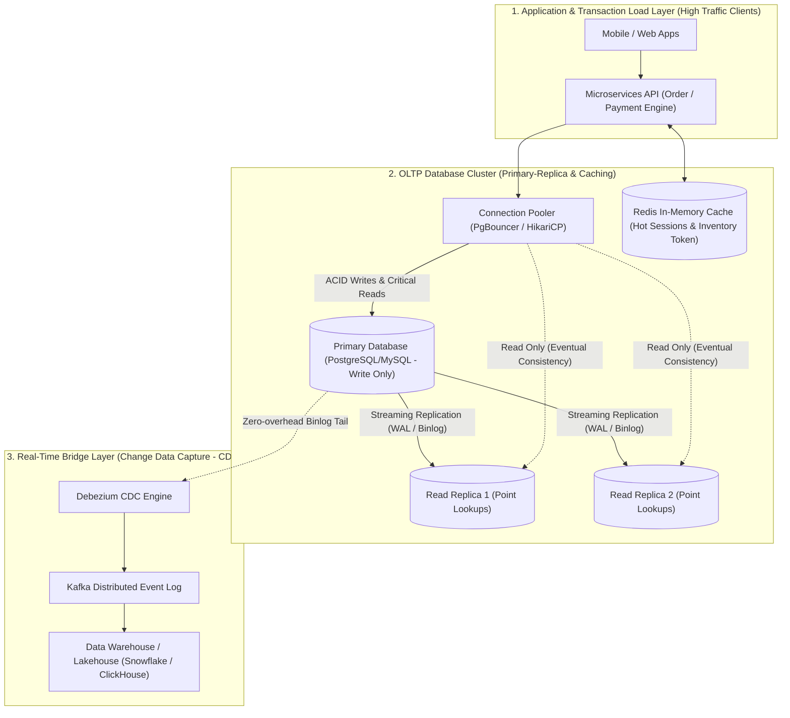

## Business Scenario / Data Requirements

In any User-Facing Application—such as E-commerce platforms, Digital Banking apps, Payment Gateways, or Ride-hailing platforms—the **Online Transaction Processing (OLTP) Database** acts as the 'heart' determining the survival of the business.

Consider the fierce business and technical challenges an OLTP system faces daily:

1. **Ensuring Absolute Financial & Inventory Data Integrity:** When thousands of users concurrently press 'Buy Now' during a Flash Sale for the last remaining item in stock, or when executing a money transfer between two bank accounts, the system absolutely must not allow phenomena like _Overselling_ or _Money deducted from sender but not credited to receiver_.
2. **Ultra-Low Latency (Sub-millisecond SLA):** Users cannot wait more than 100ms to add an item to a cart or authenticate an order. The system must serve tens of thousands of read/write queries per second (High QPS/TPS) with a p99 latency under 10ms.
3. **24/7 High Availability & Zero Data Loss:** Any power outage or hardware failure on the database server must not result in the loss of successfully committed transactions (RPO = 0, RTO in seconds).

**The Trap of Confusing OLTP and OLAP:**

OLTP databases are designed to optimize CRUD (Create, Read, Update, Delete) operations on single records using Primary Keys. If one purposefully runs aggregation reporting queries (`SELECT COUNT(*)`, `GROUP BY` on tens of millions of rows) directly against an OLTP server, the system will suffer an I/O bottleneck, exhaust its Connection Pool, and crash the entire customer payment service.

## Data Modeling

To achieve the balance between absolute data integrity and ultra-fast write performance, data engineers and systems engineers must master the 3 pillars of OLTP design:

**1. The Four Golden ACID Properties:**

- **Atomicity:** The 'All-or-Nothing' rule. Every statement in a Transaction must succeed together (COMMIT) or fail together (ROLLBACK) upon error.
- **Consistency:** Data before and after the transaction must strictly adhere to all integrity constraints (Constraints, Foreign Keys, Triggers, Cascade Rules).
- **Isolation:** Concurrently executing transactions must not see each other's uncommitted intermediate data. Delineated by 4 isolation levels (Read Uncommitted, Read Committed, Repeatable Read, Serializable).
- **Durability:** Once a transaction is successfully COMMITted, the data must be securely written to non-volatile memory (Write-Ahead Logging - WAL / Redo Log) and never lost even during sudden power losses.

**2. Normalization vs Controlled Denormalization:**

The golden rule of OLTP is normalizing to **3NF (Third Normal Form) or BCNF** to eliminate all data redundancy and remove anomalies during Insertion, Update, and Deletion of data.

<table style="width:100%; border-collapse: collapse; margin-bottom: 20px;">
  <thead>
    <tr style="border-bottom: 2px solid #e2e8f0; text-align: left;">
      <th style="padding: 8px;">Normalization Level</th>
      <th style="padding: 8px;">Mandatory Rules</th>
      <th style="padding: 8px;">Objective & Practical Application</th>
    </tr>
  </thead>
  <tbody>
    <tr style="border-bottom: 1px solid #edf2f7;">
      <td style="padding: 8px"><b>1NF (First Normal Form)</b></td>
      <td style="padding: 8px">Column values must be Atomic, containing no arrays or repeating lists</td>
      <td style="padding: 8px">Separate the <code>phone_numbers</code> column into its own table or individual rows</td>
    </tr>
    <tr style="border-bottom: 1px solid #edf2f7;">
      <td style="padding: 8px"><b>2NF (Second Normal Form)</b></td>
      <td style="padding: 8px">Must meet 1NF, and all non-key attributes must be fully dependent on the entire Primary Key</td>
      <td style="padding: 8px">Eliminate Partial Dependency within composite keys</td>
    </tr>
    <tr style="border-bottom: 1px solid #edf2f7;">
      <td style="padding: 8px"><b>3NF (Third Normal Form)</b></td>
      <td style="padding: 8px">Must meet 2NF, and no non-key attribute can be transitively dependent on the primary key</td>
      <td style="padding: 8px">Extract City/Province info from the Customer table (Avoid saving duplicate province names)</td>
    </tr>
    <tr style="border-bottom: 1px solid #edf2f7;">
      <td style="padding: 8px"><b>Controlled Denormalization</b></td>
      <td style="padding: 8px">Intentionally save immutable Snapshots (e.g., <code>unit_price_at_order</code> in <code>order_items</code>)</td>
      <td style="padding: 8px">Preserve the purchase price at the time of order when the master product pricing table changes</td>
    </tr>
  </tbody>
</table>

**3. Modern High-Concurrency Tiered OLTP Architecture Diagram:**



## Building Pipelines / Processing Scripts

To illustrate deploying an OLTP model that handles High-Concurrency Concurrency Control, below is a normalized DDL design and Python/SQL source code solving the Flash Sale inventory deduction problem ensuring stock never drops below zero.

**1. 3NF Normalized DDL Design for an E-Wallet & Order System (PostgreSQL):**

```sql
-- Create User Account Table (Users Core)
CREATE TABLE users (
    user_id BIGSERIAL PRIMARY KEY,
    email VARCHAR(255) UNIQUE NOT NULL,
    status VARCHAR(32) NOT NULL DEFAULT 'ACTIVE',
    created_at TIMESTAMPTZ NOT NULL DEFAULT CURRENT_TIMESTAMP
);

-- Create Wallet Table (Accounts Wallet) with non-negative balance constraint
CREATE TABLE wallets (
    wallet_id BIGSERIAL PRIMARY KEY,
    user_id BIGINT UNIQUE NOT NULL REFERENCES users(user_id) ON DELETE RESTRICT,
    balance DECIMAL(15, 2) NOT NULL DEFAULT 0.00,
    version INT NOT NULL DEFAULT 1, -- Used for Optimistic Locking
    updated_at TIMESTAMPTZ NOT NULL DEFAULT CURRENT_TIMESTAMP,
    CONSTRAINT chk_balance_non_negative CHECK (balance >= 0.00)
);

-- Create Immutable Transaction Ledger Table
CREATE TABLE wallet_transactions (
    transaction_id UUID PRIMARY KEY,
    from_wallet_id BIGINT NOT NULL REFERENCES wallets(wallet_id),
    to_wallet_id BIGINT NOT NULL REFERENCES wallets(wallet_id),
    amount DECIMAL(15, 2) NOT NULL,
    transaction_type VARCHAR(32) NOT NULL, -- 'TRANSFER', 'PURCHASE', 'REFUND'
    created_at TIMESTAMPTZ NOT NULL DEFAULT CURRENT_TIMESTAMP,
    CONSTRAINT chk_amount_positive CHECK (amount > 0.00)
);

-- Create Product Inventory Table (Inventory Items)
CREATE TABLE inventory_items (
    product_id BIGINT PRIMARY KEY,
    sku VARCHAR(64) UNIQUE NOT NULL,
    available_stock INT NOT NULL DEFAULT 0,
    reserved_stock INT NOT NULL DEFAULT 0,
    updated_at TIMESTAMPTZ NOT NULL DEFAULT CURRENT_TIMESTAMP,
    CONSTRAINT chk_stock_non_negative CHECK (available_stock >= 0)
);

-- Optimized Indexing for high-frequency OLTP queries
CREATE INDEX idx_wallets_user ON wallets(user_id);
CREATE INDEX idx_trans_from_wallet ON wallet_transactions(from_wallet_id, created_at DESC);
```

**2. Handling Concurrency Conflicts: Pessimistic Locking vs Optimistic Locking:**

The Python code snippet illustrates 2 concurrency control techniques during a purchase payment transaction:

```python
# Python OLTP Transaction Controller with PostgreSQL
import psycopg2
from psycopg2.extras import RealDictCursor
import time

def deduct_inventory_pessimistic(conn, product_id: int, quantity: int) -> bool:
    # Technique 1: Pessimistic Locking (SELECT ... FOR UPDATE)
    # Best when: Contention rate is extremely high (Flash Sale), ensuring exclusive locks
    with conn.cursor(cursor_factory=RealDictCursor) as cur:
        try:
            # Exclusively lock the product data row (Row-Level Exclusive Lock)
            cur.execute(
                "SELECT available_stock FROM inventory_items WHERE product_id = %s FOR UPDATE;",
                (product_id,)
            )
            row = cur.fetchone()
            if not row or row['available_stock'] < quantity:
                conn.rollback()
                return False # Out of stock

            # Safely deduct inventory
            cur.execute(
                "UPDATE inventory_items SET available_stock = available_stock - %s, updated_at = CURRENT_TIMESTAMP WHERE product_id = %s;",
                (quantity, product_id)
            )
            conn.commit()
            return True
        except Exception as e:
            conn.rollback()
            raise e

def transfer_funds_optimistic(conn, wallet_id: int, deduct_amount: float, max_retries: int = 3) -> bool:
    # Technique 2: Optimistic Concurrency Control (Version Check / CAS)
    # Best when: Contention rate is low/medium (Read-heavy), avoiding resource locking
    for attempt in range(max_retries):
        with conn.cursor(cursor_factory=RealDictCursor) as cur:
            # 1. Read balance and current version (NO LOCKS)
            cur.execute("SELECT balance, version FROM wallets WHERE wallet_id = %s;", (wallet_id,))
            wallet = cur.fetchone()
            if not wallet or wallet['balance'] < deduct_amount:
                return False # Insufficient balance

            current_version = wallet['version']
            new_balance = wallet['balance'] - deduct_amount

            # 2. Update conditionally checking the version (Atomic Compare-and-Swap)
            cur.execute(
                "UPDATE wallets SET balance = %s, version = version + 1, updated_at = CURRENT_TIMESTAMP WHERE wallet_id = %s AND version = %s;",
                (new_balance, wallet_id, current_version)
            )
            conn.commit()

            # 3. If affected row count = 1, it means success
            if cur.rowcount == 1:
                return True

            # If rowcount = 0, a conflict occurred -> Retry
            time.sleep(0.05 * (2 ** attempt))

    return False # Exceeded retry attempts
```

## Data Testing & Performance Optimization

To optimize an OLTP database handling tens of thousands of TPS without bottlenecking, systems engineers must apply the following techniques:

**1. Smart B-Tree Indexing Strategy:**

- **Avoid Index Inflation (Over-Indexing):** Every added index accelerates read speeds (`SELECT`) but severely degrades write speeds (`INSERT`, `UPDATE`, `DELETE`) because the database must update all corresponding B-Trees. On a write-heavy OLTP table, only index fields featured in the `WHERE` clauses of primary APIs.
- **Covering Indexes (Using INCLUDE):** Using the syntax `CREATE INDEX idx_orders_covering ON orders (user_id) INCLUDE (total_amount, status);` helps PostgreSQL read data directly from the B-Tree (Index-Only Scan) without needing to fetch from the original Heap Table.
- **Partial Indexes:** Index only the active dataset, for instance: `CREATE INDEX idx_pending_orders ON orders(created_at) WHERE status = 'PENDING';`. This keeps index size up to 90% smaller than a full-table index.

**2. Connection Management & Minimizing Transaction Time (Connection Pooling & Lean Transactions):**

- **Lean Transaction Rule:** Absolutely do not execute time-consuming tasks like Third-party API calls (HTTP Calls), sending Emails, or image processing _inside a Database Transaction_. The longer a Lock is held, the higher the risk of Deadlocks and Connection Pool starvation.
- **Use a dedicated Connection Pooler:** Deploy _PgBouncer_ (for PostgreSQL) in Transaction Pooling mode to multiplex thousands of client connections onto a small pool of 50-100 real connections to the Database.

**3. Concurrency Locking Performance Benchmark (Benchmarked on 10,000 Concurrent Requests):**

<table style="width:100%; border-collapse: collapse; margin-bottom: 20px;">
  <thead>
    <tr style="border-bottom: 2px solid #e2e8f0; text-align: left;">
      <th style="padding: 8px;">Locking Mechanism / Processing</th>
      <th style="padding: 8px">Throughput (TPS)</th>
      <th style="padding: 8px">Response Latency (p99)</th>
      <th style="padding: 8px">Contention Abort Rate</th>
    </tr>
  </thead>
  <tbody>
    <tr style="border-bottom: 1px solid #edf2f7;">
      <td style="padding: 8px"><b>Highest Isolation: Serializable</b></td>
      <td style="padding: 8px">850 TPS</td>
      <td style="padding: 8px">420ms</td>
      <td style="padding: 8px">High (35% of transactions hit Serialization Failure)</td>
    </tr>
    <tr style="border-bottom: 1px solid #edf2f7;">
      <td style="padding: 8px"><b>Pessimistic Locking (SELECT FOR UPDATE)</b></td>
      <td style="padding: 8px">4,200 TPS</td>
      <td style="padding: 8px">48ms</td>
      <td style="padding: 8px">0.00% (Absolutely safe, queues behind locks)</td>
    </tr>
    <tr style="border-bottom: 1px solid #edf2f7;">
      <td style="padding: 8px"><b>Optimistic Concurrency Control (Version CAS)</b></td>
      <td style="padding: 8px">6,800 TPS</td>
      <td style="padding: 8px">18ms</td>
      <td style="padding: 8px">Low (Auto-retry succeeds 99.8% of the time)</td>
    </tr>
    <tr>
      <td style="padding: 8px"><b>Redis In-Memory Token + Asynchronous DB Write</b></td>
      <td style="padding: 8px"><b>45,000 TPS</b></td>
      <td style="padding: 8px"><b>2.1ms</b></td>
      <td style="padding: 8px">0.00% (Inventory deduction layer is completely isolated)</td>
    </tr>
  </tbody>
</table>

## Conclusion & Recommendations

The OLTP system is the core operational foundation of any tech product. A small mistake in data modeling or transaction control can lead to irreversible financial damage.

1. **Design Extremely Lean Transactions:** Keep `BEGIN ... COMMIT` blocks as short as possible. Always have data prepared in-memory ready to execute before opening a Transaction, and commit immediately.
2. **Choose Lock Mechanisms Suited to Business Contexts:** Use _Pessimistic Locking_ for extreme high-contention hot spots (Flash Sales, Inventory Booking); use _Optimistic Locking_ for profile updates or user information editing.
3. **Separate Read/Writes via Read Replicas:** Route read lookup queries (Point Lookups) to a cluster of Read Replicas to dedicate the full CPU/IOPS resources of the Primary Server to transaction write operations.
4. **Use Change Data Capture (CDC) as a Bridge to the Data Platform:** Absolutely never use a Dual-Write mechanism (writing simultaneously to OLTP and Elasticsearch/Lakehouse from application code, which causes data drift upon network errors). Use Debezium CDC to extract data directly from the Write-Ahead Log asynchronously and 100% reliably.

> **Final Note:** _Building a resilient OLTP system is the art of respecting raw ACID principles combined with a smart concurrency control mindset. It acts as the secure launchpad empowering a business to confidently scale up to millions of users!_
