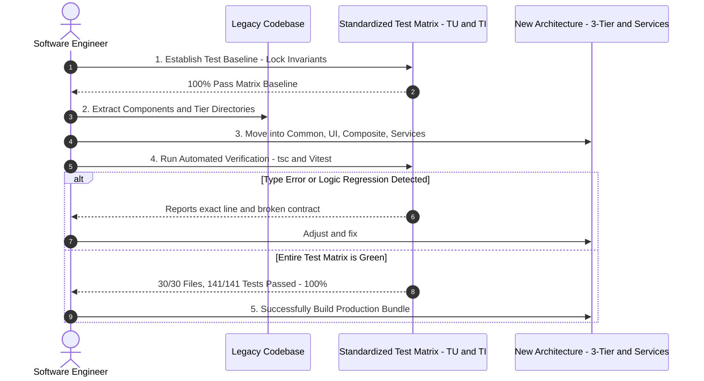

## Problem Statement & Overview

In the career journey of a Software Engineer, facing codebases that grow increasingly bloated, complex, and laden with Technical Debt is inevitable. The need for Refactoring to standardize architecture, eliminate code duplication (DRY), and improve performance is ever-present.

However, the biggest nightmare for any programmer when touching legacy code is: _'Will this change accidentally break a feature on another screen?'_. The concept of a 'Safety Net' and a Refactoring mindset based on a multi-tier Test Matrix is the key differentiator between a professional engineer and someone modifying code based on luck.

## Multidimensional Evaluation / Benchmarking

To clearly understand the value of a methodical Refactoring strategy, let's compare two common approaches in real-world projects:

- **The 'Cowboy Refactoring' School (Intuition-based Refactoring):** Developers directly modify files, rename variables, and move large components without automated tests guarding them. Testing mostly relies on 'visual checks' manually in the browser. _Consequence:_ Prone to missing edge-cases on mobile, implicit type mismatches (type regressions), and causing silent errors when deployed to Production.
- **The 'Test-Driven Refactoring' School (Refactoring with a Safety Net):** Before moving any line of code, all behavioral contracts and invariants are locked down by a comprehensive suite of Unit Tests and Integration Tests. Any change that breaks a contract is automatically detected in milliseconds.

## Practical Experience / Case Study

During a recent comprehensive refactoring campaign of my UI Portfolio & Tech Blog system, I applied a sequential automated pipeline for testing and conversion:

**Expensive Lessons from the Trenches:**

- **Standardize Identifiers (Test IDs):** Clearly categorize IDs like `TU-<GROUP>-XX` for Unit Tests (e.g., `TU-COMMON-01` for Button, `TU-SERVICES-01` for BlogService) and `TI-XX` for Integration Tests. This helps the whole team easily map the testing scope against architectural documentation.
- **1-to-1 Symmetrical Test Directory Structure:** Organizing `tests/unit/common/`, `tests/unit/ui/`, `tests/unit/composite/`, `tests/unit/services/` makes finding and updating tests immediate.

## Actionable Suggestions

To execute safe refactoring campaigns, always adhere to these 4 golden rules:

1. **Lock Typescript Typechecking:** Run `npx tsc --noEmit` in parallel with the test runner. Eliminating unnecessary aliases and using accurate relative imports helps the compiler detect broken paths right at the moment a file is saved.
2. **Atomic Refactoring Rule:** Only perform one type of change per step (e.g., only rename a component, or only move a service). Avoid moving a file and changing its business logic simultaneously in a single edit.
3. **Avoid inline styles when inheriting:** Always control CSS Specificity. Abusing inline styles (like `style={{ display: 'flex' }}`) in a parent component can override and break the CSS Grid rules of child components.
4. **Automate the Testing Pipeline:** Containerize the testing environment in Docker to ensure that execution results on local machines and CI/CD are completely identical.

## Open Questions, Discussion

Refactoring isn't just purely a technical activity but a balancing act between development speed and code quality. Some open questions worth pondering together:

- When should you decide to do Incremental Refactoring versus a Greenfield Rewrite?
- How do you communicate the value of Refactoring to stakeholders (Product Managers, Business Stakeholders) when no new user-facing features are added?
- What strategies help maintain 100% Test Coverage in a fast-paced release environment?
