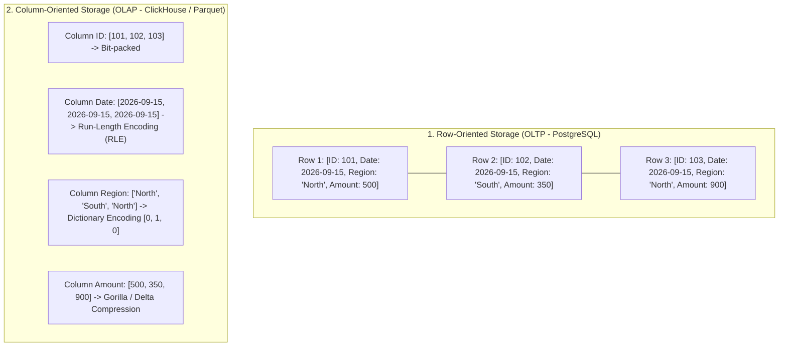
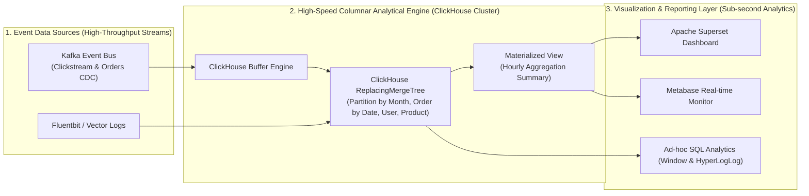

## Business Context / Data Requirements

While OLTP systems are built to process millions of single write transactions with millisecond latency, Data Analysts and Data Scientists face a completely opposite problem: **How to scan, filter, and calculate aggregations on billions of historical records in real-time to return instant business analytical charts?**

Consider business problems requiring large-scale analytical processing capabilities:

1. **Real-time User Behavior Analysis (Clickstream Analytics):** Tracking the event stream (Pageviews, Clicks, Add-to-Cart) of tens of millions of daily active users, detecting conversion funnel drop-offs, and recommending products in real-time.
2. **Multi-dimensional Consolidated Financial & Revenue Reporting (Multi-dimensional Financial BI):** Calculating net revenue, profit margins, and year-over-year (YoY, MoM) growth across hundreds of millions of order transactions over 10 years of history, allowing executives to slice and dice data by region, category, and sales channel.
3. **System Monitoring & Fraud Detection (Observability & Fraud Detection):** Analyzing terabytes of network logs and hourly payment metrics to detect DDoS attack patterns or fraudulent transactions within seconds.

**Why are Row-oriented Databases Powerless against Analytical Problems?**

In row-oriented databases (like PostgreSQL, MySQL), all columns of a record are stored adjacent to each other on the hard drive. When you run the query `SELECT AVG(total_amount) FROM orders WHERE order_date >= '2026-01-01';`, the database is forced to read the entire volume of all columns (customer name, address, notes, payment code) into the cache, wasting up to 95-99% of disk I/O bandwidth. To completely solve this problem, **Column-Oriented Architecture (OLAP Database)** was born.

## Data Modeling

To build and exploit OLAP systems for maximum performance, data engineers need to clearly understand the evolution of OLAP models and the physical mechanics of columnar storage technology.

**1. Four Generations of OLAP Architecture: MOLAP vs ROLAP vs HOLAP vs Modern Real-Time OLAP:**

<table style="width:100%; border-collapse: collapse; margin-bottom: 20px;">
  <thead>
    <tr style="border-bottom: 2px solid #e2e8f0; text-align: left;">
      <th style="padding: 8px;">OLAP Model</th>
      <th style="padding: 8px;">Operating Principle</th>
      <th style="padding: 8px;">Advantages</th>
      <th style="padding: 8px;">Disadvantages & Limitations</th>
    </tr>
  </thead>
  <tbody>
    <tr style="border-bottom: 1px solid #edf2f7;">
      <td style="padding: 8px"><b>MOLAP (Multidimensional)</b></td>
      <td style="padding: 8px">Pre-computes and stores results in multi-dimensional cubes (Cubes - SSAS, Apache Kylin)</td>
      <td style="padding: 8px">Ultra-fast query speed on fixed dimensions</td>
      <td style="padding: 8px">Storage capacity explosion (Cube Explosion), inflexible when adding new dimensions</td>
    </tr>
    <tr style="border-bottom: 1px solid #edf2f7;">
      <td style="padding: 8px"><b>ROLAP (Relational)</b></td>
      <td style="padding: 8px">Stores data in relational tables (Star/Snowflake Schema) and calculates dynamically via SQL</td>
      <td style="padding: 8px">Absolute flexibility, supports rich Ad-hoc queries</td>
      <td style="padding: 8px">Consumes computational resources if no column optimization mechanism exists</td>
    </tr>
    <tr style="border-bottom: 1px solid #edf2f7;">
      <td style="padding: 8px"><b>HOLAP (Hybrid)</b></td>
      <td style="padding: 8px">Combines summary storage in MOLAP and detail data in ROLAP</td>
      <td style="padding: 8px">Balances between high-level reporting speed and drill-down capabilities</td>
      <td style="padding: 8px">Complex architecture, difficult to synchronize data</td>
    </tr>
    <tr style="border-bottom: 1px solid #edf2f7;">
      <td style="padding: 8px"><b>Modern Real-Time OLAP (ClickHouse, Snowflake, DuckDB)</b></td>
      <td style="padding: 8px">Native Columnar storage, extreme data compression, and Vectorized execution (SIMD)</td>
      <td style="padding: 8px">Performance to scan billions of rows in milliseconds, 90% disk compression, Real-time data ingestion</td>
      <td style="padding: 8px">Limitations in small, individual single-row UPDATE transactions</td>
    </tr>
  </tbody>
</table>

**2. The Nature of Columnar Storage Mechanisms & Advanced Data Compression Algorithms:**

Instead of arranging rows next to each other, OLAP databases divide tables into data blocks (Row Groups) and store each column in separate physical files:



**3. Vectorized SIMD Query Execution Technique:**

In traditional databases (Volcano Iterator Model), each row of data calls the `next()` function one record at a time, causing CPU Cache bottlenecks and function call overhead. Conversely, a **Vectorized Engine** loads an array of 1,024 or 2,048 values of the same column directly into CPU Registers and uses the **SIMD (Single Instruction, Multiple Data - AVX2/AVX-512)** instruction set to compute tens of additions/filters in parallel in just a single CPU clock cycle.

## Building the Pipeline / Processing Script

To illustrate the implementation of a modern OLAP system, below is the real-time data flow architecture and the source code for creating a **ClickHouse MergeTree Engine** table combined with advanced analytical SQL queries.

**1. Real-Time Modern OLAP Stack Data Flow Diagram:**



**2. ClickHouse DDL Source Code for Optimal OLAP Table Design (MergeTree Engine):**

```sql
-- Create a ClickHouse table optimized for analyzing user behavior and orders
CREATE TABLE analytics.fact_user_events_hourly
(
    event_timestamp DateTime64(3, 'UTC') CODEC(DoubleDelta, LZ4),
    event_date Date DEFAULT toDate(event_timestamp) CODEC(DoubleDelta, LZ4),
    user_id UInt64 CODEC(DoubleDelta, LZ4),
    session_id UUID CODEC(ZSTD),
    event_type LowCardinality(String) CODEC(ZSTD), -- Apply Dictionary Compression
    page_url String CODEC(ZSTD(3)),
    referrer_domain LowCardinality(String) CODEC(ZSTD),
    device_type LowCardinality(String) CODEC(ZSTD),
    country LowCardinality(String) CODEC(ZSTD),
    cart_total_amount Decimal(18, 4) CODEC(T64, ZSTD),
    processing_time_ms UInt32 CODEC(Gorilla, ZSTD)
)
ENGINE = ReplacingMergeTree(event_timestamp)
-- Partition data by Month for easy lifecycle management and Pruning
PARTITION BY toYYYYMM(event_date)
-- Physical Sorting Key (Primary Index): Place lower cardinality columns first
PRIMARY KEY (event_date, event_type, user_id)
ORDER BY (event_date, event_type, user_id, event_timestamp)
-- Automatically clean up old data after 365 days (TTL Retention Policy)
TTL event_date + INTERVAL 365 DAY
SETTINGS index_granularity = 8192;
```

**3. Multi-dimensional Analytical SQL Query Leveraging HyperLogLog Estimations & Window Functions:**

```sql
-- Query to analyze funnel conversion rates and count unique users at lightning speed on 1 billion rows
SELECT
    event_date,
    country,
    device_type,
    -- Accurately count the number of events
    count() AS total_events,
    -- HyperLogLog algorithm estimates the number of unique users with < 1% margin of error in milliseconds
    uniqCombined64(user_id) AS approx_unique_users,
    -- Count the number of users who added to cart
    uniqCombined64If(user_id, event_type = 'ADD_TO_CART') AS cart_users,
    -- Count the number of users who successfully purchased
    uniqCombined64If(user_id, event_type = 'PURCHASE') AS paying_users,
    -- Calculate the checkout Conversion Rate
    ROUND(
        uniqCombined64If(user_id, event_type = 'PURCHASE')
        / NULLIF(uniqCombined64If(user_id, event_type = 'ADD_TO_CART'), 0) * 100,
        2
    ) AS cart_to_purchase_cvr_pct,
    -- Gross Merchandise Value
    SUM(cart_total_amount) AS gross_merchandise_value,
    -- Window Function calculating the revenue contribution weight of each country for the day
    ROUND(
        SUM(cart_total_amount)
        / SUM(SUM(cart_total_amount)) OVER (PARTITION BY event_date) * 100,
        2
    ) AS country_revenue_contribution_pct
FROM analytics.fact_user_events_hourly
WHERE event_date >= today() - INTERVAL 30 DAY
GROUP BY event_date, country, device_type
ORDER BY event_date DESC, gross_merchandise_value DESC;
```

## Data Testing & Performance Optimization

To achieve query response speeds under 100ms on massive datasets (Petabyte-scale), Data Engineers need to master the following deep physical optimization techniques:

**1. Designing Physical Sorting Keys & Sparse Primary Index:**

- **Column Order Rule in ORDER BY:** Always place the columns that frequently appear in the `WHERE` clause and have value Cardinality from low to high at the beginning of the sorting key (e.g., `(event_date, country, event_type, user_id)`). This arrangement helps compress data best and eliminates maximum mismatched data blocks (MinMax Data Skipping).
- **Sparse Index Granularity:** A sparse primary index (saving only 1 marker for every 8,192 rows) allows the entire index of a billion-row table to fit neatly in RAM using just a few megabytes of memory.

**2. Utilizing Probabilistic Algorithms & Sketch Data Structures:**

- When the number of users reaches hundreds of millions, running a traditional `COUNT(DISTINCT user_id)` requires huge memory costs to store all IDs for deduplication.
- Using approximation algorithms like **HyperLogLog (HLL)** and **t-Digest (calculating Percentile p95, p99)** helps reduce RAM usage by 99% and accelerates processing speed by up to 50 times with over 99% accuracy.

**3. Real-world Query Performance Benchmark Table (Dataset: 1,000,000,000 Records - 1 Billion Event Rows):**

<table style="width:100%; border-collapse: collapse; margin-bottom: 20px;">
  <thead>
    <tr style="border-bottom: 2px solid #e2e8f0; text-align: left;">
      <th style="padding: 8px;">Database Architecture</th>
      <th style="padding: 8px">Scan & Group By Query Time</th>
      <th style="padding: 8px">Disk Scan Volume</th>
      <th style="padding: 8px">Hard Disk Data Compression Ratio</th>
    </tr>
  </thead>
  <tbody>
    <tr style="border-bottom: 1px solid #edf2f7;">
      <td style="padding: 8px"><b>Row-Oriented Database (PostgreSQL 16)</b></td>
      <td style="padding: 8px">340,000ms (Over 5.6 minutes)</td>
      <td style="padding: 8px">142 GB (Full table scan)</td>
      <td style="padding: 8px">1.2x (Standard row compression)</td>
    </tr>
    <tr style="border-bottom: 1px solid #edf2f7;">
      <td style="padding: 8px"><b>Traditional ROLAP Distributed System</b></td>
      <td style="padding: 8px">12,500ms (12.5 seconds)</td>
      <td style="padding: 8px">18.5 GB</td>
      <td style="padding: 8px">3.5x (Basic Snappy compression)</td>
    </tr>
    <tr style="border-bottom: 1px solid #edf2f7;">
      <td style="padding: 8px"><b>Cloud MPP DWH (Snowflake Standard)</b></td>
      <td style="padding: 8px">420ms</td>
      <td style="padding: 8px">1.4 GB (Micro-partition pruning)</td>
      <td style="padding: 8px">6.0x (Proprietary Columnar)</td>
    </tr>
    <tr>
      <td style="padding: 8px"><b>Real-Time Vectorized OLAP (ClickHouse Cluster)</b></td>
      <td style="padding: 8px"><b>28ms</b></td>
      <td style="padding: 8px"><b>180 MB (MinMax Skip + SIMD)</b></td>
      <td style="padding: 8px"><b>10.5x (ZSTD + LowCardinality Codec)</b></td>
    </tr>
  </tbody>
</table>

## Conclusion & Recommendations

Column-oriented OLAP databases represent the pinnacle of hardware optimization engineering and modern big data processing algorithms.

**Choosing the Right OLAP Engine for the Business Context:**

- Use **ClickHouse / StarRocks** when you need real-time analytics with sub-100ms query latency on continuously ingested data streams (Clickstream, Log Analytics, Real-time Dashboard).
- Use **Snowflake / BigQuery** when you need to build a comprehensive enterprise data warehouse (Enterprise DWH / BI) serving multiple departments with unlimited compute scalability.
- Use **DuckDB** when you need an ultra-lightweight columnar analytical engine embedded directly in Python / Data Science applications without needing to build a complex server cluster.

**Always Leverage Data Type-Specific Data Compression:** Use `LowCardinality` or Dictionary Encoding for repeating string columns, `DoubleDelta` for time series, and `T64/Gorilla` for decimals.

**Applying Sketching Algorithms For Large Datasets:** Train your Data Analyst team to shift from using absolute precision `COUNT(DISTINCT)` to `HyperLogLog (HLL)` when working with estimation metrics (Reach, Active Users) to speed up analysis by tens of times.

> **Final words:** _Mastering the mechanics of OLAP, from columnar storage layers to the SIMD instruction set, helps Data Engineers confidently transform tens of terabytes of complex data into instant business answers in the blink of an eye!_
