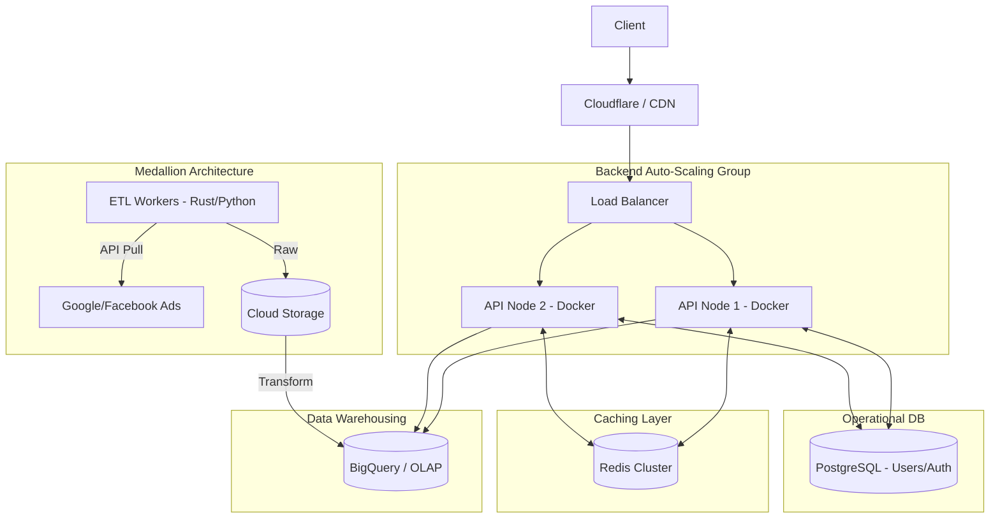

## Context & Problem

The reporting platform is a huge success, and the customer base is skyrocketing. At the end of the month, up to 1000 CCU access the system simultaneously to export reports and view Custom Dimensions on a massive amount of historical data.
The old system begins to reveal its fatal flaws: Chart loading takes more than 10 seconds, the Database constantly reports 100% CPU, and batch jobs for updating data spill over into working hours due to too much data needing processing.

## System Requirements

- **Performance:** Dashboards load in under 1 second, even when querying months of data.
- **Load Capacity:** 1000 CCU, capable of auto-scaling during traffic spikes.
- **Data:** Extremely large analytical data, supporting multi-dimensional queries (OLAP).
- **Availability:** 99.9%, serving 24/7 without a single point of failure (SPOF).

## Architecture Design

The architecture must now strictly separate the write flow (Data Pipeline) from the read flow (API / Dashboard).

- **Load Balancing & Backend Cluster:** Requests pass through the Load Balancer and are distributed to Backend Nodes running in Docker containers for easy auto-scaling.
- **Caching Layer (Redis):** All static report query results are hashed by parameters and stored in Redis. 80% of user requests will be returned directly from Redis without touching the Database.
- **Data Warehouse (BigQuery):** Responsible for storing and processing analytical queries (OLAP). BigQuery is designed to scan TBs of data in seconds.
- **Data Pipeline (ETL):** Uses high-performance languages (like Rust or Python) to extract data, dump it into the Data Lake, and then transform and load it into BigQuery following the Medallion architecture standard.

## Trade-off Analysis

- **Performance vs. Data Stale:** Using a Cache (Redis) helps the system handle loads excellently, but users might see data that is a few minutes "old". A reasonable Cache Invalidation strategy must be designed.
- **Operational Costs:** Using a Data Warehouse like BigQuery incurs charges based on the amount of data scanned. If the backend does not control this well and directly queries without filters (WHERE), infrastructure bills will skyrocket.

## Real-world Lessons & Best Practices

1.  **Block Query Storms (Query Throttling/Debouncing):** When 1000 users hit F5 continuously without Cache, the Data Warehouse will overload. Redis must act as an iron shield. Rate Limiting mechanisms on the API server should also be integrated.
2.  **Optimize Data Model on OLAP:** Data in the Data Warehouse needs to be Denormalized and Partitioned/Clustered by date and `client_id`. This reduces the amount of scanned data by up to 90% during queries, increasing speed and reducing costs.
3.  **Service Separation:** Use a dedicated PostgreSQL for CRUD operations (creating users, permissions, campaign configuration) and let BigQuery purely handle metric calculations. Absolutely do not perform cross-database queries at the API layer.
