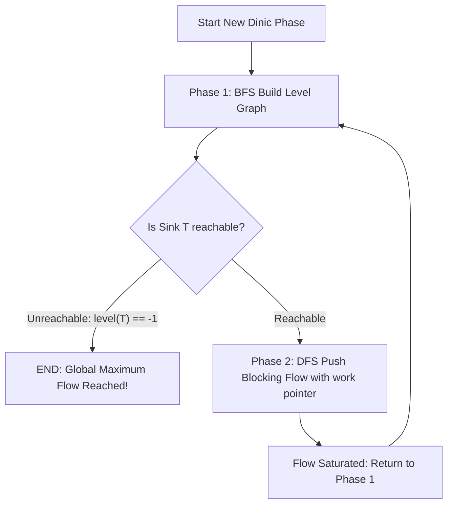

## Problem Description

Although the Edmonds-Karp algorithm guarantees polynomial time with an `O(V * E²)` complexity, on real-world large-scale graphs (tens of thousands of vertices and hundreds of thousands of edges), re-running the entire BFS from scratch just to augment flow on _a single path_ acts as a severe performance bottleneck.

In 1970, mathematician Yefim A. Dinitz invented **Dinic's Algorithm** (also known as Dinitz's Algorithm). This algorithm introduced a paradigm shift: Instead of augmenting a single flow at a time, Dinic constructs a **Level Graph** and simultaneously pushes multiple augmenting flows in a single phase using the concept of **Blocking Flow**.

The algorithm achieves an excellent complexity of `O(V² * E)` on general graphs and reaches an incredible speed of `O(E \sqrt{V})` on unit networks (equivalent to the Hopcroft-Karp algorithm for Maximum Bipartite Matching).

## Initial Approach

The fundamental difference between Edmonds-Karp and Dinic lies in their processing architecture:

- **Edmonds-Karp:** Runs BFS once &rarr; Finds 1 augmenting path &rarr; Updates residual graph &rarr; Repeats. Must execute up to `O(V * E)` independent BFS passes.
- **Dinic:** Runs BFS once to build a layered graph based on shortest distances &rarr; Continuously runs DFS to push flow through all valid paths on the level graph until completely saturated (Blocking Flow) &rarr; Moves to the next level phase. The number of level phases is strictly bounded to `V - 1` phases.

## Optimization Mindset & Algorithm Structure

Dinic's algorithm operates on a repeating two-phase structure:

1. **Phase 1: Build the Level Graph (using BFS):**
   - Assign a level to the source vertex: `level[s] = 0`.
   - Propagate using BFS: For each edge `(u, v)` with residual capacity `capacity[u][v] > 0`, if `level[v] == -1`, assign `level[v] = level[u] + 1`.
   - If the sink vertex `t` cannot be reached (`level[t] == -1`), the algorithm stops immediately &rarr; Maximum flow has been reached.

2. **Phase 2: Push Blocking Flow (using DFS):**
   - Only allow pushing flow from `level[u]` strictly to the next level `level[u] + 1`: Meaning the condition for a valid edge traversal is `level[v] == level[u] + 1` and `cap > 0`.
   - **Dead-end Pruning Optimization (Work Pointer):** Maintain a `work[u]` array storing the index of the currently processed adjacent edge. When a DFS branch from vertex `u` gets blocked (no more flow can be pushed), the `work[u]` pointer automatically increments to permanently skip that dead end for the current phase, avoiding useless edge revisits.

## Source Code Implementation & Dry Run

Architecture diagram of the 2-phase Dinic's Algorithm:



**Complete C++ Source Code (Dinic's Max Flow Algorithm with Work Pointer Optimization):**

```c++
#include <iostream>
#include <vector>
#include <queue>
#include <algorithm>

const long long INF = 1e18;

// Edge structure for Dinic's network flow graph
struct FlowEdge {
    int to;
    long long cap;
    long long flow = 0;
    int rev; // Index of the reverse edge in the destination vertex's adjacency list
};

class Dinic {
private:
    int n;
    int s, t;
    std::vector<std::vector<FlowEdge>> adj;
    std::vector<int> level;
    std::vector<int> work; // Pointer for dead-end pruning optimization

    // Phase 1: BFS to assign level graph labels
    bool bfs() {
        std::fill(level.begin(), level.end(), -1);
        level[s] = 0;
        std::queue<int> q;
        q.push(s);

        while (!q.empty()) {
            int u = q.front();
            q.pop();

            for (const auto& edge : adj[u]) {
                if (edge.cap - edge.flow > 0 && level[edge.to] == -1) {
                    level[edge.to] = level[u] + 1;
                    q.push(edge.to);
                }
            }
        }
        return level[t] != -1; // Return true if sink t is reachable
    }

    // Phase 2: DFS to push blocking flow
    long long dfs(int u, long long pushed) {
        if (pushed == 0) return 0;
        if (u == t) return pushed;

        for (int& cid = work[u]; cid < static_cast<int>(adj[u].size()); ++cid) {
            auto& edge = adj[u][cid];
            int v = edge.to;

            // Only transition from level[u] to exactly level[u] + 1
            if (level[u] + 1 != level[v] || edge.cap - edge.flow <= 0) {
                continue;
            }

            long long tr = dfs(v, std::min(pushed, edge.cap - edge.flow));
            if (tr == 0) {
                continue; // This branch cannot push flow; work[u] will increment via ++cid
            }

            edge.flow += tr;
            adj[v][edge.rev].flow -= tr; // Update backward edge
            return tr;
        }
        return 0;
    }

public:
    Dinic(int numVertices, int source, int sink)
        : n(numVertices), s(source), t(sink) {
        adj.resize(n);
        level.resize(n);
        work.resize(n);
    }

    void addEdge(int from, int to, long long cap) {
        FlowEdge a{to, cap, 0, static_cast<int>(adj[to].size())};
        FlowEdge b{from, 0, 0, static_cast<int>(adj[from].size())}; // Initial backward capacity = 0
        adj[from].push_back(a);
        adj[to].push_back(b);
    }

    long long maxFlow() {
        long long totalFlow = 0;
        while (bfs()) {
            std::fill(work.begin(), work.end(), 0);
            while (long long pushed = dfs(s, INF)) {
                totalFlow += pushed;
            }
        }
        return totalFlow;
    }
};

int main() {
    int V = 6;
    int S = 0, T = 5;
    Dinic dinic(V, S, T);

    dinic.addEdge(0, 1, 10);
    dinic.addEdge(0, 2, 10);
    dinic.addEdge(1, 2, 2);
    dinic.addEdge(1, 3, 4);
    dinic.addEdge(1, 4, 8);
    dinic.addEdge(2, 4, 9);
    dinic.addEdge(3, 5, 10);
    dinic.addEdge(4, 3, 6);
    dinic.addEdge(4, 5, 10);

    long long maxF = dinic.maxFlow();
    std::cout << "--- DINIC MAXIMUM FLOW RESULT ---" << std::endl;
    std::cout << "Total maximum flow: " << maxF << std::endl;

    return 0;
}
```

**Detailed Execution Trace (Dry Run):**

- _Phase 1 (BFS 1):_ Assign level labels `level = [0, 1, 1, 2, 2, 3]`. `level[T=5] = 3`.
- _Phase 1 (DFS 1):_
  - Path `0 -> 1 -> 3 -> 5`: `pushed = min(10, 4, 10) = 4` &rarr; Flow = 4.
  - Path `0 -> 1 -> 4 -> 5`: `pushed = min(6, 8, 10) = 6` &rarr; Flow = 4 + 6 = 10 (Vertex 1 saturated).
  - Path `0 -> 2 -> 4 -> 5`: `pushed = min(10, 9, 4) = 4` &rarr; Flow = 10 + 4 = 14 (Vertex 5 saturated at layer 3).
- _Phase 2 (BFS 2):_ Residual graph updated &rarr; BFS recalculates levels &rarr; DFS pushes more flow through path `0 -> 2 -> 4 -> 3 -> 5` adding `5` units &rarr; Flow = `19`.
- _Phase 3 (BFS 3):_ `level[T] = -1` (no paths left) &rarr; Immediately terminates with maximum flow result of `19`.

## Complexity Evaluation & Practical Applications

Performance metric summary according to the standard RAM Model:

- **Time Complexity:**
  - General graphs: `O(V² * E)`. There are at most `V - 1` BFS phases, and each DFS phase pushing blocking flow takes `O(V * E)` thanks to the `work[]` pointer pruning dead ends.
  - Unit Network: `O(E \sqrt{V})` - Able to process hundreds of thousands of vertices in just a few milliseconds.
  - Network with unit capacities at vertices (Bipartite Matching): `O(E \sqrt{V})` (Equivalent to Hopcroft-Karp algorithm).
- **Space Complexity:** `O(V + E)` for the adjacency list and symmetric `FlowEdge` structures.
- **Practical Applications:**
  - **Maximum Bipartite Matching:** Scheduling professor-course assignments, recruiting candidate-job mappings.
  - **Project Selection Problem:** Optimizing an investment project portfolio with prerequisite dependencies.
  - **CDN Bandwidth Distribution:** Routing video streaming flow from thousands of Edge servers to end users.
