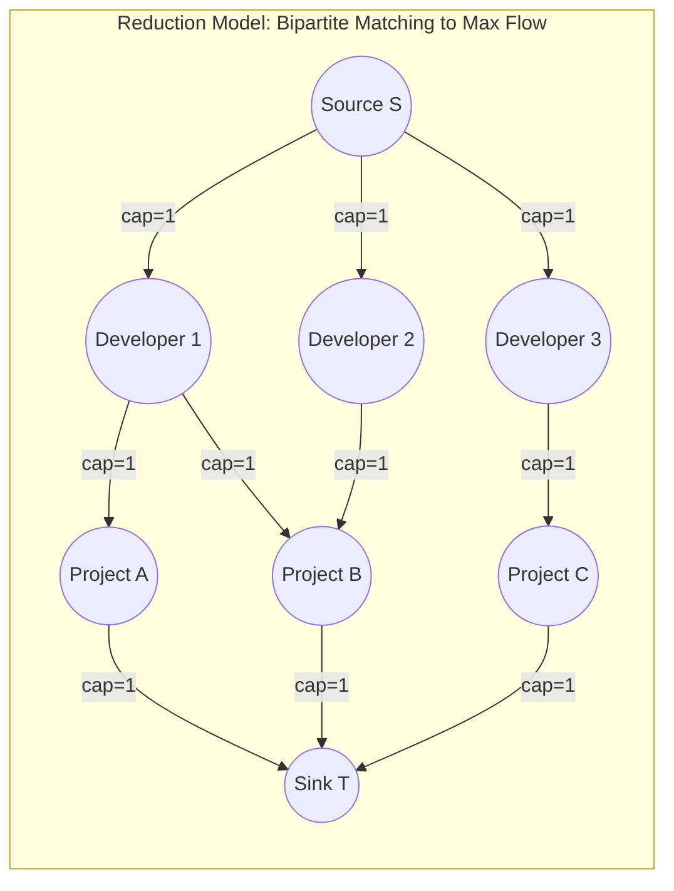

## Problem Description

Network Flow theory is one of the most important and widely applied branches of applied computer science. When facing large-scale problems, choosing between the classical **Ford-Fulkerson / Edmonds-Karp** algorithms and the modern **Dinic's** algorithm creates a performance gap of up to thousands of times.

This article analyzes the architectural essence of both paradigms, measures empirical performance bottlenecks, and presents the induction method to map classic problems (like Maximum Bipartite Matching) into the Maximum Flow problem.

## Initial Approach

Why does Edmonds-Karp become sluggish on dense networks?

- Every time BFS runs, Edmonds-Karp finds a single shortest path, increments flow by a very small `bottleneck` amount, destroys the entire BFS tree, and rescans from scratch.
- If the flow network has 10,000 independent augmenting paths of the same length, Edmonds-Karp must execute BFS 10,000 separate times iteratively.
- Dinic completely eliminates this waste by grouping all those 10,000 paths into a single **Level Graph** and wiping them clean using DFS (Blocking Flow) in just a single phase.

## Optimization Mindset & Algorithm Structure

**In-Depth Comparison Matrix between Edmonds-Karp and Dinic:**

<table style="width:100%; border-collapse: collapse; margin-bottom: 20px;">
  <thead>
    <tr style="border-bottom: 2px solid #e2e8f0; text-align: left;">
      <th style="padding: 8px;">Evaluation Criteria</th>
      <th style="padding: 8px;">Edmonds-Karp (Ford-Fulkerson BFS)</th>
      <th style="padding: 8px;">Dinic's Algorithm</th>
    </tr>
  </thead>
  <tbody>
    <tr style="border-bottom: 1px solid #edf2f7;">
      <td style="padding: 8px"><b>Augmentation Mechanism</b></td>
      <td style="padding: 8px">Single-flow (1 path per BFS)</td>
      <td style="padding: 8px">Multi-flow simultaneously (Blocking Flow via DFS)</td>
    </tr>
    <tr style="border-bottom: 1px solid #edf2f7;">
      <td style="padding: 8px"><b>Complexity (General)</b></td>
      <td style="padding: 8px"><code>O(V * E²)</code></td>
      <td style="padding: 8px"><code>O(V² * E)</code> (10x - 1000x faster)</td>
    </tr>
    <tr style="border-bottom: 1px solid #edf2f7;">
      <td style="padding: 8px"><b>Unit Network</b></td>
      <td style="padding: 8px"><code>O(V * E)</code></td>
      <td style="padding: 8px"><code>O(E \sqrt{V})</code> (Extreme speed limit)</td>
    </tr>
    <tr style="border-bottom: 1px solid #edf2f7;">
      <td style="padding: 8px"><b>Core Optimization Technique</b></td>
      <td style="padding: 8px">BFS finds Shortest Path</td>
      <td style="padding: 8px">Level Graph + <code>work[]</code> pointer for dead-end pruning</td>
    </tr>
    <tr style="border-bottom: 1px solid #edf2f7;">
      <td style="padding: 8px"><b>Space Complexity</b></td>
      <td style="padding: 8px"><code>O(V + E)</code></td>
      <td style="padding: 8px"><code>O(V + E)</code></td>
    </tr>
    <tr>
      <td style="padding: 8px"><b>Usage Recommendation</b></td>
      <td style="padding: 8px">Small networks, academic illustration (<code>V <= 100</code>)</td>
      <td style="padding: 8px">Real-world Production environments & Competitive Programming</td>
    </tr>
  </tbody>
</table>

## Source Code Implementation & Dry Run

Reduction diagram mapping the Maximum Bipartite Matching problem to a Max Flow Network:



**Practical C++ Source Code: Solving Maximum Bipartite Matching using Dinic:**

```c++
#include <iostream>
#include <vector>
#include <queue>
#include <algorithm>

const int INF = 1e9;

// Solve Job Assignment (Bipartite Matching) problem via Dinic
class BipartiteMatcher {
private:
    struct Edge {
        int to, cap, flow, rev;
    };
    int n, s, t;
    std::vector<std::vector<Edge>> adj;
    std::vector<int> level, work;

    bool bfs() {
        std::fill(level.begin(), level.end(), -1);
        level[s] = 0;
        std::queue<int> q;
        q.push(s);
        while (!q.empty()) {
            int u = q.front(); q.pop();
            for (const auto& e : adj[u]) {
                if (e.cap - e.flow > 0 && level[e.to] == -1) {
                    level[e.to] = level[u] + 1;
                    q.push(e.to);
                }
            }
        }
        return level[t] != -1;
    }

    int dfs(int u, int pushed) {
        if (!pushed || u == t) return pushed;
        for (int& cid = work[u]; cid < static_cast<int>(adj[u].size()); ++cid) {
            auto& e = adj[u][cid];
            int v = e.to;
            if (level[u] + 1 != level[v] || e.cap - e.flow <= 0) continue;
            int tr = dfs(v, std::min(pushed, e.cap - e.flow));
            if (!tr) continue;
            e.flow += tr;
            adj[v][e.rev].flow -= tr;
            return tr;
        }
        return 0;
    }

public:
    BipartiteMatcher(int numWorkers, int numJobs) {
        n = numWorkers + numJobs + 2;
        s = 0;
        t = n - 1;
        adj.resize(n);
        level.resize(n);
        work.resize(n);
    }

    void addMatchingEdge(int workerId, int jobId, int numWorkers) {
        int u = workerId;
        int v = numWorkers + jobId;
        addEdge(u, v, 1);
    }

    void addEdge(int from, int to, int cap) {
        adj[from].push_back({to, cap, 0, static_cast<int>(adj[to].size())});
        adj[to].push_back({from, 0, 0, static_cast<int>(adj[from].size()) - 1});
    }

    int solve(int numWorkers, int numJobs) {
        // Connect Source to all workers with cap = 1
        for (int i = 1; i <= numWorkers; ++i) addEdge(s, i, 1);
        // Connect all jobs to Sink with cap = 1
        for (int j = 1; j <= numJobs; ++j) addEdge(numWorkers + j, t, 1);

        int maxMatch = 0;
        while (bfs()) {
            std::fill(work.begin(), work.end(), 0);
            while (int pushed = dfs(s, INF)) {
                maxMatch += pushed;
            }
        }
        return maxMatch;
    }
};

int main() {
    int workers = 3; // 3 developers
    int jobs = 3;    // 3 projects
    BipartiteMatcher matcher(workers, jobs);

    // Developer 1 can do Job 1, Job 2
    matcher.addMatchingEdge(1, 1, workers);
    matcher.addMatchingEdge(1, 2, workers);
    // Developer 2 can do Job 2
    matcher.addMatchingEdge(2, 2, workers);
    // Developer 3 can do Job 3
    matcher.addMatchingEdge(3, 3, workers);

    int result = matcher.solve(workers, jobs);
    std::cout << "Maximum bipartite match count: " << result << std::endl;

    return 0;
}
```

## Complexity Evaluation & Practical Applications

1. **Standardize Dinic's Algorithm as Default:** In every real-world application requiring network flow processing, Dinic completely outperforms Edmonds-Karp in both speed and scalability.
2. **Universal Reduction Capability:** A myriad of seemingly unrelated problems (Maximum Bipartite Matching, Minimum Cut for Network Partitioning, ROI Project Selection Problem, Server Load Balancing) can all be elegantly modeled and solved in `O(E \sqrt{V})` time using Dinic.
