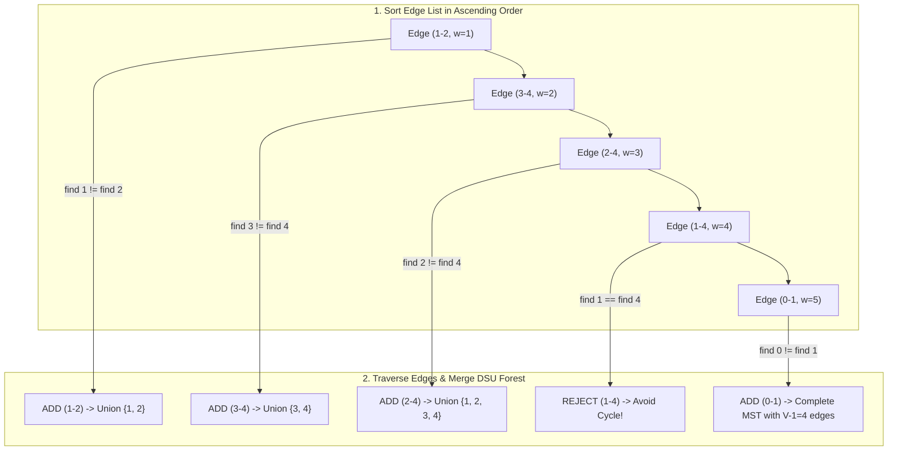

## Problem Description

When designing telecom fiber-optic backbones, intercity gas pipeline systems, or national power grids, the primary economic goal is: _How to connect all `V` cities together such that the total construction cost is minimized and no wasteful cycles exist?_

The problem statement: **Minimum Spanning Tree (MST)**. Given an undirected, connected, weighted graph `G = (V, E)` consisting of `V` vertices and `E` edges. A Spanning Tree is a connected subgraph that contains all `V` vertices and exactly `V - 1` edges (no cycles). Find a spanning tree with the **minimum total edge weight**: `w(T) = sum_{(u, v) \in T} w(u, v)`.

Kruskal's algorithm, invented by Joseph Kruskal in 1956, is a premier classic algorithm approaching the problem via an **Edge-Centric Greedy** mindset.

## Initial Approach

An intuitive greedy idea: Sort all edges in ascending order by weight. Iterate through each edge from smallest to largest, and if adding the edge `(u, v)` does not create a cycle, select that edge for the spanning tree.

The fatal challenge: _How to quickly check whether adding edge `(u, v)` creates a cycle?_

If we use DFS or BFS to check for cycles every time we evaluate an edge, the check cost will be `O(V)`, making the total algorithmic time `O(E * V)` - which is too slow when the graph has hundreds of thousands of edges.

## Optimization Mindset & Algorithm Structure

Kruskal's algorithm achieves transcendent performance by combining with the **Disjoint Set Union (DSU / Union-Find)** data structure:

1. **Spanning Forest Model:** Initially, each vertex `v \in V` forms an independent tree of 1 node (corresponding to a disjoint set). The complete spanning tree will be generated by gradually merging these trees into a single tree of `V - 1` edges.
2. **Cycle Checking in `O(\alpha(V))`:** Two vertices `u` and `v` will form a cycle if and only if they already belong to the same connected component (i.e., they share the same representative root: `find(u) == find(v)`).
3. **Two God-tier DSU Optimization Techniques:**
   - **Path Compression:** Inside the `find(u)` function, directly point all nodes along the traversal path back to the root node. Tree height is squashed to almost 1.
   - **Union by Rank:** Always attach the shallower/smaller tree to the root of the larger tree to prevent the tree from degrading into a linked list.

Thanks to DSU, every cycle check and set merge operation takes **nearly constant time** `O(\alpha(V))` (where `\alpha` is the inverse Ackermann function, `\alpha(V) \le 4` for all `V \le 10^{80}`). The total time of Kruskal is entirely dominated by the edge sorting step `O(E \log E) = O(E \log V)`.

## Source Code Implementation & Dry Run

Process diagram of greedy edge selection and the DSU merge mechanism:



**Complete C++ Source Code (Kruskal with DSU Path Compression and Union by Rank):**

```c++
#include <iostream>
#include <vector>
#include <algorithm>

// Standard Disjoint Set Union (DSU) data structure
class DisjointSet {
private:
    std::vector<int> parent;
    std::vector<int> rank;

public:
    DisjointSet(int n) {
        parent.resize(n);
        rank.assign(n, 0);
        for (int i = 0; i < n; ++i) {
            parent[i] = i; // Initially, each node is its own parent
        }
    }

    // Find representative root with Path Compression
    int find(int u) {
        if (parent[u] != u) {
            parent[u] = find(parent[u]); // Direct assignment to the root node
        }
        return parent[u];
    }

    // Merge 2 sets using Union by Rank
    bool unite(int u, int v) {
        int rootU = find(u);
        int rootV = find(v);

        if (rootU == rootV) {
            return false; // Same root -> Already connected -> Would form a cycle
        }

        if (rank[rootU] < rank[rootV]) {
            parent[rootU] = rootV;
        } else if (rank[rootU] > rank[rootV]) {
            parent[rootV] = rootU;
        } else {
            parent[rootV] = rootU;
            rank[rootU]++;
        }
        return true;
    }
};

struct Edge {
    int u, v;
    long long weight;

    // Comparison operator to sort edges by weight ascending
    bool operator<(const Edge& other) const {
        return weight < other.weight;
    }
};

struct MSTResult {
    long long totalWeight;
    std::vector<Edge> mstEdges;
};

MSTResult kruskalMST(int V, std::vector<Edge>& edges) {
    // Step 1: Sort all E edges in ascending order by weight O(E log E)
    std::sort(edges.begin(), edges.end());

    DisjointSet dsu(V);
    long long totalWeight = 0;
    std::vector<Edge> mstEdges;

    // Step 2: Iterate through each edge and union via DSU
    for (const auto& edge : edges) {
        if (dsu.unite(edge.u, edge.v)) {
            totalWeight += edge.weight;
            mstEdges.push_back(edge);

            // Early exit when exactly V - 1 edges have been picked
            if (static_cast<int>(mstEdges.size()) == V - 1) {
                break;
            }
        }
    }

    return {totalWeight, mstEdges};
}

int main() {
    int V = 5; // 5 vertices: 0, 1, 2, 3, 4
    std::vector<Edge> edges = {
        {0, 1, 9}, {0, 2, 75}, {1, 2, 95},
        {1, 3, 19}, {1, 4, 42}, {2, 3, 51},
        {3, 4, 31}
    };

    auto result = kruskalMST(V, edges);

    std::cout << "--- KRUSKAL'S MINIMUM SPANNING TREE RESULT ---" << std::endl;
    std::cout << "Total MST weight: " << result.totalWeight << std::endl;
    std::cout << "Selected edges:" << std::endl;
    for (const auto& e : result.mstEdges) {
        std::cout << "Edge (" << e.u << " - " << e.v << ") with weight: " << e.weight << std::endl;
    }

    return 0;
}
```

**Detailed Execution Trace (Dry Run):**

- _Sorted Edge List:_ `(0-1: 9), (1-3: 19), (3-4: 31), (1-4: 42), (2-3: 51), (0-2: 75), (1-2: 95)`.
- _Edge 1 (0-1, w=9):_ `find(0) != find(1)` &rarr; Selected! `total=9`, DSU groups `{0, 1}`.
- _Edge 2 (1-3, w=19):_ `find(1) != find(3)` &rarr; Selected! `total=9+19=28`, DSU groups `{0, 1, 3}`.
- _Edge 3 (3-4, w=31):_ `find(3) != find(4)` &rarr; Selected! `total=28+31=59`, DSU groups `{0, 1, 3, 4}`.
- _Edge 4 (1-4, w=42):_ `find(1) == find(4)` (both belong to set `{0, 1, 3, 4}`) &rarr; Skipped to avoid creating cycle `1-3-4-1`.
- _Edge 5 (2-3, w=51):_ `find(2) != find(3)` &rarr; Selected! `total=59+51=110`, gathered `V-1 = 4` edges &rarr; Algorithm terminates with a total weight of `110`.

## Complexity Evaluation & Practical Applications

- **Time Complexity:** `O(E \log E) = O(E \log V)`. The operation to sort `E` edges takes `O(E \log E)`, and iterating through DSU operations takes `O(E \alpha(V))`.
- **Space Complexity:** `O(V + E)` which includes `O(V)` for the DSU structure (`parent` and `rank` arrays) and `O(E)` to store the edge array.
- **Practical Applications:**
  - **Designing telecom cable and power grid infrastructure:** Connecting all substations or data centers using the minimum total cable length.
  - **Data clustering in Machine Learning (Single-Linkage Hierarchical Clustering):** Stop Kruskal's process when the number of connected components equals `K` to optimally partition data into `K` clusters.
  - **VLSI Integrated Circuit Design:** Routing copper wires on microchips to minimize surface area and signal delay.
