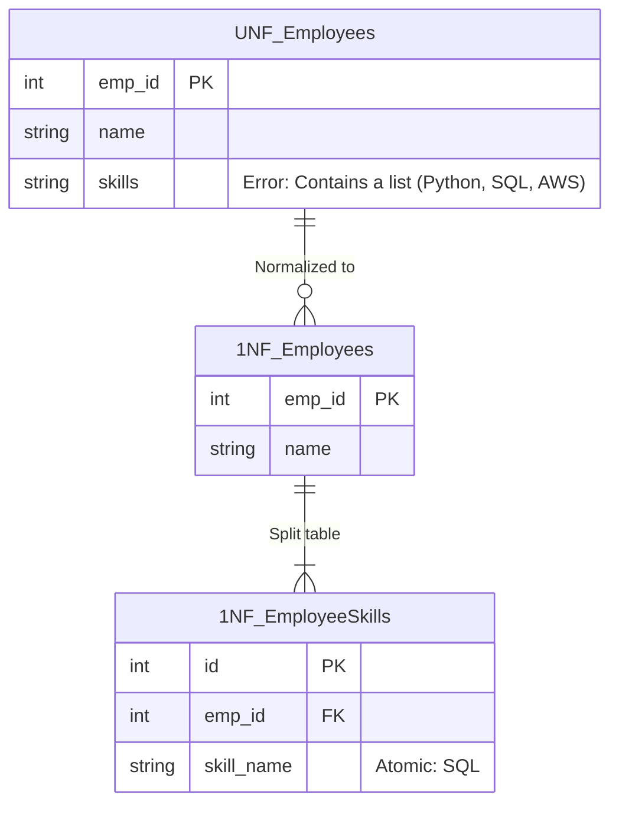

## Business Context / Data Requirements

Suppose you are a Data Engineer responsible for building an ERP (Enterprise Resource Planning) system for a company. The first module to build is **HR Profile Management**.
In the initial MVP phase, the `Employees` table stores basic information. For convenience, developers save all of the employee's skills into a single `skills` column, separated by commas (e.g., "Python, SQL, AWS").

When the company grows to 500 employees, the Resource Manager urgently needs to find personnel who know "SQL" to place into a new project. Using a `LIKE '%SQL%'` query is not only very slow (because Indexes cannot be used) but also error-prone (might mistakenly match with "NoSQL"). The ERP system begins to reveal its first weakness.

## Data Modeling

The 1NF standard requires: **Each column of a table must be atomic (cannot be further divided), must not contain arrays or lists, and each row must be unique.**



## Building the Pipeline / Processing Script

To transform the data in PostgreSQL, we use the `unnest()` and `string_to_array()` functions to split the skills into independent rows:

```sql
-- 1. Create tables following the 1NF standard
CREATE TABLE employees_1nf (
    emp_id SERIAL PRIMARY KEY,
    name VARCHAR(100) NOT NULL
);

CREATE TABLE employee_skills_1nf (
    id SERIAL PRIMARY KEY,
    emp_id INT REFERENCES employees_1nf(emp_id),
    skill_name VARCHAR(50) NOT NULL
);

-- 2. Migrate data from the old system (UNF)
INSERT INTO employees_1nf (emp_id, name)
SELECT emp_id, name FROM employees_unf;

INSERT INTO employee_skills_1nf (emp_id, skill_name)
SELECT
    emp_id,
    TRIM(unnest(string_to_array(skills, ','))) AS skill_name
FROM employees_unf
WHERE skills IS NOT NULL;
```

## Data Testing & Performance Optimization

- **Testing:** The query to find employees by skill now uses a standard `JOIN`: `SELECT e.name FROM employees_1nf e JOIN employee_skills_1nf s ON e.emp_id = s.emp_id WHERE s.skill_name = 'SQL';`
- **Performance Optimization:** By creating a B-Tree Index on the `skill_name` column, employee search speed drops from `O(N)` (Full Table Scan) to `O(log N)`.

## Conclusion & Recommendations

1NF is the first building block of any ERP system. Absolutely never use comma-separated strings for data fields that need to be used for analysis or filtering. In the next article, we will look at how the ERP system handles the Project Allocation problem and advances to the 2NF standard.
