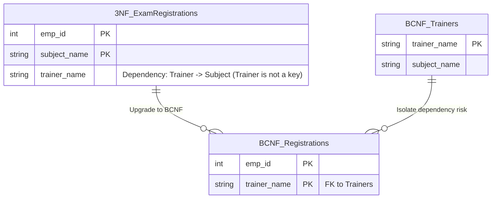

## Business Context / Data Requirements

The ERP system integrates an **Internal Training & Certifications Module**.
We have an `Exam_Registrations` table that stores: `emp_id`, `subject_name` (the course), and `trainer_name` (internal instructor).

The company's business rules are as follows:

1. An employee can take multiple subjects. A subject has multiple trainers teaching different classes.
2. An employee only registers with one trainer for a specific subject.
3. **Each trainer specializes in teaching EXACTLY ONE subject.**

Candidate Keys that uniquely identify 1 row could be: `(emp_id, subject_name)` or `(emp_id, trainer_name)`. All columns are part of the candidate keys, so this table **already meets the 3NF standard**.
But the risk is: `subject_name` depends on `trainer_name` (because a trainer only teaches 1 subject). If all employees cancel their registration for "Trainer Bob's" class, the data is deleted, and the system completely forgets the fact that "Trainer Bob teaches AWS" (Delete Anomaly).

## Data Modeling

The BCNF standard requires: **Meets 3NF and for every functional dependency X -> Y, X must be a Superkey.**
Here, `trainer_name -> subject_name`, but `trainer_name` on its own is not a key for the table (it does not represent the entire row). Therefore, it violates BCNF.



## Building the Pipeline / Processing Script

We separate trainers and subjects into their own directory:

```sql
-- 1. Create Trainers table (Contains dependency Trainer -> Subject)
CREATE TABLE trainers_bcnf AS
SELECT DISTINCT trainer_name, subject_name
FROM exam_registrations_3nf;

ALTER TABLE trainers_bcnf ADD PRIMARY KEY (trainer_name);

-- 2. Create Registrations table (Remove Subject column)
CREATE TABLE exam_registrations_bcnf AS
SELECT emp_id, trainer_name
FROM exam_registrations_3nf;

ALTER TABLE exam_registrations_bcnf ADD PRIMARY KEY (emp_id, trainer_name);
ALTER TABLE exam_registrations_bcnf
ADD FOREIGN KEY (trainer_name) REFERENCES trainers_bcnf(trainer_name);
```

## Data Testing & Performance Optimization

- **Data Integrity:** We can now declare a new Trainer along with the subject they teach (INSERT into the `trainers_bcnf` table) even if no employees have registered for that class yet.
- **Flawless Design:** BCNF closes the final loophole of tables with complex composite key logic.

## Conclusion & Recommendations

In an ERP, operations like Shift Assignments, Class Schedules, or Equipment Usage Logs easily fall into the "3NF but violates BCNF" scenario. Always use BCNF as a durability test for data tables with Composite Keys.
