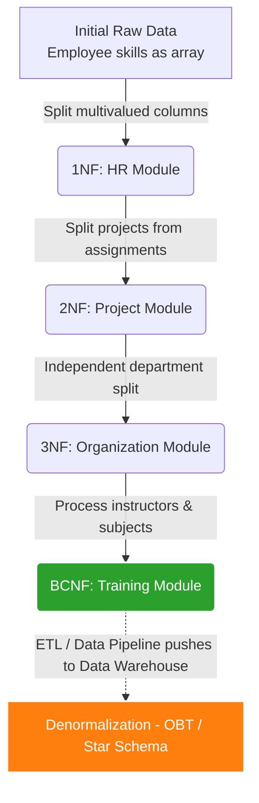

## Business Problem / Data Requirements

Returning to our ERP system. After going through 4 modules (HR, Projects, Departments, Training), the backend Database has achieved a very strict and safe 3NF/BCNF standard with no data redundancy. Update and Delete operations are performed perfectly.

However, the Board of Directors requested the Data Analytics team to create a **Resource Allocation Dashboard** on Looker Studio. This report needs to display: _Which employee belongs to which department, what skills they have, which client project they are working on, and what certifications they are studying._
The query now has to `JOIN` across 7-8 different tables on a dataset of millions of rows. The Backend Database becomes a bottleneck, and the dashboard spins endlessly (timeout).

This is when we discuss the **Denormalization** technique for OLAP/Data Warehouse analysis.

## The Big Picture: Normalization and Denormalization Process



## Comparison Table of Design Standards

<table style="width:100%; border-collapse: collapse; margin-bottom: 20px;">
  <thead>
    <tr style="border-bottom: 2px solid #e2e8f0; text-align: left;">
      <th style="padding: 8px;">Criteria</th>
      <th style="padding: 8px;">1NF</th>
      <th style="padding: 8px;">2NF</th>
      <th style="padding: 8px;">3NF</th>
      <th style="padding: 8px;">BCNF (3.5NF)</th>
      <th style="padding: 8px;">Denormalization (OLAP)</th>
    </tr>
  </thead>
  <tbody>
    <tr style="border-bottom: 1px solid #edf2f7;">
      <td style="padding: 8px;"><strong>Rule</strong></td>
      <td style="padding: 8px;">Atomic, no repeating arrays.</td>
      <td style="padding: 8px;">1NF + No partial dependency on PK.</td>
      <td style="padding: 8px;">2NF + No transitive dependency.</td>
      <td style="padding: 8px;">3NF + Every determinant is a Super Key.</td>
      <td style="padding: 8px;">Intentionally merge tables, allow data duplication.</td>
    </tr>
    <tr style="border-bottom: 1px solid #edf2f7;">
      <td style="padding: 8px;"><strong>Problem Solved in ERP</strong></td>
      <td style="padding: 8px;">Errors parsing skills string, no Index.</td>
      <td style="padding: 8px;">Inconsistent update of project client_name.</td>
      <td style="padding: 8px;">Missing update of department address.</td>
      <td style="padding: 8px;">Accidental deletion of internal subject data.</td>
      <td style="padding: 8px;">Report queries (JOINs) are too slow.</td>
    </tr>
    <tr style="border-bottom: 1px solid #edf2f7;">
      <td style="padding: 8px;"><strong>Model Characteristics</strong></td>
      <td style="padding: 8px;">Fewer tables, list-containing columns.</td>
      <td style="padding: 8px;">Creates Master/Trans tables.</td>
      <td style="padding: 8px;">Many tables, strict Foreign Keys.</td>
      <td style="padding: 8px;">Absolute safety for complex logic.</td>
      <td style="padding: 8px;">One extremely wide table (One Big Table).</td>
    </tr>
    <tr style="border-bottom: 1px solid #edf2f7;">
      <td style="padding: 8px;"><strong>JOIN Operations</strong></td>
      <td style="padding: 8px;">Very few</td>
      <td style="padding: 8px;">Average</td>
      <td style="padding: 8px;">Very many</td>
      <td style="padding: 8px;">Very many</td>
      <td style="padding: 8px;">Few or None</td>
    </tr>
    <tr style="border-bottom: 1px solid #edf2f7;">
      <td style="padding: 8px;"><strong>Use case</strong></td>
      <td style="padding: 8px;">Data Staging</td>
      <td style="padding: 8px;">Small modules</td>
      <td style="padding: 8px;">Core ERP Backend (OLTP)</td>
      <td style="padding: 8px;">Calendar, Shift modules (OLTP)</td>
      <td style="padding: 8px;">Data Warehouse, BI Dashboard</td>
    </tr>
  </tbody>
</table>

## Building Processing Pipeline / Script (Denormalization)

To solve the Report problem, instead of tearing down the Core ERP's BCNF design, Data Engineers build a **Materialized View** (or use ETL to push to BigQuery/ClickHouse) to "Denormalize" it into One Big Table (OBT):

```sql
-- Create Materialized View for Looker Studio (Denormalization)
CREATE MATERIALIZED VIEW mv_resource_analytics AS
SELECT
    e.emp_id,
    e.name AS employee_name,
    d.department_name,
    d.office_location,
    sk.skill_name,
    p.project_name,
    p.client_name,
    pa.assigned_hours
FROM employees_3nf e
JOIN departments_3nf d ON e.department_id = d.department_id
LEFT JOIN employee_skills_1nf sk ON e.emp_id = sk.emp_id
LEFT JOIN project_assignments_2nf pa ON e.emp_id = pa.emp_id
LEFT JOIN projects_2nf p ON pa.project_id = p.project_id;

-- Create indexes to support dashboard filtering
CREATE INDEX idx_mv_dept ON mv_resource_analytics(department_name);
CREATE INDEX idx_mv_skill ON mv_resource_analytics(skill_name);

-- Schedule periodic REFRESH of the MATERIALIZED VIEW (e.g., every night)
```

## Data Testing & Performance Optimization

- **Core ERP (3NF/BCNF Standard):** HR operations and project updates happen at lightning speed, table locking is minimal, and ACID integrity is preserved.
- **Analytics System (Denormalized):** Aggregated queries of working hours by Department and Skill drop from minutes to a few dozen milliseconds due to the complete elimination of JOIN costs.

## Summary & Recommendations

- **Always aim for 3NF/BCNF** as the standard foundation when designing Databases for Backend Services and ERPs. The strictness of Codd and Boyce will save you from sleepless nights fixing Data Inconsistency bugs.
- **Be flexible in breaking rules:** At the Data Engineering / Analytics layer, Denormalization with Dimensional Modeling or One-Big-Table is the true path to speed.
- An excellent Software/Data Engineer not only masters design standards but also knows **when to follow them and when to cross the line** to optimize system value.
