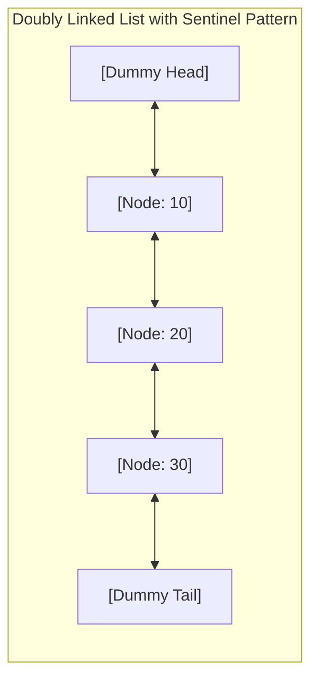

## Problem Description

While an Array requires a fixed, contiguous block of memory and costs `O(N)` to insert/delete elements at the beginning or middle, many system problems (like OS process management, Text Buffers, or LRU Caches) require a data structure capable of **flexible, discrete memory allocation** that permits **insertion/deletion in constant `O(1)` time** at a known pointer location.

The **Linked List** is the classic solution perfectly addressing this requirement. It organizes elements as distributed **Nodes** on the Heap memory, chained together via **Pointers / References**.

## Initial Approach

The most basic approach is the **Singly Linked List**: Each node contains a data value and a single `next` pointer directing to the subsequent node. The weakness of a singly linked list is that traversal is strictly one-way from head to tail; to delete an arbitrary node, we must find the node immediately preceding it in `O(N)`.

To overcome this, we use the **Doubly Linked List**: Each node maintains both a `next` pointer (to the succeeding node) and a `prev` pointer (to the preceding node), enabling two-way traversal and allowing current node deletion in absolute `O(1)` time.

## Optimization Mindset & Algorithm Structure

When manipulating pointers in Linked Lists, classic bugs such as _Null Pointer Dereference_ or _Memory Leaks_ typically arise from edge cases (empty list, inserting at the Head, deleting at the Tail). Professional engineers apply the **Sentinel (Dummy) Node** technique:

1. **Sentinel Nodes:** Initialize 2 fixed placeholder nodes: `dummyHead` and `dummyTail`. An empty list always has `dummyHead->next = dummyTail` and `dummyTail->prev = dummyHead`. Every actual data node resides sandwiched between these 2 sentinels.
2. **Completely eliminate `if (head == nullptr)` branches:** Insertion/deletion at any location (head, middle, tail) strictly follows a single pointer-swapping pattern, eliminating 100% of complex conditional branching.
3. **4-step pointer swap when inserting in the middle:**

```c++
newNode->next = target;
newNode->prev = target->prev;
target->prev->next = newNode;
target->prev = newNode;
```

4. **2-step pointer swap when deleting a node:**

```c++
nodeToDelete->prev->next = nodeToDelete->next;
nodeToDelete->next->prev = nodeToDelete->prev;
delete nodeToDelete;
```

## Source Code Implementation & Dry Run

Diagram of a Doubly Linked List structure using Sentinel Nodes (Dummy Head / Tail):



**Complete C++ Source Code: Memory-Safe Doubly Linked List with Sentinel Nodes:**

```c++
#include <iostream>

template <typename T>
class DoublyLinkedList {
private:
    struct Node {
        T data;
        Node* prev;
        Node* next;
        Node(const T& val = T()) : data(val), prev(nullptr), next(nullptr) {}
    };

    Node* head; // Dummy Head sentinel
    Node* tail; // Dummy Tail sentinel
    size_t count;

public:
    DoublyLinkedList() : count(0) {
        head = new Node();
        tail = new Node();
        head->next = tail;
        tail->prev = head;
    }

    ~DoublyLinkedList() {
        clear();
        delete head;
        delete tail;
    }

    // Insert at the front of the list: O(1)
    void pushFront(const T& val) {
        insertAfter(head, val);
    }

    // Insert at the end of the list: O(1)
    void pushBack(const T& val) {
        insertAfter(tail->prev, val);
    }

    // Insert a new value immediately after prevNode: O(1)
    void insertAfter(Node* prevNode, const T& val) {
        Node* newNode = new Node(val);
        Node* nextNode = prevNode->next;

        newNode->next = nextNode;
        newNode->prev = prevNode;
        prevNode->next = newNode;
        nextNode->prev = newNode;

        ++count;
    }

    // Delete a specific node in O(1)
    void removeNode(Node* target) {
        if (target == head || target == tail || target == nullptr) return;

        target->prev->next = target->next;
        target->next->prev = target->prev;
        delete target;
        --count;
    }

    // Remove the first element: O(1)
    void popFront() {
        if (!empty()) {
            removeNode(head->next);
        }
    }

    // Remove the last element: O(1)
    void popBack() {
        if (!empty()) {
            removeNode(tail->prev);
        }
    }

    void clear() {
        while (!empty()) {
            popFront();
        }
    }

    size_t size() const { return count; }
    bool empty() const { return count == 0; }

    void printForward() const {
        std::cout << "Forward:  ";
        for (Node* curr = head->next; curr != tail; curr = curr->next) {
            std::cout << curr->data << " <-> ";
        }
        std::cout << "NULL" << std::endl;
    }
};

int main() {
    DoublyLinkedList<int> list;

    std::cout << "--- DOUBLY LINKED LIST (SENTINEL) DEMO ---" << std::endl;
    list.pushBack(10);
    list.pushBack(20);
    list.pushBack(30);
    list.pushFront(5);

    list.printForward(); // 5 <-> 10 <-> 20 <-> 30 <-> NULL

    std::cout << "Removing front and back..." << std::endl;
    list.popFront();
    list.popBack();

    list.printForward(); // 10 <-> 20 <-> NULL
    std::cout << "Current size: " << list.size() << std::endl;

    return 0;
}
```

**Detailed Execution Trace (Dry Run):**

- _Initialization:_ `head <-> tail`. `count = 0`.
- _`pushBack(10)`:_ Insert after `tail->prev (head)`: `head <-> [10] <-> tail`.
- _`pushBack(20)`:_ Insert after `tail->prev ([10])`: `head <-> [10] <-> [20] <-> tail`.
- _`pushFront(5)`:_ Insert after `head`: `head <-> [5] <-> [10] <-> [20] <-> tail`.
- _`popFront()`:_ Delete node `head->next ([5])`: Wire `head` directly to `[10]` &rarr; `head <-> [10] <-> [20] <-> tail` in exactly 2 pointer operations `O(1)`.

## Complexity Evaluation & Practical Applications

- **Insert / Delete at a known pointer position:** Absolute `O(1)` (no shifting of other elements required).
- **Push / Pop Front/Back:** `O(1)` utilizing a doubly linked list with a tail pointer.
- **Search by Value:** `O(N)` because it requires sequential pointer traversal.
- **Access by Index:** `O(N)` (does not support Random Access like Arrays).
- **Space Complexity:** `O(N)` with a memory overhead of 8 to 16 bytes per node to store `prev` and `next` pointers on 64-bit architectures.
- **Practical Applications:**
  - **LRU (Least Recently Used) Cache:** Combining a Hash Table with a Doubly Linked List to achieve `O(1)` operations for both read and write.
  - **Operating Systems (Process Schedulers):** Managing Ready Queues for executing processes and Free List Memory Allocators.
  - **Music Players & Web Browsers:** Next / Prev Track functionality and Back / Forward History.
