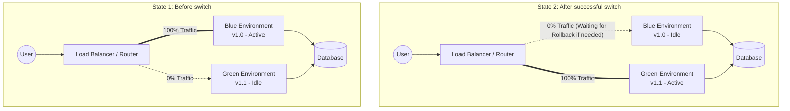

## Objective of the Article

In modern software environments, service disruption (downtime) during a new version update is taboo. This article belongs to the **DevOps, Cloud & Tooling** series, focusing on analyzing and guiding the application of the **Blue-Green Deployment** strategy into the CI/CD pipeline.

The article will address two core questions:

- **When to use it?** Use it when the system requires **zero-downtime**, needs immediate **rollback** capability if errors occur, and the applications are mission-critical systems (finance, healthcare, large e-commerce).

- **How to use it?** By maintaining two independent but infrastructure-identical environments, combined with a flexible traffic routing mechanism at the Load Balancer/Router layer.

## Architecture / Working Principle

The principle of Blue-Green Deployment revolves around running two identical infrastructure environments in parallel:

- **Blue Environment (Active):** Running the current version and serving 100% of user traffic.

- **Green Environment (Idle):** A static environment used to deploy and test the new version (vNext).

Once the new version on Green has passed all tests (Health checks, Integration tests), the router (Load Balancer, API Gateway, or Ingress) will redirect all traffic from Blue to Green. At this point, Green becomes Active, and Blue becomes Idle (waiting to be destroyed or used for the next deployment).



## Step-by-Step Setup

Below is a standard CI/CD flow using popular tools (like GitLab CI/GitHub Actions, Docker, and Nginx as a Load Balancer).

### Step 1: Infrastructure Preparation (Infrastructure as Code)

Ensure you have flexible traffic routing capabilities. For example, configuring Nginx upstream:

```nginx
# nginx.conf
upstream backend_servers {
    # This variable will be changed by CI/CD during swap
    server 10.0.0.1:8080; # Blue IP
    # server 10.0.0.2:8080; # Green IP
}

server {
    listen 80;
    location / {
        proxy_pass http://backend_servers;
    }
}
```

### Step 2: Continuous Integration (CI)

When Developers push new code (v1.1):

1. **Build:** Package the source code (e.g., build Docker image).
2. **Test:** Run Unit Tests, Linting.
3. **Push:** Push Image to Container Registry (Docker Hub, GCR, AWS ECR).

### Step 3: Continuous Deployment (CD - Deploy to Green)

1. **Identify Idle Environment:** The CD script checks which environment is Active. If Blue is Active -> deployment target is Green.
2. **Deploy:** Pull the latest Docker image and launch containers on the Green environment.
3. **Pre-flight Checks:** Run Integration Tests and API Health Checks directly against the internal IP of the Green environment (bypassing external Load Balancer).

### Step 4: Traffic Cutover

1. **Update Router:** If tests in Step 3 pass, the pipeline updates the Nginx config file (pointing `backend_servers` to Green's IP).
2. **Reload Service:** Execute the Router reload command (e.g., `nginx -s reload`) to apply changes without dropping current connections.
3. **Verify:** Monitor for errors (HTTP 5xx) during the first few minutes. If the system is stable, the process is complete.

## Troubleshooting and Common Issues

1. Database Conflicts (Database Schema Changes)

- **Problem:** Both Blue and Green share the same Database. If the v1.1 update deletes a column that v1.0 (currently serving users) still needs, the v1.0 system will crash immediately.
- **Solution:** Always apply **Forward/Backward Compatible Migrations**. Separate schema changes into 2 steps: _Deploy v1.1_, add the new column, code supports both old and new columns; _Deploy v1.2_, permanently delete the old column when v1.0 no longer exists.

2. Loss of User Sessions during Swap

- **Problem:** When traffic switches from Blue to Green, users are logged out or payment flows are interrupted due to sessions stored in Blue's server RAM.
- **Solution:** Stateless Architecture. Move the entire Session State to an external storage system like **Redis** or Memcached.

3. Difficulties in Data Rollback

- **Problem:** Switching traffic back to Blue is very fast, but what if Green wrote a large amount of "junk data" or incorrect structures to the DB during its Active time?
- **Solution:** Separate database migrations from code CI/CD flows. If the code logic is flawed, rollback traffic to Blue. If the data is corrupted, there must be a pre-prepared Data Rollback or manual Data Fix scenario.

## Evaluation & Extension

### Evaluation

- **Pros:**
  - Achieves true Zero-downtime.
  - Rollbacks take only seconds (just reverting the Load Balancer config).
  - Minimizes psychological pressure on Dev/Ops teams during releases.
- **Cons:**
  - Doubled costs: Must maintain double the infrastructure (at least during deployment).
  - Extremely complex Database management.

### Extension Patterns (Advanced Patterns)

1. **Canary Release:** Instead of switching 100% of traffic immediately, you can combine Router configurations to shift 5% -> 10% -> 50% -> 100% of traffic to Green to measure risk.
2. **Automated Rollback:** Integrate CI/CD with monitoring tools (Prometheus, Datadog). If after swapping to Green, the Error Rate (5xx errors) exceeds 1% within 2 minutes, CI/CD automatically triggers a script to route traffic back to Blue.
3. **Kubernetes (K8s):** In Cloud Native environments, Blue-Green can be easily implemented by changing the `selector` of a `Service` to point to `Pods` bearing the new version's label, avoiding manual Nginx config management.
