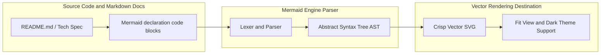
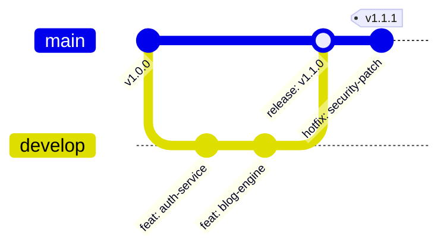

## Article Objective

In modern software development, technical documentation and Architecture Diagrams play a vital role in synchronizing understanding among technical team members. However, the traditional method of drawing diagrams using GUI tools (like Draw.io, Visio, Lucidchart) and saving them as binary image files (.png, .jpg) often reveals fatal flaws:

- **Documentation Drift:** When code changes, the process of reopening a drawing tool, editing the image, exporting, and committing back to the repository is often skipped due to the heavy workflow, causing documentation to quickly become outdated.
- **No Git Diff:** Binary image files cannot be compared line-by-line (line-by-line diff) in Pull Requests, making architecture reviews difficult.

The objective of this article is to introduce the **Diagrams as Code (DaC)** solution via the **Mermaid.js** library - transforming diagram drawing into plain text blocks that can be version-controlled, automatically rendered on GitHub/GitLab, and integrated directly into Markdown documentation.

## Architecture / Operating Principles

The core principle of Mermaid.js is using a declarative text syntax to build an Abstract Syntax Tree (AST) and compile it directly into scalable vector graphics (SVG). Below are the most important diagram families commonly used in engineering workflows:

1. **Flowchart & Architecture Graph:** Used to describe navigation flows, infrastructure structures, or component tiering. Supports `TD` (Top-Down), `LR` (Left-Right) orientations, and `subgraph` grouping.
2. **Sequence Diagram:** Extremely powerful for describing handshake protocols, API call flows between microservices, or interaction lifecycles. Supports `autonumber`, `actor`, `participant`, `alt/else` (branching conditions), and `loop`.
3. **Git Graph:** Vividly visualizes branching strategies (GitFlow / Trunk-based development), commit chains, and merge/rebase operations.
4. **Class & Entity Relationship Diagram (ERD):** Describes the entity-relationship schema in a database or object-oriented programming class structures.

## Step-by-Step Setup

A step-by-step process for applying Mermaid.js to software projects and documentation:

1. **Declare Mermaid blocks in Markdown:** Use standard `mermaid` code fences in any Markdown document. Platforms like GitHub, GitLab, Notion, and Obsidian all natively support this rendering as of 2022.
2. **Build a sample GitFlow branching diagram:**

3. **Integrate Automation in CI/CD Pipelines:** Use the `@mermaid-js/mermaid-cli` (command `mmdc`) CLI tool to automatically export diagrams to PDF/PNG image files for publishing technical books or internal archives.

## Troubleshooting & Common Pitfalls

While working practically with Mermaid, engineers often encounter these 3 common traps:

1. **Text Label Parsing Error:** When a text string in a label contains parentheses `()`, brackets `[]`, or quotes `""`, the Mermaid parser might mistake it for node shape formatting syntax. _Fix:_ Avoid nesting parentheses or brackets inside unquoted labels, use dashes as separators: `NodeA[Node Name - With details]`.
2. **HTML Entity Characters:** When the Markdown parser converts `<` to `<` or `>` to `>`, make sure to run a sanitize/unescape function on the string before passing it to `mermaid.render()`.
3. **Size Overflow on highly-branched diagrams:** Avoid placing all 50+ services on a flat diagram. Utilize `subgraph`s or break them down into smaller diagrams based on domain areas (Domain-Driven Context).

## Evaluation & Extension

- **Engineering Productivity Optimization (ROI):** Save up to **80% of the time** spent updating documentation when systems change their architecture. Every change is reflected directly through Git pull request commits.
- **Auto-generating diagrams from source code (AST to Diagram):** Combine OpenAPI/Swagger plugins or TypeScript/Go AST parsers to automatically scan codebases and generate Class Diagrams or data flow diagrams without manual typing.
- **Platform Compatibility:** The SVG vector format ensures diagrams remain crisp across all pixel densities (Retina/4K) and allows easy visual customization via CSS.
