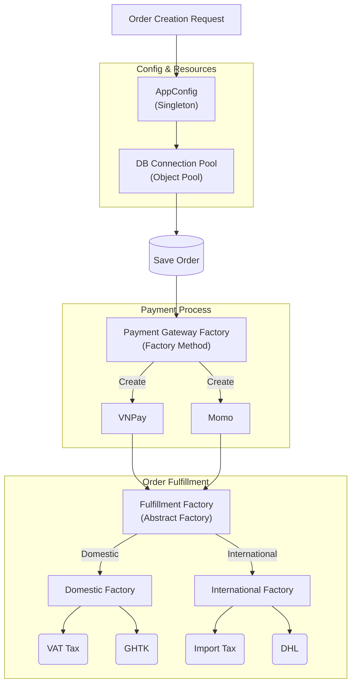

## Overall Architecture with Creational Patterns

## Selection Criteria (Decision Matrix)

When facing design decisions for a large system (ERP, E-commerce, Data Pipeline), ask the following questions to choose the right Creational Pattern:

<table style="width:100%; border-collapse: collapse; margin-bottom: 20px;">
  <thead>
    <tr style="border-bottom: 2px solid #e2e8f0; text-align: left;">
      <th style="padding: 8px;">Problem Specification (Use Case)</th>
      <th style="padding: 8px;">Pattern</th>
      <th style="padding: 8px;">Real-world application example (Backend)</th>
    </tr>
  </thead>
  <tbody>
    <tr style="border-bottom: 2px solid #e2e8f0; text-align: left;">
      <td style="padding: 8px">Need strict control so that <strong>only 1 instance</strong> exists globally?</td>
      <td style="padding: 8px"><strong>Singleton</strong></td>
      <td style="padding: 8px">System Logger, Configuration Manager, State Manager.</td>
    </tr>
    <tr style="border-bottom: 2px solid #e2e8f0; text-align: left;">
      <td style="padding: 8px">Object initialization cost (CPU, I/O, Network) is <strong>very expensive</strong>, requiring continuous allocation and deallocation?</td>
      <td style="padding: 8px"><strong>Object Pool</strong></td>
      <td style="padding: 8px">Database/Redis Connection Pool, Thread Pool, Worker Pool.</td>
    </tr>
    <tr style="border-bottom: 2px solid #e2e8f0; text-align: left;">
      <td style="padding: 8px">Need to create an object with a common interface but the <strong>specific generation logic depends on subclass/param</strong>?</td>
      <td style="padding: 8px"><strong>Factory Method</strong></td>
      <td style="padding: 8px">Initializing Data Exporter (PDF/CSV/Excel), Payment Gateways.</td>
    </tr>
    <tr style="border-bottom: 2px solid #e2e8f0; text-align: left;">
      <td style="padding: 8px">Need to spawn <strong>multiple interdependent objects at once</strong>, belonging to the same family?</td>
      <td style="padding: 8px"><strong>Abstract Factory</strong></td>
      <td style="padding: 8px">Creating cross-platform UI Components, Multi-Cloud Infrastructure Provisioning (AWS/GCP), Regional Processing Modules (Domestic/International).</td>
    </tr>
    <tr style="border-bottom: 2px solid #e2e8f0; text-align: left;">
      <td style="padding: 8px"><em>Addition:</em> Object construction is <strong>too complex</strong>, needing to be built through multiple sequential steps?</td>
      <td style="padding: 8px"><strong>Builder</strong> <em>(For reference)</em></td>
      <td style="padding: 8px">Creating dynamic SQL queries (Query Builder), Building complex HTTP Requests.</td>
    </tr>
  </tbody>
</table>

## Lessons Learned

Abusing Design Patterns is the shortest path to _Over-engineering_ (unnecessarily complicating the system).

- Do not use Singleton if the object doesn't truly share state.
- Do not rush to use Abstract Factory if the system only has one single shipping method; Factory Method or Dependency Injection is sufficient.
- Always prioritize readability and Maintainability.

Software design isn't about rigidly imposing Patterns, but rather **understanding the core pain points of the problem** to choose the most elegant tool for the job.
