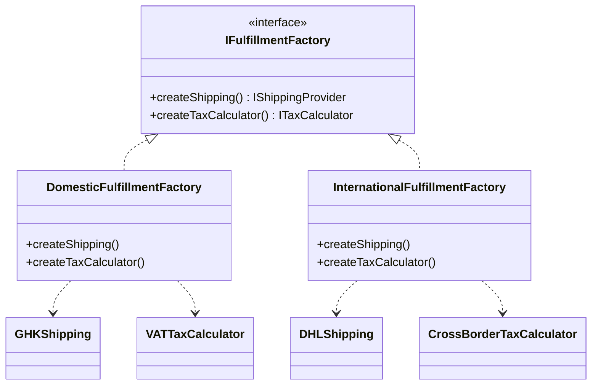

## Problem Description

An order has been successfully paid. The final step is Fulfillment, which includes: Tax calculation and Shipping scheduling.
A problem arises: The system serves both **Domestic** and **International** orders.

- Domestic Order: Uses Giao Hang Tiet Kiem (Shipping) + VAT calculation (Tax).
- International Order: Uses DHL (Shipping) + Cross-border import tax calculation (Tax).

If initialized chaotically (e.g., a Domestic order calling the DHL API), the system will miscalculate costs. We need a mechanism to initialize based on "Families" (Family of related objects). That is the **Abstract Factory Pattern**.

## What is the Abstract Factory Pattern?

This pattern provides an interface for creating "families" of related or dependent objects without specifying their concrete classes.

## Applying to the System

We will design an `IFulfillmentFactory` interface with 2 methods: `createShipping()` and `createTaxCalculator()`. There will be 2 implementations: `DomesticFulfillmentFactory` and `InternationalFulfillmentFactory`.



## Implementation (Pseudocode)

```typescript
// --- Product Interfaces ---
interface IShippingProvider {
  arrangeDelivery(): void;
}
interface ITaxCalculator {
  calculate(amount: number): number;
}

// --- Concrete Products: Domestic ---
class GHKShipping implements IShippingProvider {
  arrangeDelivery() {
    console.log("Shipping via GHTK");
  }
}
class VATTaxCalculator implements ITaxCalculator {
  calculate(amount: number) {
    return amount * 0.1;
  } // VAT 10%
}

// --- Concrete Products: International ---
class DHLShipping implements IShippingProvider {
  arrangeDelivery() {
    console.log("Shipping via DHL");
  }
}
class CrossBorderTaxCalculator implements ITaxCalculator {
  calculate(amount: number) {
    return amount * 0.15;
  } // Import tax 15%
}

// --- Abstract Factory ---
interface IFulfillmentFactory {
  createShippingProvider(): IShippingProvider;
  createTaxCalculator(): ITaxCalculator;
}

// --- Concrete Factories ---
class DomesticFulfillmentFactory implements IFulfillmentFactory {
  createShippingProvider() {
    return new GHKShipping();
  }
  createTaxCalculator() {
    return new VATTaxCalculator();
  }
}

class InternationalFulfillmentFactory implements IFulfillmentFactory {
  createShippingProvider() {
    return new DHLShipping();
  }
  createTaxCalculator() {
    return new CrossBorderTaxCalculator();
  }
}

// Client Code (Service)
function processFulfillment(factory: IFulfillmentFactory, amount: number) {
  const taxCalc = factory.createTaxCalculator();
  const shipping = factory.createShippingProvider();

  console.log("Tax:", taxCalc.calculate(amount));
  shipping.arrangeDelivery();
}

// Usage
const orderType = "international";
const factory =
  orderType === "domestic"
    ? new DomesticFulfillmentFactory()
    : new InternationalFulfillmentFactory();

processFulfillment(factory, 1000000);
// Ensures shipping and tax are always synchronized according to the order type.
```
