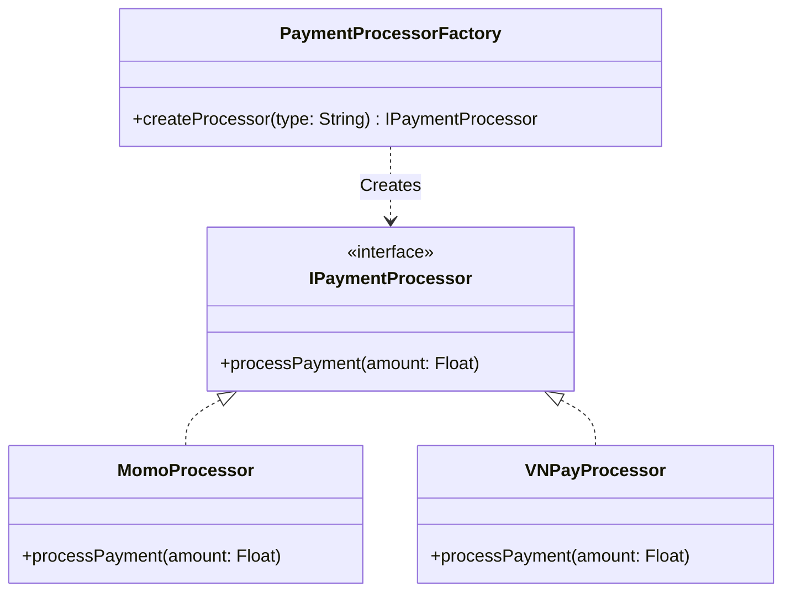

## Problem Description

The order has been saved to the Database. Now it's time for the customer to pay. The business requirement is that the system must support multiple methods: Momo E-wallet, VNPay, or International Credit Cards (Stripe). Each gateway has completely different API calling and signature encryption methods.

If we write all `if-else` statements in the `OrderService`, the code will violate the Open/Closed Principle (OCP) and become very difficult to maintain. The **Factory Method** completely resolves this issue.

## What is the Factory Method Pattern?

This pattern defines an interface for creating an object, but lets subclasses decide which class to instantiate. The Factory Method defers instantiation to subclasses.

## Applying to the Order Processing System

Instead of directly initializing `new MomoPayment()` or `new VNPayPayment()`, we create a `PaymentProcessorFactory`. Based on input parameters, the Factory will generate the corresponding payment processing object standardized through a common interface, `IPaymentProcessor`.



## Implementation (Pseudocode)

```typescript
// 1. Common Interface
interface IPaymentProcessor {
  processPayment(amount: number): boolean;
}

// 2. Concrete implementations
class MomoProcessor implements IPaymentProcessor {
  processPayment(amount: number): boolean {
    console.log(`Processing ${amount} VND via Momo...`);
    // Momo API logic
    return true;
  }
}

class VNPayProcessor implements IPaymentProcessor {
  processPayment(amount: number): boolean {
    console.log(`Processing ${amount} VND via VNPay...`);
    // Signature creation, VNPay API logic
    return true;
  }
}

// 3. Factory Class
class PaymentProcessorFactory {
  public static createProcessor(method: string): IPaymentProcessor {
    switch (method.toLowerCase()) {
      case "momo":
        return new MomoProcessor();
      case "vnpay":
        return new VNPayProcessor();
      default:
        throw new Error("Payment method not supported");
    }
  }
}

// Usage in Controller
const selectedMethod = "vnpay"; // Fetched from user request
const processor = PaymentProcessorFactory.createProcessor(selectedMethod);
processor.processPayment(1000000);
```

## Benefits

Later on, when you need to integrate ZaloPay, you just create a `ZaloPayProcessor` class and add a case to the Factory, completely untouched the core of `OrderService`.
However, if the system has multiple interconnected processes (Shipping, Tax Calculation) categorized differently (Domestic / International), the Factory Method will become overloaded. That's when we upgrade to the **Abstract Factory Pattern**.
