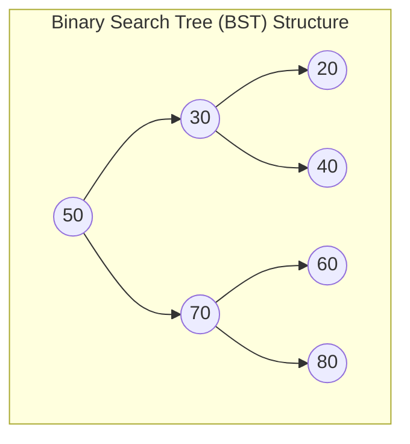

## Problem Description

Linear data structures (Arrays, Linked Lists, Stacks, Queues) only represent data sequentially in one dimension. However, in the real world, information often has **Hierarchical Relationships** - such as File System Hierarchies, the HTML DOM Tree parsing structure in browsers, or decision trees in artificial intelligence.

A **Tree** is a non-linear data structure consisting of a set of nodes connected by directed edges, starting from a single node called the **Root** and containing no cycles.

The most crucial tree structure is the **Binary Search Tree (BST)**: Each node has a maximum of 2 child nodes (Left child `left` and Right child `right`), satisfying the **BST Invariant**:

```
All nodes in Left Subtree < Root Node < All nodes in Right Subtree
```

## Initial Approach

Why does the BST outperform Arrays and Linked Lists?

- Sorted Array: Fast searching `O(\log N)` via Binary Search, but extremely slow Insertion/Deletion `O(N)`.
- Linked List: Fast Insertion/Deletion `O(1)` at a known node, but slow Searching `O(N)`.
- **BST perfectly combines the strengths of both:** Provides Searching `O(\log N)`, Insertion `O(\log N)`, and Deletion `O(\log N)` under balanced tree conditions.

## Optimization Mindset & Algorithm Structure

**Four Standard Tree Traversals:**

1. **In-order Traversal (Left &rarr; Root &rarr; Right):** Visit the left subtree, visit the root, visit the right subtree. _Magical property:_ An in-order traversal on a BST always produces a **perfectly sorted ascending sequence** of values.
2. **Pre-order Traversal (Root &rarr; Left &rarr; Right):** Visit the root first. Commonly used to copy the tree or for Serialization.
3. **Post-order Traversal (Left &rarr; Right &rarr; Root):** Visit both children first, then the root last. Mandatory when freeing memory (destroying the tree from leaves to root) or calculating directory sizes.
4. **Level-order Traversal (BFS):** Traverse level by level from top to bottom using a Queue.

**BST Node Deletion (3 scenarios):**

- _Scenario 1 (Leaf node - 0 children):_ Delete directly and set the parent's pointer to `nullptr`.
- _Scenario 2 (Node with 1 child):_ Connect the single child directly to the deleted node's parent.
- _Scenario 3 (Node with 2 children):_ Find the **In-order Successor** - which is the smallest node in the Right subtree. Copy the Successor's value into the current node, then recursively delete the Successor from the Right subtree.

## Source Code Implementation & Dry Run

Structure diagram of a Binary Search Tree and In-Order traversal sequence:



**Complete C++ Source Code: Binary Search Tree with Insert, Delete, Search & Traversal:**

```c++
#include <iostream>
#include <queue>

class BinarySearchTree {
private:
    struct TreeNode {
        int val;
        TreeNode* left;
        TreeNode* right;
        TreeNode(int x) : val(x), left(nullptr), right(nullptr) {}
    };

    TreeNode* root;

    // Recursive Insertion
    TreeNode* insertInternal(TreeNode* node, int val) {
        if (node == nullptr) return new TreeNode(val);
        if (val < node->val) {
            node->left = insertInternal(node->left, val);
        } else if (val > node->val) {
            node->right = insertInternal(node->right, val);
        }
        return node;
    }

    // Recursive Search
    bool searchInternal(TreeNode* node, int val) const {
        if (node == nullptr) return false;
        if (node->val == val) return true;
        if (val < node->val) return searchInternal(node->left, val);
        return searchInternal(node->right, val);
    }

    // Find the node with the minimum value in a subtree
    TreeNode* findMin(TreeNode* node) const {
        while (node && node->left != nullptr) {
            node = node->left;
        }
        return node;
    }

    // Recursive Deletion
    TreeNode* removeInternal(TreeNode* node, int val) {
        if (node == nullptr) return nullptr;

        if (val < node->val) {
            node->left = removeInternal(node->left, val);
        } else if (val > node->val) {
            node->right = removeInternal(node->right, val);
        } else {
            // Node to delete found!
            // Case 1 & 2: 0 or 1 child
            if (node->left == nullptr) {
                TreeNode* temp = node->right;
                delete node;
                return temp;
            } else if (node->right == nullptr) {
                TreeNode* temp = node->left;
                delete node;
                return temp;
            }
            // Case 3: 2 children -> Find In-order Successor
            TreeNode* successor = findMin(node->right);
            node->val = successor->val;
            node->right = removeInternal(node->right, successor->val);
        }
        return node;
    }

    void inOrderInternal(TreeNode* node) const {
        if (node == nullptr) return;
        inOrderInternal(node->left);
        std::cout << node->val << " ";
        inOrderInternal(node->right);
    }

    void destroyTree(TreeNode* node) {
        if (node == nullptr) return;
        destroyTree(node->left);
        destroyTree(node->right);
        delete node;
    }

public:
    BinarySearchTree() : root(nullptr) {}
    ~BinarySearchTree() { destroyTree(root); }

    void insert(int val) { root = insertInternal(root, val); }
    bool search(int val) const { return searchInternal(root, val); }
    void remove(int val) { root = removeInternal(root, val); }

    void printInOrder() const {
        std::cout << "In-Order Traversal (Sorted): ";
        inOrderInternal(root);
        std::cout << std::endl;
    }
};

int main() {
    BinarySearchTree bst;

    std::cout << "--- BINARY SEARCH TREE (BST) DEMO ---" << std::endl;
    bst.insert(50);
    bst.insert(30);
    bst.insert(70);
    bst.insert(20);
    bst.insert(40);
    bst.insert(60);
    bst.insert(80);

    bst.printInOrder(); // 20 30 40 50 60 70 80

    std::cout << "Searching for value 40: " << (bst.search(40) ? "FOUND" : "NOT FOUND") << std::endl;

    std::cout << "Deleting root node 50 (Node with 2 children)..." << std::endl;
    bst.remove(50);
    bst.printInOrder(); // 20 30 40 60 70 80

    return 0;
}
```

**Detailed Execution Trace (Dry Run):**

- _Insert values:_ `50, 30, 70, 20, 40, 60, 80`.
  - `30 < 50` &rarr; Left child of 50. `70 > 50` &rarr; Right child of 50.
  - `40 > 30` &rarr; Right child of 30. `60 < 70` &rarr; Left child of 70.
- _In-order Traversal:_ Visit 50's left subtree (`20, 30, 40`) &rarr; Root `50` &rarr; Right subtree (`60, 70, 80`) &rarr; Outputs the perfectly sorted sequence `[20, 30, 40, 50, 60, 70, 80]`.
- _Delete root 50:_ 50 has 2 children &rarr; Find In-order Successor in the right subtree (the smallest node of `{70, 60, 80}` is `60`) &rarr; Assign `root->val = 60`, delete the old node 60 from the right leaf &rarr; The tree perfectly maintains the BST invariant.

## Complexity Evaluation & Practical Applications

- **Search, Insert, Delete (Average Case / Balanced Tree):** `O(\log N)` proportional to the tree height `h \sim \log_2 N`.
- **Worst Case (Tree degrades into a Linked List):** `O(N)` when inserting an already sorted sequence (fully resolved by Self-Balancing Trees like AVL Trees and Red-Black Trees used in `std::map` / `std::set`).
- **Full Tree Traversals:** `\Theta(N)` time and `O(h)` Call Stack space.
- **Practical Applications:**
  - **C++ `std::map` / `std::set`:** Implemented using Red-Black BSTs guaranteeing `O(\log N)` time in all cases.
  - **B-Tree & B+ Tree Databases:** Expanding binary trees into multi-way branching trees to optimize hard drive indexing in MySQL InnoDB and PostgreSQL.
  - **Huffman Coding Data Compression:** Utilizing Binary Trees to generate variable-length prefix codes that optimize file sizes.
