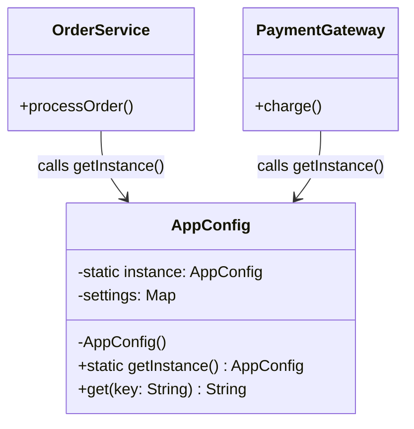

## Problem Description

In this series, we will build the backend for an **Order Processing System**. The very first challenge upon booting the system is managing configuration parameters (Database credentials, Payment partner API Keys, dev/prod environments).

If every module automatically reads the `.env` file or queries the DB to fetch configurations, the system will waste I/O and easily end up in an inconsistent state. This is where the **Singleton Pattern** shines.

## What is the Singleton Pattern?

Singleton ensures a class has **only one instance** created throughout the application's lifecycle, while providing a global access point to that instance.

## Applying to the Order Processing System

We will create an `AppConfig` class to load system configurations only once during startup. Any service (Payment, Shipping, Database) requiring configuration will call this instance.



## Implementation (Pseudocode - TypeScript)

```typescript
class AppConfig {
  private static instance: AppConfig;
  private settings: Map<string, string>;

  // Constructor is always private to prevent instance creation via the 'new' keyword
  private constructor() {
    this.settings = new Map();
    this.loadConfiguration(); // Read from file or Secrets Manager
  }

  private loadConfiguration() {
    console.log("Loading system configurations...");
    this.settings.set("DB_HOST", "localhost");
    this.settings.set("PAYMENT_API_KEY", "secret_abc123");
  }

  public static getInstance(): AppConfig {
    if (!AppConfig.instance) {
      AppConfig.instance = new AppConfig();
    }
    return AppConfig.instance;
  }

  public get(key: string): string {
    return this.settings.get(key) || "";
  }
}

// Usage
const config1 = AppConfig.getInstance();
const config2 = AppConfig.getInstance();

console.log(config1 === config2); // Output: true - Both point to the same memory space
```

## Key Notes

- **Thread-safe**: In a Multi-threading environment, a locking mechanism (e.g., Mutex) is needed in the `getInstance()` function to avoid Race Conditions that spawn multiple instances simultaneously.
- In the next article, we will use configurations from `AppConfig` to initialize the database connection with the **Object Pool Pattern**.
