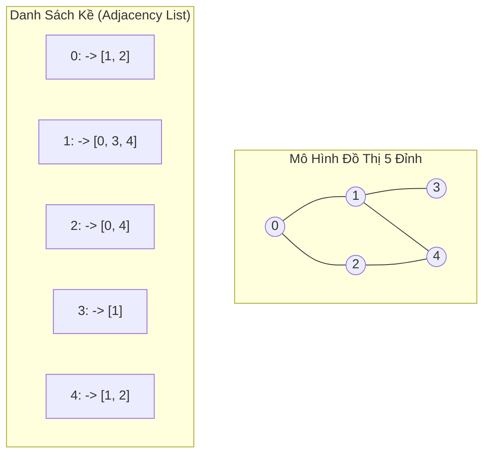

## Mô tả bài toán

Khi mô hình hóa các mạng lưới phức tạp trong thế giới thực - như mạng lưới bạn bè trên Facebook, mạng liên kết trang web của Google PageRank, hệ thống giao thông đường bay quốc tế, hay lưới phân phối điện năng - các mối quan hệ không còn đơn thuần là tuyến tính hay phân cấp một chiều. Các thực thể có thể **kết nối tùy ý với nhau tạo thành mạng lưới đa chiều**.

**Đồ thị (Graph)** là cấu trúc dữ liệu phi tuyến tính tổng quát nhất, được định nghĩa toán học bởi cặp `G = (V, E)`, trong đó:

- `V` (Vertices / Nodes): Tập hợp các **Đỉnh** (đại diện cho người dùng, thành phố, máy chủ).
- `E` (Edges / Links): Tập hợp các **Cạnh** kết nối giữa các cặp đỉnh (đại diện cho quan hệ bạn bè, đường bay, cáp mạng). Cạnh có thể có hướng (Directed) hoặc vô hướng (Undirected), có trọng số (Weighted) hoặc không trọng số.

## Ý tưởng tiếp cận ban đầu

Hai phương pháp kinh điển để biểu diễn đồ thị trong bộ nhớ máy tính:

1. **Ma trận kề (Adjacency Matrix):**

- Sử dụng ma trận 2 chiều `adj[V][V]`. Nếu có cạnh từ `u` đến `v` thì `adj[u][v] = 1` (hoặc bằng trọng số `w`), ngược lại bằng `0`.
- _Ưu điểm:_ Kiểm tra xem hai đỉnh bất kỳ có cạnh nối trực tiếp hay không trong thời gian tức thời `O(1)`.
- _Nhược điểm:_ Tiêu tốn bộ nhớ cố định `O(V²)` ngay cả khi đồ thị có rất ít cạnh (Đồ thị thưa). Duyệt qua các đỉnh kề của một nút tốn `O(V)`.

2. **Danh sách kề (Adjacency List):**

- Sử dụng mảng gồm `V` danh sách: `std::vector<std::vector<int>> adj(V)`. Mỗi đỉnh `u` lưu danh sách các đỉnh kề trực tiếp với nó.
- _Ưu điểm:_ Tiết kiệm bộ nhớ tối đa `O(V + E)`. Duyệt các đỉnh kề cực nhanh chỉ tốn `O(deg(u))`. Đây là cấu trúc chuẩn mực được sử dụng trong 99% các ứng dụng thực tế.

## Tư duy tối ưu & Cấu trúc thuật toán

**Hai Thuật toán Duyệt Đồ thị Cơ bản (Graph Traversals):**

1. **Tìm kiếm theo Chiều rộng (Breadth-First Search - BFS):**

- Sử dụng **Hàng chờ (Queue)** để duyệt đồ thị theo từng lớp sóng lan tỏa (Level by Level).
- _Đặc tính:_ Luôn tìm ra **đường đi ngắn nhất** (số cạnh ít nhất) từ đỉnh nguồn đến mọi đỉnh khác trên đồ thị không trọng số.

2. **Tìm kiếm theo Chiều sâu (Depth-First Search - DFS):**

- Sử dụng **Đệ quy / Ngăn xếp (Call Stack)** để đi sâu nhất có thể theo từng nhánh trước khi quay lui (Backtrack).
- _Đặc tính:_ Dùng để kiểm tra tính liên thông, phát hiện chu trình, sắp xếp Tô-pô (Topological Sort) và tìm các thành phần liên thông mạnh (SCC).

_Nguyên tắc an toàn:_ Bắt buộc phải duy trì mảng `visited[V]` để đánh dấu các đỉnh đã thăm, ngăn ngừa thuật toán rơi vào vòng lặp vô tận khi đồ thị chứa chu trình.

## Triển khai mã nguồn & Dry Run

Sơ đồ cấu trúc Danh sách kề và Cây duyệt đồ thị BFS / DFS:



**Mã nguồn C++ hoàn chỉnh: Graph Class với Adjacency List, BFS và DFS:**

```c++
#include <iostream>
#include <vector>
#include <queue>

class Graph {
private:
    int numVertices;
    std::vector<std::vector<int>> adj;

    void dfsInternal(int u, std::vector<bool>& visited) const {
        visited[u] = true;
        std::cout << u << " ";

        for (int v : adj[u]) {
            if (!visited[v]) {
                dfsInternal(v, visited);
            }
        }
    }

public:
    Graph(int vertices) : numVertices(vertices), adj(vertices) {}

    void addEdge(int u, int v, bool bidirectional = true) {
        adj[u].push_back(v);
        if (bidirectional) {
            adj[v].push_back(u);
        }
    }

    // Duyệt theo Chiều rộng (BFS)
    void bfs(int startNode) const {
        std::vector<bool> visited(numVertices, false);
        std::queue<int> q;

        visited[startNode] = true;
        q.push(startNode);

        std::cout << "BFS Traversal tu " << startNode << ": ";
        while (!q.empty()) {
            int u = q.front();
            q.pop();
            std::cout << u << " ";

            for (int v : adj[u]) {
                if (!visited[v]) {
                    visited[v] = true;
                    q.push(v);
                }
            }
        }
        std::cout << std::endl;
    }

    // Duyệt theo Chiều sâu (DFS)
    void dfs(int startNode) const {
        std::vector<bool> visited(numVertices, false);
        std::cout << "DFS Traversal tu " << startNode << ": ";
        dfsInternal(startNode, visited);
        std::cout << std::endl;
    }
};

int main() {
    Graph g(5);

    // Xây dựng đồ thị 5 đỉnh: 0, 1, 2, 3, 4
    g.addEdge(0, 1);
    g.addEdge(0, 2);
    g.addEdge(1, 3);
    g.addEdge(1, 4);
    g.addEdge(2, 4);

    std::cout << "--- DEMO DUYET DO THI (GRAPH TRAVERSALS) ---" << std::endl;
    g.bfs(0); // BFS: 0 1 2 3 4
    g.dfs(0); // DFS: 0 1 3 4 2

    return 0;
}
```

**Phân tích luồng thực thi chi tiết (Dry Run Trace):**

- _BFS từ đỉnh 0:_
  - Khởi tạo: `q = [0]`, `visited[0] = true`.
  - Pop 0 &rarr; In `0`. Đẩy các đỉnh kề chưa thăm `1, 2` vào hàng đợi &rarr; `q = [1, 2]`.
  - Pop 1 &rarr; In `1`. Đẩy các đỉnh kề chưa thăm `3, 4` &rarr; `q = [2, 3, 4]`.
  - Pop 2 &rarr; In `2`. Đỉnh kề 4 đã được đánh dấu thăm nên bỏ qua.
  - Pop 3, 4 &rarr; In `3, 4` &rarr; Kết quả BFS: `0 1 2 3 4`.
- _DFS từ đỉnh 0:_
  - Thăm 0 &rarr; Đi sâu vào nhánh 1 &rarr; Đi sâu vào nhánh 3 (hết đường, quay lui) &rarr; Đi sang nhánh 4 &rarr; Từ 4 đi sang 2 &rarr; Kết quả DFS: `0 1 3 4 2`.

## Đánh giá độ phức tạp & Ứng dụng thực tế

- **Độ phức tạp Thời gian (Time Complexity):** `Θ(V + E)` cho cả BFS và DFS khi dùng Danh sách kề. Mỗi đỉnh được thăm 1 lần và mỗi cạnh được duyệt qua tối đa 2 lần.
- **Độ phức tạp Không gian (Space Complexity):** `O(V + E)` để lưu trữ Danh sách kề và `O(V)` bộ nhớ bổ trợ cho mảng `visited` và Hàng đợi/Call Stack.
- **So sánh Ma trận kề vs Danh sách kề:**
  - Ma trận kề: Bộ nhớ `O(V²)`, kiểm tra cạnh `O(1)`, duyệt kề `O(V)` (Thích hợp cho đồ thị dày `E ~ V²`).
  - Danh sách kề: Bộ nhớ `O(V + E)`, kiểm tra cạnh `O(deg(u))`, duyệt kề `O(deg(u))` (Tối ưu tuyệt đối cho đồ thị thưa).
- **Ứng dụng thực tế:**
  - **Đồ thị Tri thức & Mạng xã hội:** Friend Recommendation (Thuật toán gợi ý bạn bè chung qua khoảng cách 2 bước BFS).
  - **Hệ thống Web Crawling của Công cụ Tìm kiếm:** Googlebot duyệt toàn bộ mạng Internet bằng thuật toán BFS phân tán.
  - **Phân tích Phụ thuộc Gói phần mềm (Package Managers):** npm/yarn sử dụng DFS để kiểm tra chu trình phụ thuộc vòng (Circular Dependencies) và sinh thứ tự biên dịch (Topological Sort).
