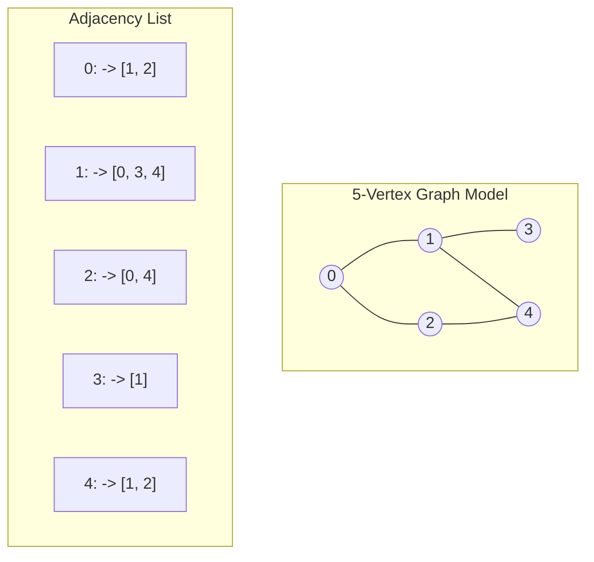

## Problem Description

When modeling complex networks in the real world - such as friendship networks on Facebook, Google PageRank's web link networks, international flight routing systems, or power distribution grids - relationships are no longer purely linear or strictly hierarchical. Entities can **connect to each other arbitrarily to form multidimensional networks**.

A **Graph** is the most generalized non-linear data structure, mathematically defined by a pair `G = (V, E)`, where:

- `V` (Vertices / Nodes): The set of **Vertices** (representing users, cities, servers).
- `E` (Edges / Links): The set of **Edges** connecting pairs of vertices (representing friendships, flights, network cables). Edges can be Directed or Undirected, Weighted or Unweighted.

## Initial Approach

There are two classic methods to represent a graph in computer memory:

1. **Adjacency Matrix:**

- Uses a 2D matrix `adj[V][V]`. If there is an edge from `u` to `v`, `adj[u][v] = 1` (or equals the weight `w`), otherwise `0`.
- _Pros:_ Checking whether any two specific vertices are directly connected takes instant `O(1)` time.
- _Cons:_ Consumes a fixed memory of `O(V²)` even if the graph has very few edges (Sparse Graph). Traversing adjacent vertices of a node takes `O(V)`.

2. **Adjacency List:**

- Uses an array of `V` lists: `std::vector<std::vector<int>> adj(V)`. Each vertex `u` stores a list of its directly adjacent vertices.
- _Pros:_ Maximally saves memory `O(V + E)`. Extremely fast to iterate over adjacent vertices, taking only `O(deg(u))` time. This is the standard structure used in 99% of real-world applications.

## Optimization Mindset & Algorithm Structure

**Two Fundamental Graph Traversal Algorithms:**

1. **Breadth-First Search (BFS):**

- Uses a **Queue** to traverse the graph layer by layer, propagating outward like ripples.
- _Characteristics:_ Always finds the **shortest path** (fewest edges) from the source vertex to all other vertices in an unweighted graph.

2. **Depth-First Search (DFS):**

- Uses **Recursion / Call Stack** to plunge as deep as possible into each branch before backtracking.
- _Characteristics:_ Used to check connectivity, detect cycles, perform Topological Sorts, and find Strongly Connected Components (SCCs).

_Safety Rule:_ You must maintain a `visited[V]` array to mark visited vertices, preventing the algorithm from falling into infinite loops when the graph contains cycles.

## Source Code Implementation & Dry Run

Structure diagram of an Adjacency List and BFS / DFS Traversal Trees:



**Complete C++ Source Code: Graph Class with Adjacency List, BFS, and DFS:**

```c++
#include <iostream>
#include <vector>
#include <queue>

class Graph {
private:
    int numVertices;
    std::vector<std::vector<int>> adj;

    void dfsInternal(int u, std::vector<bool>& visited) const {
        visited[u] = true;
        std::cout << u << " ";

        for (int v : adj[u]) {
            if (!visited[v]) {
                dfsInternal(v, visited);
            }
        }
    }

public:
    Graph(int vertices) : numVertices(vertices), adj(vertices) {}

    void addEdge(int u, int v, bool bidirectional = true) {
        adj[u].push_back(v);
        if (bidirectional) {
            adj[v].push_back(u);
        }
    }

    // Breadth-First Search (BFS)
    void bfs(int startNode) const {
        std::vector<bool> visited(numVertices, false);
        std::queue<int> q;

        visited[startNode] = true;
        q.push(startNode);

        std::cout << "BFS Traversal from " << startNode << ": ";
        while (!q.empty()) {
            int u = q.front();
            q.pop();
            std::cout << u << " ";

            for (int v : adj[u]) {
                if (!visited[v]) {
                    visited[v] = true;
                    q.push(v);
                }
            }
        }
        std::cout << std::endl;
    }

    // Depth-First Search (DFS)
    void dfs(int startNode) const {
        std::vector<bool> visited(numVertices, false);
        std::cout << "DFS Traversal from " << startNode << ": ";
        dfsInternal(startNode, visited);
        std::cout << std::endl;
    }
};

int main() {
    Graph g(5);

    // Build a 5-vertex graph: 0, 1, 2, 3, 4
    g.addEdge(0, 1);
    g.addEdge(0, 2);
    g.addEdge(1, 3);
    g.addEdge(1, 4);
    g.addEdge(2, 4);

    std::cout << "--- GRAPH TRAVERSALS DEMO ---" << std::endl;
    g.bfs(0); // BFS: 0 1 2 3 4
    g.dfs(0); // DFS: 0 1 3 4 2

    return 0;
}
```

**Detailed Execution Trace (Dry Run):**

- _BFS from vertex 0:_
  - Initialization: `q = [0]`, `visited[0] = true`.
  - Pop 0 &rarr; Print `0`. Push unvisited neighbors `1, 2` to queue &rarr; `q = [1, 2]`.
  - Pop 1 &rarr; Print `1`. Push unvisited neighbors `3, 4` &rarr; `q = [2, 3, 4]`.
  - Pop 2 &rarr; Print `2`. Neighbor 4 is already marked visited, so skip it.
  - Pop 3, 4 &rarr; Print `3, 4` &rarr; BFS result: `0 1 2 3 4`.
- _DFS from vertex 0:_
  - Visit 0 &rarr; Dive into branch 1 &rarr; Dive into branch 3 (dead end, backtrack) &rarr; Go to branch 4 &rarr; From 4 go to 2 &rarr; DFS result: `0 1 3 4 2`.

## Complexity Evaluation & Practical Applications

- **Time Complexity:** `\Theta(V + E)` for both BFS and DFS when using an Adjacency List. Each vertex is visited once, and each edge is evaluated at most twice.
- **Space Complexity:** `O(V + E)` to store the Adjacency List, and `O(V)` auxiliary memory for the `visited` array and Queue / Call Stack.
- **Adjacency Matrix vs Adjacency List Comparison:**
  - Adjacency Matrix: Space `O(V²)`, check edge `O(1)`, traverse neighbors `O(V)` (Suitable for Dense Graphs `E \approx V^2`).
  - Adjacency List: Space `O(V + E)`, check edge `O(deg(u))`, traverse neighbors `O(deg(u))` (Absolutely optimal for Sparse Graphs).
- **Practical Applications:**
  - **Knowledge Graphs & Social Networks:** Friend Recommendations (Finding mutual friends using a 2-step BFS).
  - **Search Engine Web Crawlers:** Googlebot indexes the entire Internet utilizing distributed BFS algorithms.
  - **Package Dependency Management:** npm/yarn use DFS to check for Circular Dependencies and generate compilation orders (Topological Sort).
