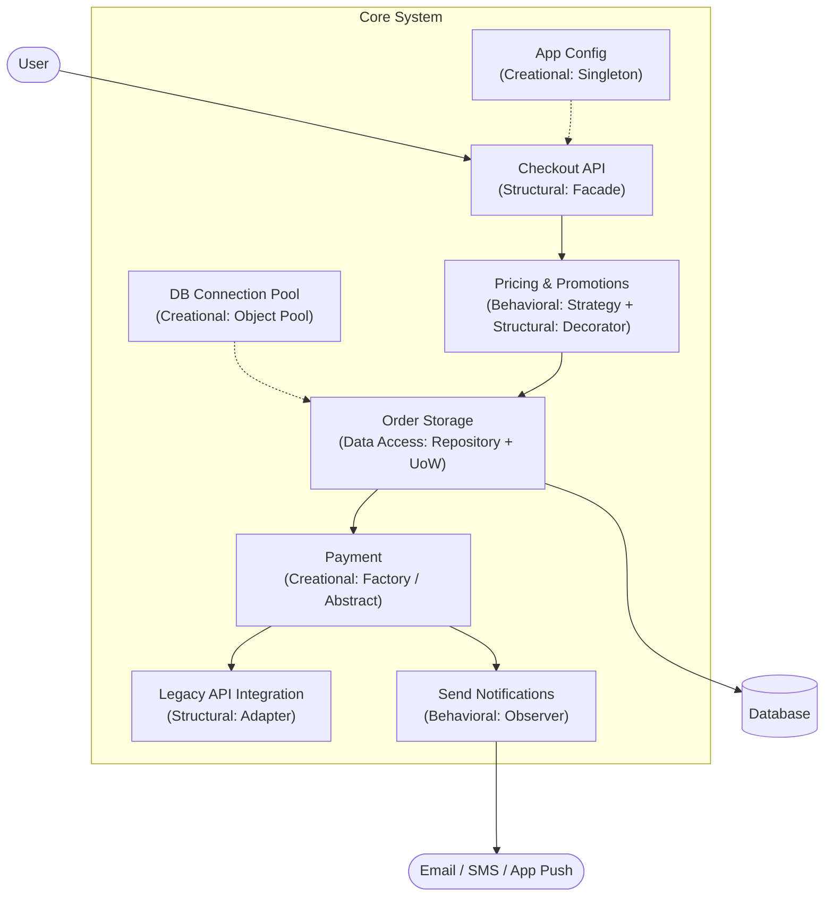

## Problem Description

Welcome to the comprehensive series on **Design Patterns**.

Usually, when learning about Design Patterns, we often encounter disconnected examples like Ducks, Shapes, or Vehicles. Although easy to understand conceptually, when applied to a real-world Backend project with thousands of lines of code, many programmers are left confused about where to logically place which pattern.

To solve that problem, this series is designed with a completely different approach: **Learning through a single, continuous Case Study**.

## Case Study: Order Processing System

Throughout all the articles, we will play the role of Software Engineers designing the backend for an E-commerce platform. This system must solve real-world problems:

- Centralized configuration management.
- High load tolerance during data writes.
- Integration with multiple payment gateways and shipping providers.
- Handling complex pricing rules and discount codes.
- Notifying users when order status changes.

Below is the big picture of the system architecture and where we will "assemble" Design Patterns:

Looking at the diagram above, you can see that technical problems don't stand alone but are tightly coupled. Each Pattern will act as a "gear" to keep the machine running smoothly, easy to maintain, and highly scalable.

## Series Roadmap

The series is divided into 4 main design pattern groups and 1 summary article, specifically:

### Part 1: Creational Patterns

Focuses on how to create objects safely, flexibly, and optimized for performance.

- **Singleton Pattern:** Building a system configuration manager (AppConfig).
- **Object Pool Pattern:** Optimizing the reuse of Database connections (Database Connection Pool).
- **Factory Method Pattern:** Flexibly extending payment gateways (Momo, VNPay, Stripe).
- **Abstract Factory Pattern:** Encapsulating the order fulfillment process for domestic and international.
- **Use Case Analysis:** Summary and selection criteria for Creational Patterns.

### Part 2: Behavioral Patterns

Focuses on how objects communicate, distribute responsibilities, and control flow.

- **Strategy Pattern:** Applying shipping fee calculation strategies and customer ranking algorithms.
- **Observer Pattern:** Building an Event-driven system, automatically sending email/SMS notifications upon order status changes.
- **Use Case Analysis:** Selection criteria for Behavioral Patterns.

### Part 3: Structural Patterns

Focuses on how to assemble objects and classes into larger structures while maintaining flexibility.

- **Decorator Pattern:** Designing a system to stack discount codes without bloating pricing logic.
- **Adapter Pattern:** Integrating an old partner's Inventory system (Legacy System) into new standards.
- **Facade Pattern:** Providing a single Checkout API, hiding the underlying complexity of the entire system.
- **Use Case Analysis:** Selection criteria for Structural Patterns.

### Part 4: Data Access Patterns

Focuses on the Database interaction layer, decoupling business logic from query logic.

- **Repository Pattern:** Building a standardized bridge between Domain Models and Database.
- **Unit Of Work Pattern:** Ensuring data integrity (Transactions) when saving orders, payment histories, and deducting inventory simultaneously.
- **Use Case Analysis:** Selection criteria for Data Access Patterns.

### Part 5: Summary

- **Synthesizing patterns and real-world application:** Looking back at the entire source code architecture. How to combine them without falling into the "Over-engineering" trap.

Prepare a cup of coffee, fire up your IDE, and let's begin the system design journey with the first article: **Creational Patterns - Singleton**.
