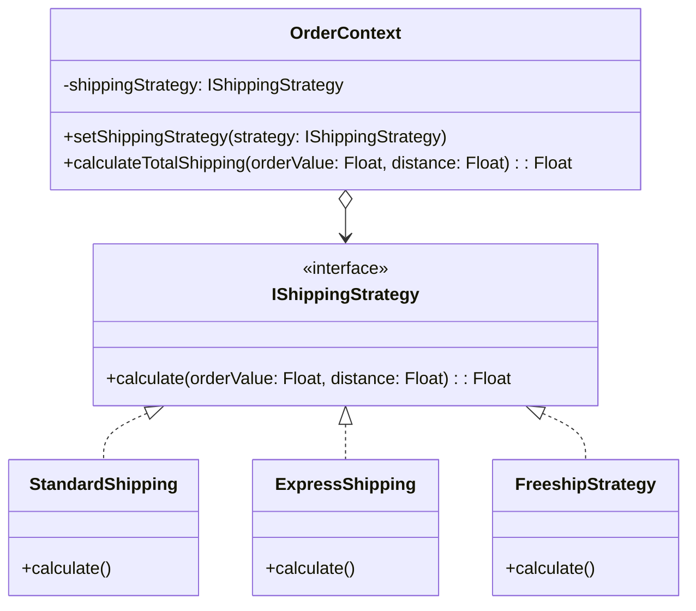

## Problem Description

During the order fulfillment phase, our system needs to calculate shipping fees. Real-world needs are highly diverse: Standard Shipping, Express Delivery, or Same-day Delivery. Even during Flash Sales, we might introduce a "Free Shipping" strategy.

If this logic is handled by a giant function containing dozens of `if-else` or `switch-case` blocks, the `OrderService` file will quickly develop "code smells", becoming hard to test and extremely risky to modify. The **Strategy Pattern** is born to completely solve this problem.

## What is the Strategy Pattern?

The Strategy Pattern is a Behavioral design pattern. It lets you define a family of algorithms (the "strategies"), encapsulate each one into separate classes, and make them interchangeable at runtime.

## Applying to the Order Processing System

We will define a common interface `IShippingStrategy`. The specific shipping methods will be classes that implement this interface. The `Order` class (acting as the Context) will only hold a reference to `IShippingStrategy` and call the calculation method without needing to know the internal logic.



## Implementation (Pseudocode - TypeScript)

```typescript
// 1. Common interface for strategies
interface IShippingStrategy {
  calculate(orderValue: number, distance: number): number;
}

// 2. Concrete Strategies
class StandardShipping implements IShippingStrategy {
  calculate(orderValue: number, distance: number): number {
    return distance * 15000; // 15k / km
  }
}

class ExpressShipping implements IShippingStrategy {
  calculate(orderValue: number, distance: number): number {
    return distance * 15000 + 30000; // Extra surcharge 30k
  }
}

class FreeshipStrategy implements IShippingStrategy {
  calculate(orderValue: number, distance: number): number {
    return 0; // Free shipping
  }
}

// 3. Context
class OrderContext {
  private strategy: IShippingStrategy;

  constructor(strategy: IShippingStrategy) {
    this.strategy = strategy;
  }

  public setShippingStrategy(strategy: IShippingStrategy) {
    this.strategy = strategy;
  }

  public getShippingFee(orderValue: number, distance: number): number {
    return this.strategy.calculate(orderValue, distance);
  }
}

// Usage
const distance = 10; // 10 km
const orderValue = 500000;

// Customer chooses standard delivery
let order = new OrderContext(new StandardShipping());
console.log("Standard Fee:", order.getShippingFee(orderValue, distance));

// Changes mind, switches to Express at runtime
order.setShippingStrategy(new ExpressShipping());
console.log("Express Fee:", order.getShippingFee(orderValue, distance));
```

## Pros / Cons Evaluation

**Pros:**

- **Open/Closed Principle (OCP):** Add new strategies (e.g., `HolidayShipping`) without altering old code.
- **Separation of Concerns:** Fee calculation algorithms are completely decoupled from core order processing flows.
- **Runtime Flexibility:** Can easily "swap" strategies based on configurations or user selections while running.

**Cons:**

- The Client (Controller/Service calling Context) must be aware of the existence of Concrete Strategies to pick the right one.
- Increases the number of classes in the system. If there are only 1-2 algorithms that rarely change, using Strategy is overkill.

After calculating fees and completing the order, the system needs to notify the customer across multiple channels. We will see how the **Observer Pattern** addresses this in the next article.
