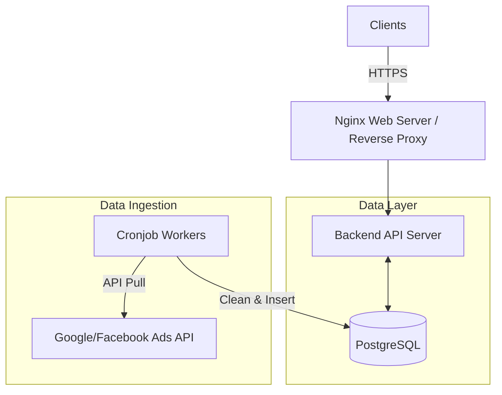

## Context & Problem

A digital agency has just launched a portal platform allowing clients to log in and monitor the daily performance of their advertising campaigns (Google Ads, Facebook Ads). The initial demand is not excessively large; the system is expected to serve around 100 concurrent users (CCU) during peak hours (early morning or the beginning of the month). The core problem is to build a system that is sufficiently fast, has low operating costs, and features the shortest time-to-market possible.

## System Requirements

- **Performance:** Report dashboard load time under 2 seconds.
- **Load Capacity:** 100 CCU, with each user averaging 3-5 API requests to load various charts.
- **Data:** Real-time processing is not required. Data is allowed a delay of 1 to 24 hours (updated via batch).
- **Availability:** 99%, short downtimes at night are acceptable for maintenance or running heavy batch jobs.

## Architectural Design

For a scale of 100 CCU, a Monolithic architecture combined with a traditional relational database is the optimal choice.

- **Web Server / Proxy:** Nginx handles HTTPS termination and serves the frontend's static assets.
- **Backend API:** A single instance running a backend framework responsible for authentication, authorization, and querying report data.
- **Database:** PostgreSQL is utilized as the sole database (functioning as both OLTP and lightweight OLAP). Advertising data is parsed and stored in normalized tables.
- **Data Ingestion:** Scripts executed via scheduled Cronjobs (e.g., every 4 hours) call APIs from advertising platforms, process the data, and write it into PostgreSQL.

## Trade-off Analysis

- **Cost vs. Scalability:** This architecture is incredibly cost-effective and can run entirely on 1 or 2 small VPS instances. However, as historical data inflates to tens of millions of rows, querying directly via standard SQL commands will begin to overload the database's CPU.
- **Simplicity vs. Single Point of Failure (SPOF):** The system bundles everything together (API, Database, Worker), leading to risks. If a worker script fails and causes a memory leak or full disk, the entire API service will crash alongside it.

## Practical Lessons & Best Practices

1. **Use Materialized Views:** Do not directly query `SUM()`, `COUNT()` functions on raw data tables when a user opens the dashboard. Create Materialized Views that pre-aggregate data by day/campaign and refresh them in the background.
2. **Proper Indexing:** Map the dashboard's query patterns to establish Composite Indexes. For example, an Index on `(client_id, campaign_id, date)` will save the system from catastrophic Full Table Scans.
3. **Isolate Workers:** Even though the system is small, the process pulling ad APIs (Cronjob) must have its resources isolated so it doesn't compete for CPU with the process serving APIs to end-users.
