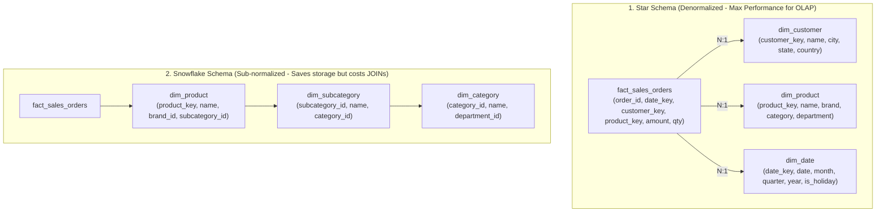
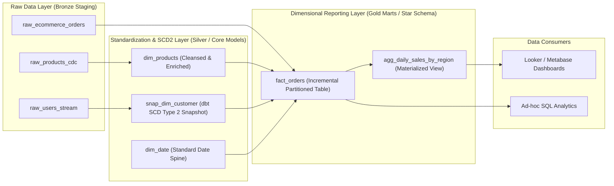

## Business Scenario / Data Requirements

In the digital era, all strategic business decisions must be guided by empirical data (Data-Driven Decision Making). However, one of the most common mistakes made by early-stage companies is: **Allowing Reporting tools (BI/Dashboards) and Data Analysts to query directly against the Transactional Database (OLTP Databases like PostgreSQL, MySQL)**.

This behavior quickly leads to a double disaster:

1. **Crippling the live operational system (OLTP Downtime):** Analytical queries scan millions of records simultaneously utilizing heavy aggregations (`SUM`, `AVG`, `COUNT DISTINCT`) and complex `JOIN`s, which hogs all CPU/RAM, causes Table Locks, and crashes customer-facing APIs.
2. **Fragmented 3NF Data Structure & Lack of Context:** Application databases are highly normalized (3NF) to optimize data writing (INSERT/UPDATE), causing a single order's data to be shattered across dozens of small tables. To answer a simple business question (e.g., _'What was the revenue by region and product group last quarter?'_), analysts have to write hundreds of lines of SQL with over 15 JOINs, resulting in sluggish query speeds and an extremely high rate of data discrepancies.
3. **Loss of Historical Traceability:** Transactional DBs only store the Current State. When a customer changes their shipping address or a product changes its category, old information is overwritten, completely distorting historical reports from the past.

**Core Requirements of a Data Warehouse System:**

- **Workload Isolation:** Completely separate the analytical workload (OLAP) from the transactional operational system (OLTP).
- **Data Integration:** Collect and unify data from dozens of disparate systems (CRM, ERP, Payment Gateways, Web Clickstreams) into a Single Source of Truth.
- **Optimized Dimensional Slicing & Dicing:** Model data so analysts can easily slice, drill-down, and aggregate metrics with response times under 1 second.
- **Comprehensive Historical Auditing (Time-Travel):** Preserve the exact transformational states of data at any given point in the past.

## Data Modeling

To build a robust Data Warehouse, data engineers must master 3 classical architectural schools and core data modeling techniques.

**1. The Three Classic Data Warehouse Architectural Schools:**

<table style="width:100%; border-collapse: collapse; margin-bottom: 20px;">
  <thead>
    <tr style="border-bottom: 2px solid #e2e8f0; text-align: left;">
      <th style="padding: 8px;">Criteria</th>
      <th style="padding: 8px;">Bill Inmon (Corporate Information Factory)</th>
      <th style="padding: 8px;">Ralph Kimball (Dimensional Modeling)</th>
      <th style="padding: 8px;">Dan Linstedt (Data Vault 2.0)</th>
    </tr>
  </thead>
  <tbody>
    <tr style="border-bottom: 1px solid #edf2f7;">
      <td style="padding: 8px"><b>Design Philosophy</b></td>
      <td style="padding: 8px">Top-Down: Build centralized 3NF warehouse first, then create Data Marts</td>
      <td style="padding: 8px">Bottom-Up: Directly build Data Marts as Dimensional models (Star Schema)</td>
      <td style="padding: 8px">Hybrid: Separate Keys (Hubs), Relationships (Links), and Attributes (Satellites)</td>
    </tr>
    <tr style="border-bottom: 1px solid #edf2f7;">
      <td style="padding: 8px"><b>Data Structure</b></td>
      <td style="padding: 8px">Highly Normalized (3NF - Third Normal Form)</td>
      <td style="padding: 8px">Denormalized (Fact & Dimension Tables)</td>
      <td style="padding: 8px">Extremely Normalized & Decomposed (Hub, Link, Satellite)</td>
    </tr>
    <tr style="border-bottom: 1px solid #edf2f7;">
      <td style="padding: 8px"><b>BI/Analyst Serving Capability</b></td>
      <td style="padding: 8px">Indirect (Must pass through intermediate Data Mart layer)</td>
      <td style="padding: 8px">Direct (Extremely intuitive, easy for Analysts to write SQL)</td>
      <td style="padding: 8px">Indirect (Requires creating Information Marts / Views layer)</td>
    </tr>
    <tr style="border-bottom: 1px solid #edf2f7;">
      <td style="padding: 8px"><b>Scalability & Automation</b></td>
      <td style="padding: 8px">Difficult when source schemas change frequently</td>
      <td style="padding: 8px">Good, managed via Conformed Dimensions</td>
      <td style="padding: 8px">Absolute (Supports 100% parallel loading, ultimate flexibility)</td>
    </tr>
  </tbody>
</table>

**2. Deep Dive into Kimball Dimensional Modeling:**

Ralph Kimball's model is the most widely adopted gold standard in modern Data Warehouse systems today due to its intuitiveness and ultra-fast query performance. The model divides data into 2 core types of tables:

1. **Fact Tables (Measurements):** Contain quantitative business metrics (Measures like: `quantity`, `amount`, `discount_value`) and foreign keys linking to Dimension tables.
   - _Transaction Fact:_ Records each atomic event at a specific point in time (e.g., each card swipe, each order line item).
   - _Periodic Snapshot Fact:_ Captures the cumulative state at regular intervals (e.g., End-of-day account balance, End-of-month inventory).
   - _Accumulating Snapshot Fact:_ Tracks the entire lifecycle of a multi-stage process (Order Placed &rarr; Payment &rarr; Warehouse Out &rarr; Delivered &rarr; Closed).

2. **Dimension Tables (Context):** Contain textual attributes used for filtering, grouping, and slicing data (e.g., `dim_customer`, `dim_product`, `dim_date`, `dim_store`).

**Slowly Changing Dimensions (SCD) Management Techniques:**

- **SCD Type 1 (Overwrite):** Directly updates the new value over the current row. _Consequence:_ Complete loss of historical tracking.
- **SCD Type 2 (Row Versioning):** Creates a new record row when a change occurs, accompanied by versioning columns: `is_current (BOOLEAN)`, `valid_from (TIMESTAMP)`, `valid_to (TIMESTAMP)`. _This is the gold standard for historical tracing in a Data Warehouse_.
- **SCD Type 3 (Add History Column):** Adds a `previous_value` column to store the most recent past value.
- **SCD Type 6 (Hybrid 1 + 2 + 3):** Combines adding a new row (Type 2) and updating the current value column on all old rows (Type 1).

**Architectural Comparison Diagram: Star Schema vs Snowflake Schema:**



_Architectural Recommendation:_ On modern Cloud Data Warehouses (Snowflake, BigQuery, ClickHouse) boasting MPP distributed computing and Columnar Storage, **the Star Schema vastly outperforms the Snowflake Schema** because it eliminates unnecessary multi-level JOINs.

## Building Pipelines / Processing Scripts

To materialize the Kimball model in a real-world environment, the modern transformation tool **dbt (data build tool)** combined with a Cloud Data Warehouse is the most popular industry standard.

**Overall Data Flow Architecture (Medallion DWH Architecture):**



**1. Implementing a dbt Snapshot to Auto-Manage Slowly Changing Dimensions (SCD Type 2):**

```sql
-- snapshots/snap_dim_customer.sql


{{
    config(
        target_schema='silver_core',
        unique_key='customer_id',
        strategy='check',
        check_cols=['email', 'address', 'city', 'phone_number', 'loyalty_tier'],
        invalidate_hard_deletes=True
    )
}}

SELECT
    customer_id,
    first_name || ' ' || last_name AS full_name,
    email,
    address,
    city,
    phone_number,
    loyalty_tier,
    updated_at
FROM {{ source('raw_oltp', 'customers') }}


```

**2. Implementing an Incremental Fact Table Model with Hash Surrogate Keys:**

```sql
-- models/gold/marts/fact_orders.sql
{{
    config(
        materialized='incremental',
        unique_key='order_item_key',
        cluster_by=['order_date', 'customer_key'],
        partition_by={
            "field": "order_date",
            "data_type": "date",
            "granularity": "month"
        }
    )
}}

WITH raw_orders AS (
    SELECT * FROM {{ ref('stg_ecommerce_orders') }}
    
        -- Only process new data from the last 3 days (supports late-arriving events)
        WHERE order_timestamp >= DATEADD('day', -3, CURRENT_DATE())
    
),

dim_customers AS (
    SELECT * FROM {{ ref('snap_dim_customer') }}
    WHERE dbt_valid_to IS NULL -- Get the current active version of the customer
),

dim_products AS (
    SELECT * FROM {{ ref('dim_products') }}
)

SELECT
    -- Generate Surrogate Key using MD5 hash to guarantee absolute uniqueness
    MD5(o.order_id || '-' || o.product_id) AS order_item_key,
    o.order_id,
    CAST(o.order_timestamp AS DATE) AS order_date,

    -- Dimensional Foreign Keys
    c.customer_id AS customer_key,
    p.product_id AS product_key,
    o.store_id AS store_key,

    -- Business Fact Metrics
    o.quantity,
    o.unit_price,
    o.discount_amount,
    (o.quantity * o.unit_price) - o.discount_amount AS net_amount,
    o.tax_amount,

    -- Degenerate Dimensions
    o.payment_method,
    o.order_status,

    CURRENT_TIMESTAMP() AS dwh_inserted_at
FROM raw_orders o
INNER JOIN dim_customers c ON o.customer_id = c.customer_id
INNER JOIN dim_products p ON o.product_id = p.product_id;
```

**3. The Power of Star Schema in Advanced Analytics (MoM & YoY Growth):**

```sql
-- Analytical query for Month-over-Month (MoM) Revenue Growth
WITH monthly_metrics AS (
    SELECT
        d.year,
        d.month_number,
        d.month_name,
        p.category_name,
        SUM(f.net_amount) AS total_revenue,
        COUNT(DISTINCT f.order_id) AS total_orders
    FROM fact_orders f
    INNER JOIN dim_date d ON f.order_date = d.date_actual
    INNER JOIN dim_products p ON f.product_key = p.product_key
    GROUP BY d.year, d.month_number, d.month_name, p.category_name
)
SELECT
    year,
    month_name,
    category_name,
    total_revenue,
    -- Window Function calculating previous month's revenue in the same year
    LAG(total_revenue, 1) OVER (PARTITION BY category_name ORDER BY year, month_number) AS prev_month_revenue,
    -- Calculate MoM growth percentage
    ROUND(
        (total_revenue - LAG(total_revenue, 1) OVER (PARTITION BY category_name ORDER BY year, month_number))
        / NULLIF(LAG(total_revenue, 1) OVER (PARTITION BY category_name ORDER BY year, month_number), 0) * 100,
        2
    ) AS mom_growth_pct
FROM monthly_metrics
ORDER BY category_name, year, month_number;
```

## Data Testing & Performance Optimization

To maintain a Data Warehouse running stably at a scale of billions of records with optimized cloud compute costs, a Data Engineer must establish the following testing principles and optimization techniques:

**1. Compute & Storage Optimization Techniques on Cloud MPP Data Warehouses:**

- **Partitioning & Clustering Keys:** Partition the table by time (`order_date`) and set Clustering Keys on frequently filtered columns (`customer_region`, `category_id`). This triggers _Partition Pruning / MinMax Metadata Elimination_, discarding up to 95-99% of Disk Scans and dropping query times from minutes to milliseconds.
- **Surrogate Keys vs Business Natural Keys:** Always use Surrogate Keys (Integer Auto-increment or MD5 Hash) for Dimension tables to avoid risks when source systems alter primary key structures, while simultaneously optimizing in-memory Join speed.
- **Degenerate Dimensions:** Identifying attributes lacking a separate dimension table (like `order_number`, `invoice_code`, `tracking_number`) should be stored directly in the Fact table to avoid creating unnecessary junk dimension tables.
- **Junk Dimensions:** Group all minor logical flags or statuses (`is_gift`, `is_promo_applied`, `delivery_type`) into a single dimension table to reduce the width of the Fact table.

**2. Data Quality Testing Guardrails:**

- Implement automated daily testing using `dbt test` or `Great Expectations`:
  - **Uniqueness & Non-null:** Ensure all Surrogate Keys are never duplicated or `NULL`.
  - **Referential Integrity:** Every `customer_key` or `product_key` in the Fact Table MUST exist in the corresponding Dimension table (handle orphaned records using Late-Arriving Dimensions / Default 'Unknown' Key `-1`).
  - **Business Constraints Validation:** `net_amount >= 0`, `valid_to >= valid_from`, `discount_amount <= unit_price * quantity`.

**3. Empirical Performance Benchmark Table (Benchmarked on 100M Rows):**

<table style="width:100%; border-collapse: collapse; margin-bottom: 20px;">
  <thead>
    <tr style="border-bottom: 2px solid #e2e8f0; text-align: left;">
      <th style="padding: 8px;">Model & Execution Platform</th>
      <th style="padding: 8px">Revenue Report Runtime</th>
      <th style="padding: 8px">Data Volume Scanned</th>
      <th style="padding: 8px">System Impact</th>
    </tr>
  </thead>
  <tbody>
    <tr style="border-bottom: 1px solid #edf2f7;">
      <td style="padding: 8px"><b>Direct Query on 3NF OLTP (PostgreSQL)</b></td>
      <td style="padding: 8px">32,500ms (Over 32 seconds)</td>
      <td style="padding: 8px">18.5 GB (Full table scan)</td>
      <td style="padding: 8px">Causes 98% CPU bottleneck, risks OLTP table locks</td>
    </tr>
    <tr style="border-bottom: 1px solid #edf2f7;">
      <td style="padding: 8px"><b>Snowflake Schema (3 levels of JOINs on Cloud DW)</b></td>
      <td style="padding: 8px">1,240ms</td>
      <td style="padding: 8px">850 MB</td>
      <td style="padding: 8px">No OLTP impact, incurs Shuffle JOIN costs</td>
    </tr>
    <tr style="border-bottom: 1px solid #edf2f7;">
      <td style="padding: 8px"><b>Kimball Star Schema (Partitioned & Clustered)</b></td>
      <td style="padding: 8px"><b>38ms</b></td>
      <td style="padding: 8px"><b>12 MB (Thanks to Partition Pruning)</b></td>
      <td style="padding: 8px">Perfect, compute cost is near zero</td>
    </tr>
  </tbody>
</table>

## Conclusion & Recommendations

Designing a Data Warehouse is not simply creating tables in a database; it is the art of structuring enterprise information to turn raw data into a strategic asset.

**Actionable Recommendations for Data Engineers & Data Architects:**

1. **Kimball Star Schema is the Default Choice for the Serving (Gold) Layer:** Always model your Data Marts for BI and Data Analysts using the Star Schema structure. Avoid overusing the Snowflake Schema unless dimension tables are extraordinarily massive and update independently.
2. **Apply SCD Type 2 for All Core Data Dimensions:** Ensure the system always retains the ability for 'Time-Travel' to accurately reconstruct historical contexts at any point in the past.
3. **Utilize dbt as the Data Transformation Standard (Transformations as Code):** Manage all models, tests, documentation, and Data Lineage graphs through version-controlled source code (Git).
4. **Maintain Clear Separation Between the Standardization (Silver) and Dimensional (Gold) Layers:** You can implement Data Vault 2.0 or 3NF in the integrated Silver layer to maximize data engineering flexibility, but always transform it into a Kimball Star Schema at the Gold layer to provide the ultimate query experience for end-users.

> **Final Note:** _An outstanding Data Warehouse architecture is one where a newly hired analyst can look at the Star Schema diagram and instantly comprehend the entire business operation landscape without needing to read a single page of explanatory documentation!_
