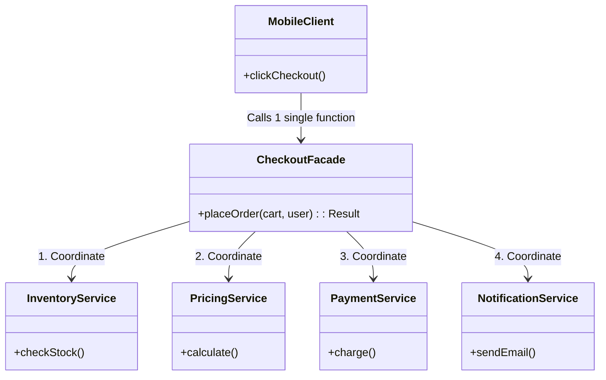

## Problem Description

We have built many compact and powerful modules: Pricing (Decorator), Inventory (Adapter), Payment (Factory), Notification (Observer).
Now, at the `/checkout` API Endpoint, the client (Mobile App / Web React) only wants to call a single API to complete the order.

If the Controller has to manually call them sequentially: Check stock -> Apply Voucher -> Charge credit card -> Save DB -> Send Email... then the Controller will become a "Disaster" (Fat Controller). **Facade Pattern** helps us create a more user-friendly interface layer.

## What is the Facade Pattern?

A Facade provides a high-level, simplified, and unified interface for a complex group of interfaces within a subsystem. It "hides" the underlying complexity from the Client.

## Application in the System

We create a `CheckoutFacade` class. Mobile/Web simply calls `checkoutFacade.placeOrder(cart, user)`. Inside, the Facade will coordinate all the different services.



## Implementation (Pseudocode - TypeScript)

```typescript
// Subsystems - Very complex
class InventorySvc {
  checkStock(id: string) {
    return true;
  }
}
class PricingSvc {
  applyDiscount(val: number) {
    return val * 0.9;
  }
}
class PaymentSvc {
  process(val: number) {
    console.log(`Charged ${val}`);
    return true;
  }
}
class NotiSvc {
  send(msg: string) {
    console.log(`Email sent: ${msg}`);
  }
}

// Facade Class
class CheckoutFacade {
  private inventory: InventorySvc;
  private pricing: PricingSvc;
  private payment: PaymentSvc;
  private noti: NotiSvc;

  constructor() {
    this.inventory = new InventorySvc();
    this.pricing = new PricingSvc();
    this.payment = new PaymentSvc();
    this.noti = new NotiSvc();
  }

  // Single interface exposed to the Client
  public placeOrder(productId: string, price: number): boolean {
    console.log("--- Start Checkout process ---");

    if (!this.inventory.checkStock(productId)) {
      console.log("Out of stock!");
      return false;
    }

    const finalPrice = this.pricing.applyDiscount(price);

    if (!this.payment.process(finalPrice)) {
      console.log("Payment failed!");
      return false;
    }

    this.noti.send(`Order for Product ${productId} is successful!`);
    console.log("--- Checkout complete ---");
    return true;
  }
}

// At Controller (Client) - Very clean and concise
const facade = new CheckoutFacade();
facade.placeOrder("IPHONE-15", 30000000);
```

## Pros & Cons

**Pros:**

- Extremely friendly to the Client, reducing coupling between the user interface / HTTP Controller and core logic.
- Easy to upgrade or change internal subsystems without affecting the externally called APIs.

**Cons:**

- Risk of the Facade becoming a "God Object" (a class holding too many things) if you cram all logic into it.
- Facade does not prevent clients from directly using subsystems if they want to. It just provides a more convenient pathway.
