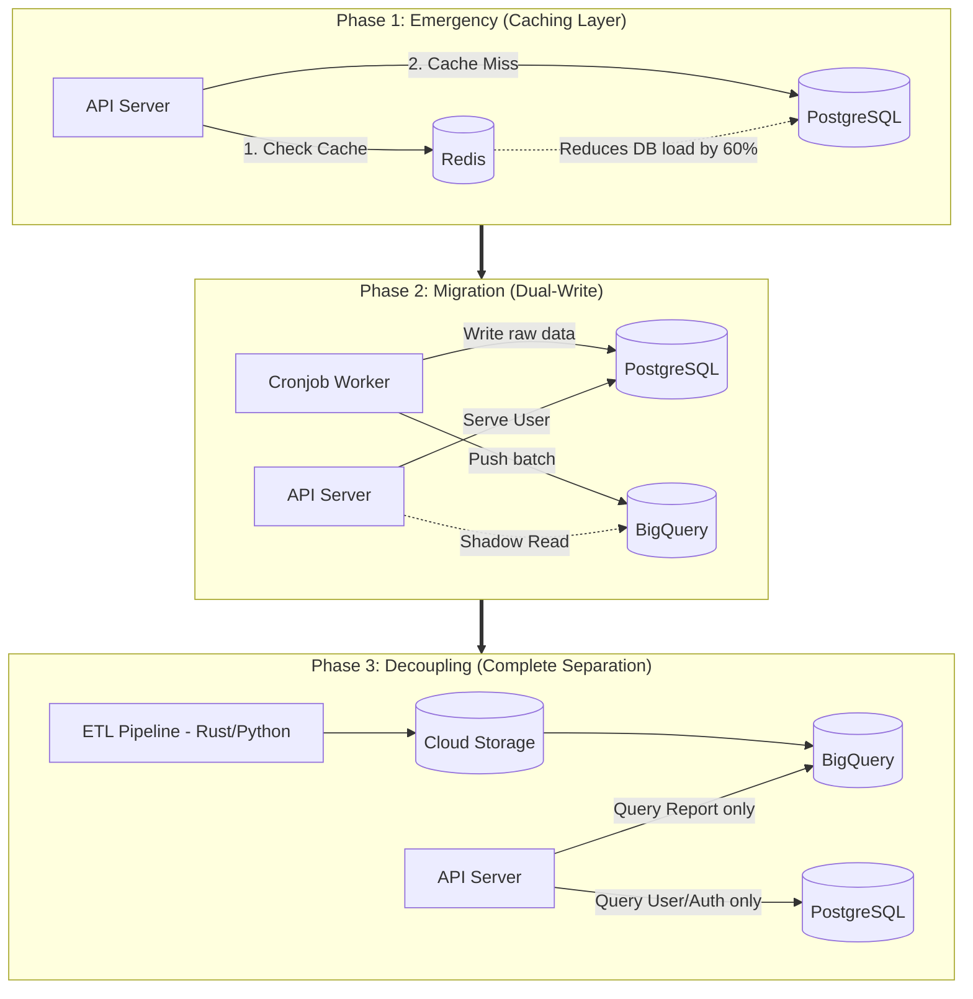

## Context & Problem

The PostgreSQL system from Part 1 is starting to "gasp for air." As the CCU reaches the 300 threshold, the database CPU consistently stays at 90-100% every Monday morning. API Response Time surges from 2 seconds to 15 seconds, occasionally throwing `504 Gateway Timeout` errors.
The mission: Advance this system to the Data Warehouse (BigQuery) architecture described in Part 2, but **absolutely without causing downtime** or altering the reporting data for active customers.

## Architecture Design: 3-Phase Upgrade Strategy

Instead of changing everything at once, the system will be upgraded across 3 Phases.

### Phase 1: System Emergency (Introduce Redis Cache)

- **Problem:** 80% of users visiting the dashboard only look at the same time range (e.g., the last 7 days). Forcing Postgres to scan and recalculate `SUM()` for every click is a massive waste of resources.
- **Action:** Insert Redis between the API and PostgreSQL. When user A calls a report, the result is calculated and stored in Redis with a 15-minute TTL (Time-to-Live). User B calling the same parameters will instantly get data from RAM (Redis).
- **Result:** Database CPU immediately drops from 100% to 40%. The system gains "breathing" room for the engineering team to prepare for Phase 2.

### Phase 2: Background Data Migration (Dual-Write & Shadow Read)

- **Problem:** Need to move data from Postgres to BigQuery without disrupting the active flow.
- **Action:** Modify the Workers pulling data (Cronjobs). Instead of writing only to Postgres, Workers will write an extra copy (Dual-write) to BigQuery. Simultaneously, at the API layer, implement a **Shadow Read** mechanism: The API still returns results from Postgres to the user, but silently makes an additional query to BigQuery and logs a comparison to see if the results match 100%.

### Phase 3: Cutting the Cord & Completing Data Pipeline

- **Problem:** Postgres is still bloating, and old Workers are running too slow.
- **Action:** Completely remove writing ad data to Postgres. Rewrite the Data Pipeline using Rust or Python (following Medallion Architecture) to push data directly into the Data Lake and BigQuery. Toggle the API to query 100% of reporting data from BigQuery. Postgres is now "liberated," only fulfilling its task of storing User, Auth, and Config information.

## Trade-off Analysis

- **Short-term Cost Increase (Dual-Cost):** In Phase 2, you have to pay for both the old infrastructure (bloating PostgreSQL) and the new one (BigQuery) simultaneously. This is the mandatory price for safety (Zero Downtime).
- **Complexity in Data Synchronization:** The Dual-write process can lead to data inconsistency risks if the Worker successfully writes to Postgres but fails to write to BigQuery. Retry and Idempotency mechanisms are necessary (it yields the exact same result no matter how many times it runs).

## Real-world Lessons & Best Practices

1.  **Use Feature Flags:** When routing users to read data from BigQuery, do not apply it to 100% of users at once. Use a Feature Flag to turn it on for the Internal Team to test first, then 10% of users, 50%, and finally 100%. If there is an error with BigQuery, it takes just 1 second to toggle the flag to fallback to Postgres.
2.  **Keep the Old System as a Backup:** After completing Phase 3, don't immediately turn off the Postgres reporting feature. Let it idle for another 1-2 weeks. This is a "life parachute" in case the Data Warehouse encounters an unforeseen incident.
3.  **Observability is Number 1:** If you don't have monitoring dashboards (like Grafana) to visualize CPU, RAM, and API Latency, you won't know if Phase 1 (Redis) or Phase 2 (Shadow Read) is actually effective or if it's slowing the system down.
