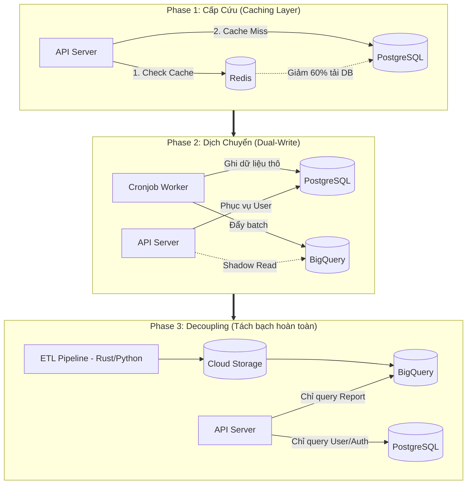

## Bối cảnh & Vấn đề

Hệ thống PostgreSQL ở Bài 1 bắt đầu xuất hiện những "tiếng thở dốc". Khi lượng CCU chạm ngưỡng 300, CPU của database liên tục duy trì ở mức 90-100% vào mỗi sáng thứ Hai. Thời gian phản hồi API (API Response Time) tăng vọt từ 2 giây lên 15 giây, thỉnh thoảng xuất hiện lỗi `504 Gateway Timeout`.
Nhiệm vụ đặt ra: Phải đưa hệ thống này tiến lên kiến trúc Data Warehouse (BigQuery) ở Bài 2, nhưng **tuyệt đối không được gây downtime** hoặc làm sai lệch dữ liệu báo cáo của khách hàng đang sử dụng.

## Thiết kế kiến trúc: Chiến lược nâng cấp 3 giai đoạn

Thay vì thay đổi toàn bộ cùng lúc, hệ thống sẽ được nâng cấp qua 3 Phase.

### Phase 1: Cấp cứu hệ thống (Introduce Redis Cache)

- **Vấn đề:** 80% user vào dashboard chỉ xem cùng một khoảng thời gian (ví dụ: 7 ngày gần nhất). Việc bắt Postgres phải scan và tính toán lại `SUM()` cho mỗi cú click là sự lãng phí tài nguyên khủng khiếp.
- **Hành động:** Chèn Redis vào giữa API và PostgreSQL. Khi user A gọi báo cáo, kết quả được tính toán và lưu vào Redis với TTL (Time-to-Live) là 15 phút. User B gọi cùng tham số sẽ nhận ngay data từ RAM (Redis).
- **Kết quả:** CPU Database lập tức giảm từ 100% xuống còn 40%. Hệ thống có thêm thời gian "thở" để team kỹ sư chuẩn bị cho Phase 2.

### Phase 2: Dịch chuyển dữ liệu ngầm (Dual-Write & Shadow Read)

- **Vấn đề:** Cần đưa dữ liệu từ Postgres sang BigQuery mà không làm gián đoạn luồng đang chạy.
- **Hành động:** Sửa lại các Worker kéo data (Cronjob). Thay vì chỉ ghi vào Postgres, Worker sẽ ghi thêm 1 bản (Dual-write) vào BigQuery. Đồng thời, ở tầng API, ta triển khai cơ chế **Shadow Read**: API vẫn trả về kết quả từ Postgres cho user, nhưng ngầm gọi thêm truy vấn sang BigQuery và ghi log so sánh xem kết quả của 2 bên có khớp nhau 100% hay không.

### Phase 3: Cắt rốn & Hoàn thiện Data Pipeline

- **Vấn đề:** Postgres vẫn đang phình to, Worker cũ chạy quá chậm.
- **Hành động:** Xóa bỏ hoàn toàn việc ghi data quảng cáo vào Postgres. Viết lại Data Pipeline bằng Rust hoặc Python (tuân theo chuẩn Medallion Architecture) để đẩy data thẳng vào Data Lake và BigQuery. Chuyển đổi (Toggle) API để truy vấn 100% dữ liệu báo cáo từ BigQuery. Postgres giờ đây được "giải phóng", chỉ còn làm đúng nhiệm vụ lưu trữ thông tin User, Auth và Config.

## Phân tích đánh đổi

- **Tăng chi phí ngắn hạn (Dual-Cost):** Trong Phase 2, bạn phải trả tiền cho cả hạ tầng cũ (PostgreSQL đang phình to) và hạ tầng mới (BigQuery) cùng lúc. Đây là cái giá bắt buộc phải trả cho sự an toàn (Zero Downtime).
- **Sự phức tạp trong đồng bộ dữ liệu:** Quá trình Dual-write có thể dẫn đến rủi ro lệch dữ liệu nếu Worker ghi vào Postgres thành công nhưng ghi vào BigQuery thất bại. Cần có cơ chế Retry và Idempotency (tính không thay đổi, chạy lại bao nhiêu lần vẫn ra 1 kết quả).

## Bài học thực tế & Best Practices

1.  **Dùng Feature Flags (Cờ tính năng):** Khi bắt đầu định tuyến (route) người dùng sang đọc dữ liệu từ BigQuery, đừng áp dụng cho 100% user cùng lúc. Hãy dùng Feature Flag để bật cho nhóm Internal Team test trước, sau đó là 10% user, 50% và cuối cùng là 100%. Nếu có lỗi ở BigQuery, chỉ mất 1 giây gạt cờ để fallback (quay về) Postgres.
2.  **Giữ lại hệ thống cũ làm Backup:** Sau khi hoàn thành Phase 3, đừng tắt tính năng báo cáo của Postgres ngay lập tức. Hãy để nó chạy không tải thêm 1-2 tuần. Đây là chiếc "dù cứu sinh" trong trường hợp Data Warehouse gặp sự cố không lường trước.
3.  **Observability (Khả năng quan sát) là số 1:** Nếu không có các dashboard giám sát (như Grafana) để nhìn thấy CPU, RAM và API Latency, bạn sẽ không thể biết Phase 1 (Redis) hay Phase 2 (Shadow Read) có thực sự mang lại hiệu quả hay đang làm hệ thống chậm đi.
