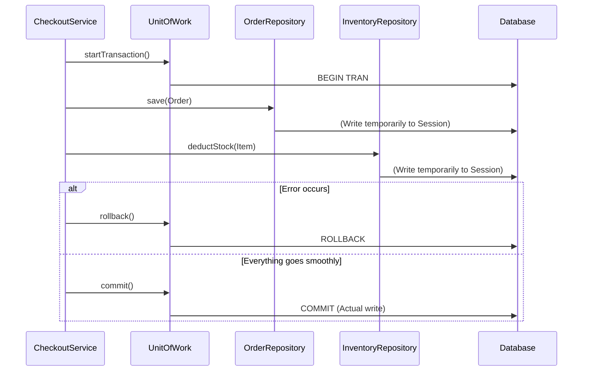

## Problem Description

In a real-world Checkout process, the system doesn't just save to the `Orders` table. It must perform the following chain of tasks:

1. Save the order to the `Orders` table.
2. Deduct inventory quantities in the `Inventory` table.
3. Save the payment history to the `Payments` table.

If steps (1) and (2) succeed, but step (3) fails (due to a network error), the order is created, but the money isn't recorded, and inventory is incorrectly deducted.
We need a **Transaction** concept: "All or Nothing" (Succeed all together or rollback to the beginning). The **Unit of Work (UoW) Pattern** combined with Repositories will solve this problem.

## What is the Unit of Work Pattern?

The Unit of Work maintains a list of objects affected by a business transaction. It coordinates the writing of all those changes to the Database within the same Database Transaction. It provides `commit()` (save) and `rollback()` (abort) operations.

## Applying to the Order Processing System

We create an `IUnitOfWork`. This class not only holds references to the `OrderRepository` and `InventoryRepository` but also manages the common DB connection (Connection/Session) for all those Repos.



## Implementation (Pseudocode - TypeScript)

```typescript
// 1. Interface for Unit of Work
interface IUnitOfWork {
  orders: IOrderRepository;
  inventory: IInventoryRepository;

  startTransaction(): void;
  commit(): void;
  rollback(): void;
}

// 2. Concrete UoW Implementation
class PostgresUnitOfWork implements IUnitOfWork {
  private dbConnection: any; // Simulate DB Session
  public orders: IOrderRepository;
  public inventory: IInventoryRepository;

  constructor() {
    this.dbConnection = {}; // Get connection from Connection Pool
    // Pass the common connection to the repos so they share 1 Transaction
    this.orders = new PostgresOrderRepository(this.dbConnection);
    this.inventory = new PostgresInventoryRepository(this.dbConnection);
  }

  startTransaction() {
    console.log("--- BEGIN TRANSACTION ---");
  }

  commit() {
    console.log("--- COMMIT (Save to DB) ---");
  }

  rollback() {
    console.log("--- ROLLBACK (Restore data) ---");
  }
}

// 3. Business Logic Service
class CheckoutService {
  private uow: IUnitOfWork;

  constructor(uow: IUnitOfWork) {
    this.uow = uow;
  }

  public processCheckout(order: Order, productId: string) {
    this.uow.startTransaction();
    try {
      // Execute multiple operations
      this.uow.orders.save(order);
      this.uow.inventory.deductStock(productId, 1);

      // If no errors -> Commit
      this.uow.commit();
      console.log("Checkout successful!");
    } catch (error) {
      // If error occurs -> Abort everything
      this.uow.rollback();
      console.log("Checkout failed, Rollback executed!");
    }
  }
}
```

## Pros / Cons Evaluation

**Pros:**

- **Ensures Data Integrity:** Prevents garbage or skewed data when processing threads break mid-way.
- Centralized Connection Management: Avoids each Repository opening a new connection to the Database and wasting resources.

**Cons:**

- Manual implementation is quite complex, especially in Multi-threading or Asynchronous environments (Node.js/Async-await), easily causing deadlocks if Transaction contexts are not carefully managed.
- **Note:** Nowadays, most ORM frameworks (like Entity Framework, TypeORM, Prisma, Hibernate) have already implemented Unit of Work under the hood (usually via `.transaction()` functions). Developers rarely have to code UoW from scratch, but understanding this architecture is mandatory to call the functions correctly.
